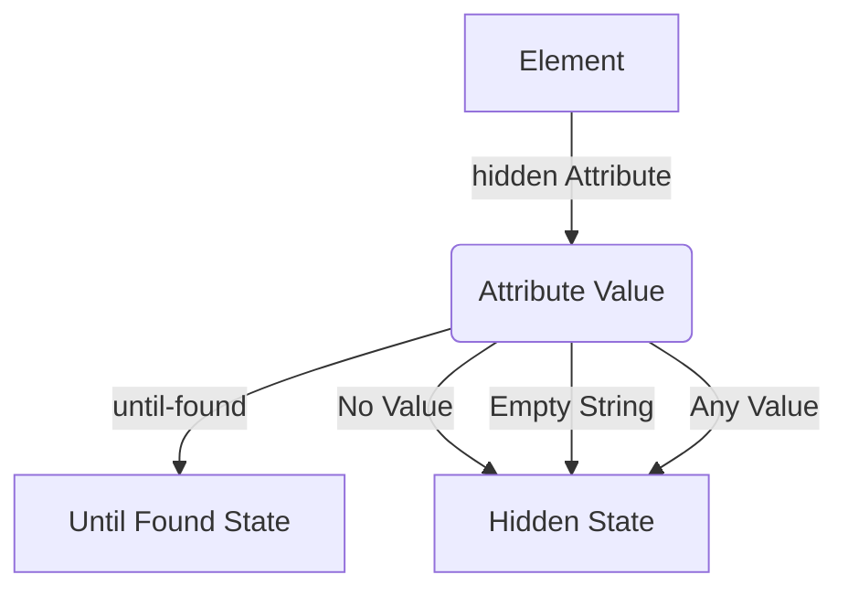

HTML5 introduced the `hidden` attribute to allow the authors to hide some HTML elements from the page. The hidden attribute worked in a very simple way, set the `display` property to `none` to hide the element, leaving the element hidden for the user.

During the early days when this attribute was created, many people voiced out their concern because here we are; mixing styles with markup again. To be fair, this was at a time before the rise of the frameworks and the change in the mindset where separation of concern became a less debatable issue. There were also others who opposed the attribute because it can be easily overridden by CSS. The solution at the time was to add this snippet to your stylesheet to make sure it override whatever in your style that can override it.

```css
[hidden] {
	display: none !important;
}
```

However, there were differing opinions on using the `!important` declaration, as some authors considered it a code smell. Over time, the use of `!important` in utility classes became more accepted.

>A modern way to mitigate the use of `!important` is the use of CSS layers. CSS layers is implemented by using the `@layer` directive, allowing us to define specific layers for our styles. This allow us to control the specificity and ordering of the CSS rules without resorting to `!important`. This approach promotes a more maintainable and scalable codebase, reducing the reliance on `!important` declarations and making it easier to manage styles across different components and elements. All we need to do is to add the previous snippet in the utility layer and moving that layer to be the last. This way we can ensure that their styles take precedence without the need for `!important`.

Let's take an example where in our application, we need to toggle the display of an element on a web page. We can do that by setting its `display` value to `none` using JavaScript and inline CSS. This is a common approach that many follow to hide an element instantly. To show the element back again we can change the display back to whatever value we want.

```javascript
// Hide the element
el.style.display = 'none';

// Show the element back by setting the display to another value
el.style.display = 'block';
```

The problem with setting the display to something other than `none` is that we could be dealing with an element that has different display values according to the media size for example (e.g. `block`, `flex` ... etc). In that case, setting it to a specific value can introduce some troubles if the media size change.

Another approach would be to use the `removeProperty` method which is available on the `style` property of the HTML elements which remove specific inline style that we want.

```javascript
// Show the element back by removing the inline declared property
el.style.removeProperty('display');
```

One argument in favor of the `hidden` attribute is its semantic value. It clearly indicates that an element using the attribute is intended to be hidden from display. So without having to set inline style, we can add and remove the attribute on the element as we want.

```javascript
// Hide the element
el.hidden = true;
// We can also use addAttribute
el.setAttribute('hidden', '');

// Show the element
el.hidden = false;
// We cal also use removeAttribute
el.removeAttribute('hidden');
```
## The future of `hidden` attribute

Initially, the `hidden` attribute was considered a boolean attribute. If the attribute was present on an HTML element, it would be effective regardless of its value:

```html
<div hidden>This element will be hidden</div>
<div hidden="hidden">This element is also hidden</div>
<div hidden="false">This one is hidden as well</div>
```

However, the specification has recently changed, and the `hidden` attribute is now an enumerated attribute. This means it can have specific named values. One new value introduced in the specification is `until-found`, which triggers a new state called the "Until Found" state. This introduces a change in behavior for the attribute.



So what is that state?
## The hidden until found state

The hidden until found state is a new state that was created to solve a common problem. Let's look at tabs and accordions for example. These UI components contain elements that are inaccessible until a certain action is done (e.g clicking a button or a title). This makes the content unavailable using find-in-page as well as for the search engine.

Unlike the standard "hidden" state, which completely hides the content by setting its display to none, the "hidden until found" state utilizes the `content-visibility` property to hide the content while still making it accessible to search engines, find-in-page functionality, and linking. Consider the following example, which requires Google Chrome to observe its behavior.

<iframe width="100%" height="500" src="https://livecodes.io/?x=code/N4IgLglmA2CmIC4QAkIBM2wHYAICCYYAThAEYCuY8ANCJgM4DGJADpAPZaIgi1gCGAc3qIA2gF1a-RpABusAKJoo7ItyaswvEAFt+RANbkWiUNH5ZB5IfCQALMDujbGnKli1IAPAEIAIgDyAMIAKgCaAAoKOA5OAHwAOlhesdA45pYAvAkg2DmJyXaw-GgFODheOrACOIx2+vTV2SAAqiEAYgC0ABz5SeWV1fwxhCydsACO5BCyzQAanS14nUHsOiz8kKRwObVu2GDNAJIKmbBogrB9uBVVNVj8Vc2yELAA7iyqYLuuHgfNb3QYDsmUwL0YsE6gLQwOoOAgWCgEH40E6TBRsEyAEYAHQABmuA0gMFgcT87EY5CqHi8AHpiXACnSiiUmaR2GgAJ5lCp2LFxABCFmFzP5SXFYBSACY4kcsJgAB7MmUSrzkaA8gbQCBxLzDOxEWAAM2aAGIEcR2Pk5Za0OQZBBOHT+LradqCglvpL3XqYoaTTlTQxmBA2I6sPk-LANKGOMlaS66e6JZ6vD79f6zdVOTp2NB2IJOfkFGAc3mC5zna7kxHJbT1R6bl5lLJ4WhmhaiFaQDF0JgsM1yB4IKijewh2hCeUKiw4ngcKRhQ94fQcBYcLB85ZNuc4ecyHAcEaiNMwDhAMgEC-YAkRjBR0E5a4XsCIRE5oix4lEUvEF5wLC7O0ITQBdH0aeQiBRHADARNBV3YI10n0S4YhfRcIXHVcjXzN4XwRQR-wyMBVwRHBgVgHBLiwchVwAWRo-gcVEABmX85Rweg1go1wh2IV56DhRcHgeVcaPOI9VD2dgYMsHA9EfUhuPvcSchYIj+ARegcjhZR6EgSxpnoOx8LIoodCPLtzIYRoiDPIThXoHEcBCIoLNPFccFkfRkW2CjSPoCAAC9YDhVx8yIOELBAo0ICIHQsGjASF0oDyaOsaAHw3LdBB3ECotqcgiHkNA4UBYEOIQs9sOjOwcBIOp4VwPT9Aa1wIPEsrauGEh5VK4yGvk59KMNbA4U5TccLhQ0Sv-Qq1JCnBJNILs3lwN4ilwVhYCclyKOPU9V0EFacGMN59BA0jGGgGiqCIVcEv0UyKLAdgWEWxDyMIiwwCcvBoFzPS1wyuSORfXB918jjYHOOB6FXAAKDZbI2il9BYABKBcl34VdXCqCy1jIt52BwQFoBA+gWFgRh+L-ej6GGaQqQRTZGflHB6eGRdoFICAAuFHbXKYV5hxixgcAeKp4MQgGz0paA5FyrHhJxtdDQ5hi10pHQWYEOFOaxnm+eRB5IvZg2AHX-30EpjekYYxyIJ6Yk5Zb0A1hmteZh4ait2inO53n+dNnBMCp+UTM4J7Yso7A1ggcXfj0qBKHDQWKLzCmaYOCAxYlx49sk4E+Zdt2ZoNhmWBFsAqThEusBJ7KXxOxo0DpWd+gqWkW0bVMWzbZpg00cNdmMjBsEHYdR3HeVrk9VM7BlKMYzDJ1aUXj0vS8WdduV4Uvo8DzPvMIhLkBooiHQ2BMKPHC8NktTvqYrE8V-P60k+-h2XkTojpnkCkbEXek+eyy5H6Hz-m8Am5lhh6RPDIQqFE0r3kfHeDK4lhg5FcHFHIz9Pw4AiERVc+gKINziigsi941zsyNBpIgmU9KFS5KTKAXUyIjW1AYCi-AWBUxtlgCEgkUrrU2GuXhxQ7pkRJopJ8xAhwGA8tIGuFDMEgFodARoHEqA6F2JJFgjRyBoHYHpWAOgnJChVodY6pFhjQgol5Eg2ZgGcRHElVW2U1yrk+i4tIJdRFwBxmeAAbHiWoOc7iGgRlKfER4wCY0wLAFgcJ6iHXYByUOkEWYoXyvXa8ex1hKPOM-H8OALH73AUAkha5cyyU+rQkxgNIGR0QlQipSVOqhw0gwwqtCITDXYG8cqkEqCrkNNgzAIEEI4FxAAFg4lMKpETow4HhliAArPM2JmMXrTJxEE+Z1h1ZLIRliAA7Jso0cTn6sQ-DM8Q7dN50h7uKWszYZgDxyNmXM+ZCyjz7BPHIvERydDHBOOeW8N4ljLD8ys68VS1lTDvVyxMiAgRyKA-guwS7AnHIIBwUihpTIAOrRjPHgY8Cd1yqAgIIBEcJPhwwPI+Y8hNPpEvLIhFFIF7LCjNgAnGrdGo7IUJYbURlPLIhwAAZQ2IicVkkIhfHIFYaM20WJ3JYms+5tIO6vO7jMXukoKCECjqWKmzRjUvQjCAOIAAlVVZ4-B80frCy1nAmS0nZFyD1qQ4ggAAL60D0pyOApgQAZCsDYbgjA4YuH2B4bgAag0hjYGGiN1hLjcAAFb8C8ivLQtBfjuE8CAXOKyfDwwAOScEUo7Uxmw6iVsaqHCkVIDg4i9ZydGmNgCdyTmeM6RBESyUyC27W7bmDFCoAoOA1IwBVpYJW9GABuTug7h2CBxAiBKRAQiwAVGeUdAADFyJdloDJsi25ZDczz0GMJ8WyztK1AunhOJtXlrqFydp9Me-Y1yEBIMa7aR7V03CMeOjwHaOSchxABRJ2A0Dw3XfhdGSR-UvP7clE1uBR3gbbZBqYL5ORSs3NTF6RAq1uqwEu0DSQqM4hKGgBQ8gPAABk+buBfFWq6CcDCVrhPDTGmQ4g4F7QisAeG504kI2+EjcAZCqHflW0Q6BxBLpxI7BQ0g7Dw3hpuITImxPzy9JuHEjQwAED4kBqtv7sD8ZwM+qeIL-40YlP61DWB3NJpAMG2GRRqgiAQBIZNmhAvBZADG+gERInVETbQACFJEqqDC5ICLN01gkcIPhQLwBA2lvWF8HLeWzXRlMMV0lOXw0WEjZmpAJX81xr+AmpA3mIIBU4NwdZAagA"></iframe>

In this example, try using the browser's search feature (find-in-page) and type the word "banana." After the first result is highlighted, attempting to navigate to the next result will reveal the "Introduction" section. Following that, the subsequent sections will become visible in sequence. Clicking the "Reset Display" button will hide the sections again, enabling you to retry the process. Additionally, clicking any of the links will automatically display the corresponding sections.

Note that this example doesn't rely on JavaScript, except for the functionality used to reset the display. Instead, the behavior is achieved purely on the HTML side. As the corresponding sections are "found," the hidden attribute is automatically removed from the elements, triggering their visibility.