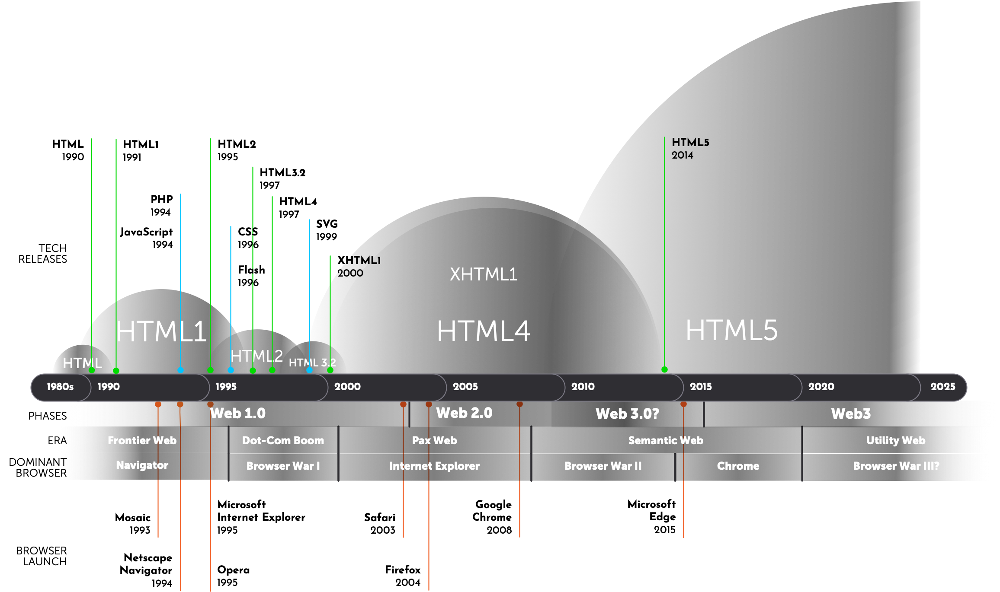
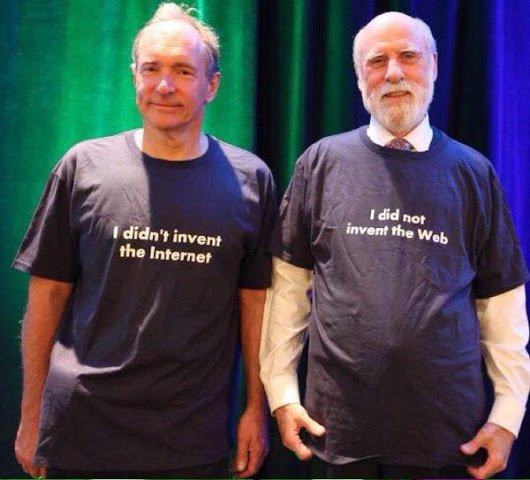
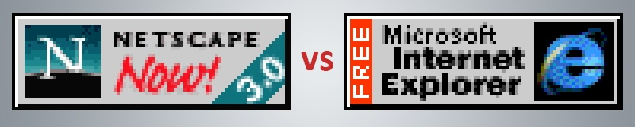
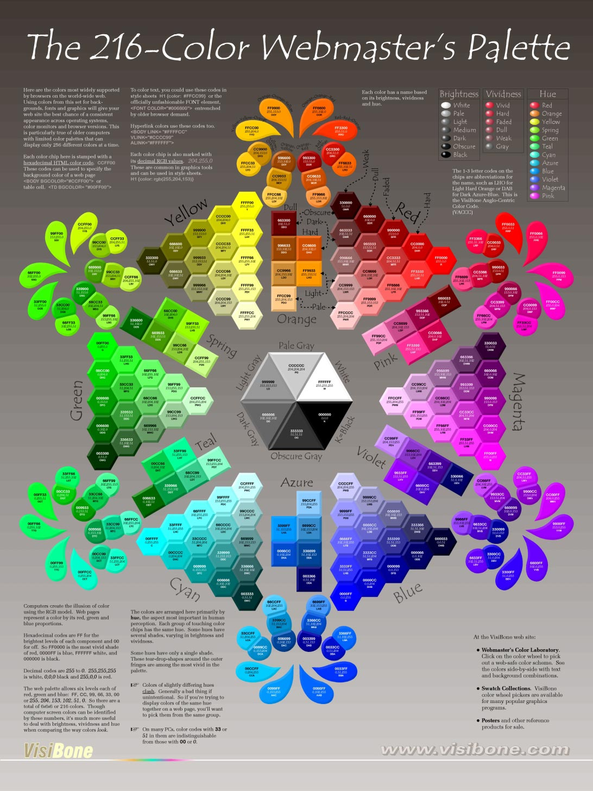
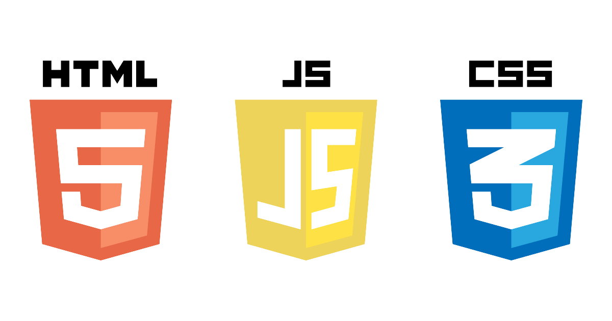
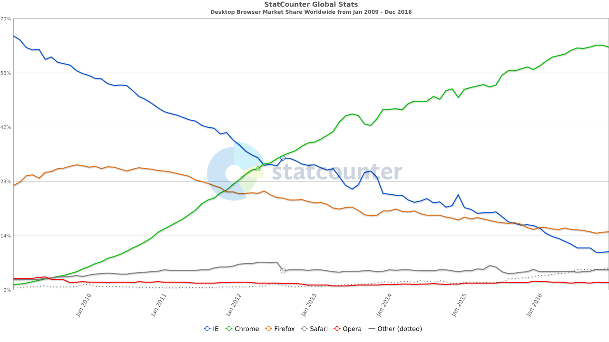

<figure class="u-mb">

<figcaption>Timeline of HTML from 1990–2024</figcaption>
</figure>

<strong>Note:</strong> HTML standards are developed first in browsers, so the version might have already became the de facto standard before the official standard document is released.

The story so far:

In the beginning Tim Berners-Lee created the World Wide Web. This has made a lot of people [very angry](https://lareviewofbooks.org/article/the-internet-is-a-crime-against-humanity/ "The Internet Is a Crime Against Humanity") and — putting all of humanity in constant contact with each other — [been widely](https://veniceoarsman.com/11932/opinion/essay-how-the-internet-destroyed-the-human-experience/ "How The Internet Destroyed The Human Experience") [regarded as](https://www.theatlantic.com/technology/archive/2021/06/the-internet-is-a-collective-hallucination/619320/ "The Internet Is Rotting") [a bad](https://medium.com/@jamesbridle/something-is-wrong-on-the-internet-c39c471271d2 "Something is wrong on the internet") [move](https://www.vanityfair.com/news/2018/07/the-man-who-created-the-world-wide-web-has-some-regrets "“I Was Devastated”: Tim Berners-Lee, the Man Who Created the World Wide Web, Has Some Regrets").

This would be called the _Hypertext Transfer Protocol_, but you probably see it every day as `http://`. Although initially intended as a way to share scientific papers, Berners-Lee quickly realized it would do a lot more than that:

<blockquote>
I designed it for a social effect — to help people work together — and not as a technical toy.
</blockquote>

His vision has led us to today, where the Web is now the predominant information platform for the planet Earth, and the language he created to create documents, HTML, is used by billions.

Unlike other systems at the time that were making use of the growth of home computers and modems — like [AOL](https://en.wikipedia.org/wiki/AOL) and [Compuserve](https://en.wikipedia.org/wiki/CompuServe) — Berners-Lee provided the World Wide Web as a free and open standard:

<blockquote>
The web is for everyone. It should be accessible to people with disabilities and be available in whatever language they speak. 
</blockquote>

<figure class="u-mb">

<figcaption>

Tim Berners-Lee (left) did **not** invent the Internet. He did invent the Web and HTML. Vinton G Cerf (right) did **not** invent the Web. He and Robert Kahn did invent the Internet.

</figcaption>
</figure>

## HTML: The Early Years (1990 – 1991)

In 1990, the Web was at best an “alpha” version of what it would become. Until then, computer networks were generally limited to a local area (LAN) and required a good deal of computer knowledge to use, much less create. There were other contenders at the time that allowed wider area networks (WAN) that could communicate with computers around a country or around the World. Most notable of these was the Internet. My favorite (and arguably the most popular) way of traveling the Internet in the early 1990s was [Gopher](https://en.wikipedia.org/wiki/Gopher_(protocol)). Gopher was (and technically still is) a way to retrieve documents from the Internet stored on a server. However, it quickly fell out of favor after HTTP arrived on the scene. This is, probably for the best. Can you imagine if we were all surfing the Gopher today?

What HTTP had going for it was HTML. Every single web page ever created uses the _Hypertext Markup Language_. Tim based HTML off of _[Standard Generalized Markup Language (SGML)](https://en.wikipedia.org/wiki/Standard_Generalized_Markup_Language)_ which was already in common use at CERN, mostly by just adding the `<a>` tag for hypertext links.

In the early 1990s, HTML was pretty limited. In fact it didn’t include  `` tags, and its design capabilities were sub-par even when compared to even the clunky word processors of the day. So web pages of the time at best looked like poorly formatted text files.

What the Web did offer, though, was the seemingly magical ability to click a link on one web page and instantly (ok, quickly) load another web page created by anyone else located anywhere in the world. 

In 1990, this was big stuff!

## HTML“1” & HTML+: The Wild Frontier (1991 – 1995)

The first public mention of HTML was an informal CERN document in 1991, listing just 18 tags. There are now around 140. The Web in those early years was just an academic curiosity used by Universities… well, used by tech geeks at a few universities. The HTML tags were so informal that they were really defined more by whatever the person who wrote the Web browser code wanted them to be and they could (and did) just make up their own.

Although there were a few web browsers available, there was one that rose to popularity amongst the tech geeks of the time.  _[Mosaic](https://en.wikipedia.org/wiki/Mosaic_(web_browser))_, released in 1993, was co-created by a (at the time) idealistic and starry eyed student by the name of [Marc Andreessen](https://en.wikipedia.org/wiki/Marc_Andreessen) atttending the University of Illinois at Urburna-Champaign. Marc decided it was such a good idea that, in 1994, he released _[Netscape Navigator](https://en.wikipedia.org/wiki/Netscape_Navigator)_ as a consumer product. Free from academic constrains, Netscape could add features and functionality to appeal to non-academics as well as add whatever tags they felt appropriate. These tags were referred to as HTML+.

This freedom led to a lot of growth in what the Web could do with tags for greater styling (remember, CSS is still several years off) and structure. Added during this time were tags we take for granted like tables, forms, and inline images.

This freedom also led to a few really terrible tags, for example Netscape introduced `<blink>`, which, in case you can’t tell, caused the enclosed content to blink on and off. No, you couldn’t control the speed. No, you couldn’t make it stop. The text just blinked on and off… on and off… on and off… and would keep doing that until you left the page.

<figure class="u-mb">

<picture>
	<source srcset="images/blink_main.gif" media="(prefers-reduced-motion: no-preference)">
	
</picture>

<figcaption>WHATEVER YOU DO, DON’T BLINK!</figcaption>
</figure>

Unfortunately, this also meant that if you used tags recognized by one browser there was no guarantee they would be implemented or even included by another. This lead to problems when your web page didn’t display the way you intended. Fortunately, HTML is a very forgiving language, and if the browser didn’t recognize a tag it was supposed to just ignore it completely but should still display the content as if there was no tag. Still, imagine if you had set up a data table for your web page. If the user’s browser didn’t recognize the `<table>` tag, all that information becomes an unintelligible mess.

Another problem on the horizon was that there was no guarantee that the different browser makers would agree on what each tag specifically did or even what to call them. One browser might display a `
` with the first line indented, while another could require you to add an extra `
` or  `  ` to add a space between paragraphs. Interestingly, what we did at the time out of necessity — no indent and an extra space between paragraphs — has became the editorial norm we still use today. 

There was obviously a need for some kind of standard for HTML if the Web was going to grow out of its infancy.

In 1994, Tim started The World Wide Web Consortium, at first to create standards for HTML that could be agreed upon and used by anyone creating browsers and websites.

Netscape would rule the early web until Microsoft, seeing the threat to their desktop market, ignited the bitter struggle known to legend as _The Browser Wars_.

<figure class="u-mb">

<figcaption>These buttons were ubiquitous in the 1990s World Wide Web, often accompanied a message reading “Built for Netscape” or “Built for Internet Explorer”</figcaption>
</figure>

### My Own Private HTMHell: Slammin’ Ps

I was first introduced to the Web and HTML in the fall of 1994, when I started at Rensselaer Polytechnic Institute (RPI) for my Masters in Communication. I’d heard some rumbling about this new fangled Web thingy earlier in the year while working computer tech at another University, but I had my Gopher and that was good enough for me.

At RPI, I fell in with a rowdy crowd of Communication PhD and Master students, one of whom had co-authored the first book about the web, _[The World Wide Web Unleashed](https://www.amazon.com/exec/obidos/ASIN/0672306174)_. 

[John December](https://www.linkedin.com/in/johndecember/), for that was his name, had also started what was, arguably, the first online only magazine, called _[Computer Mediated Communications](https://johndecember.com/cmc/mag/archive/)_, a few months before I got there. There was no real design to it beyond the basic HTML, so he brought me in to be the first designer.

At the time, being able to display images was still pretty new, and background images could only be applied to the web pages entire background and had to tile vertically and horizontally without stopping. Good enough to add a bit of color or texture, but not much else. 

To create web pages required you to code them using a command line prompt in a terminal. I still get hives at the very mention of using a command line, but I was determined to learn HTML. So, despite my trepidation, I tucked into command line editing. 

To code and write the pages you had to go back and forth between code mode and text mode. In code mode you could add tags but not text. In text mode you could add text but any code would be treated as text. Switching between these modes could take up to 30 seconds to load each time. 

If you forgot to add the `
` in code mode or thoughtlessly added them in text mode (which happened painfully often), you had to go back, delete all of the `
`s in text mode and reinsert them in code mode which could take a lot of time as the system lumbered between modes — you added the tag and then switched back to go to the next spot to add the next tag. I spent many hours doing that at first.

To speed production, we would set up our basic web page code structure and then simply add a bunch of `
` tags (there wasn’t a close paragraph tag at the time) and start writing an article, skipping over the next `
` to start a new paragraph. 

We referred to this process as “Slammin’ P’s”.

## HTML2: The Standards Rise (1995 – 1997)

Realizing that all of these different browsers needed to agree on exactly what tags were available in HTML and at least a rough guideline on how they should present the content, Tim started [The World Wide Web Consortium](https://www.w3.org "The World Wide Web Consortium").

The W3C would become the recognized body for setting Web technology standards, including (amongst many others) HTML, CSS, SVG, XML, and Web Accessibility. The one exception to this is JavaScript, which is controlled by [ECMA International](https://www.ecma-international.org).

HTML2 attempted to make order out of the chaos that HTML had quickly  become. Although not introducing any particularly exciting features, it codified the existing features to give everyone a level playing field to work on.

I just want to reiterate that at this point in the Web, CSS (which today does the lion’s share of actual visual design on the Web) and JavaScript (which does the lion’s share of interactivity on the web) were both new technologies that even if implemented had a lot of cross-browser inconsistencies. JavaScript caught on fast, but it would be the turn of the century before CSS would become the default way to add a visual layer to HTML code.

### My Own Private HTMHell: Color Me unimpressed

In the 1990s most color monitors were limited to just 216 colors. Let me make this clear, since we live in a world of monitors that can display millions of colors: A single pixel on the overwhelming majority of computer monitors in the 1990s could only display one of 216 colors at a time. This limited the color palette for web designs to what became referred to as the _Web Safe Colors_, which, today, we call just [Web Colors](https://en.wikipedia.org/wiki/Web_colors). Although other colors could be simulated by placing two different colors together and letting the viewers eye blend them (like a [pointillism](https://en.wikipedia.org/wiki/Pointillism) painting), the effect was never satisfying, and drop shadows and gradients were never smooth. [Entire books](https://archive.org/details/coloringwebgraph0000wein/mode/2up) were devoted to using Browser Safe Colors most effectively. I even kept a poster on my office 

When I would try to sneak a drop shadow into a design (I had a high-end monitor that could display thousands of colors!), my creative director would (metaphorically) slap me on the wrist and tell me to cut it out.

<figure class="u-mb">

<figcaption>In my day we only had 216 colors to design with and we liked it!</figcaption>
</figure>

## HTML3.2: Short and Sweet (1997)

Although it didn’t last long as a standard, HTML3, brought the standard fully under the control of the W3C.  Despite working on it for almost two years, HTML 3.0 was never released as a standard. According to the W3C, the difference between HTML 2.0 and HTML 3.0 was, “so large that standardization and deployment of the whole proposal proved unwieldy” and was eventually dropped. 

Instead of starting from scratch, the W3C worked to refine the 2.0 standard, releasing  HTML 3.2 (code named _wilbur_ for reasons no one is sure of) in January of 1997 HTML4 was released a little less than twelve months later in December.

By 1997, the Web was beginning to take off as a commercial platform. HTML 3.2 standardized features we take for granted today like tables, text flow around images, and inputs. Crucially, HTML 3.2 was backwards compatible with HTML 2, meaning that older Web pages could be displayed, something that still holds true to today. 

Although some tags were [depreciated](https://en.wikipedia.org/wiki/Deprecation?wprov=sfti1#) — most notably `<blink>` and `<marque>` to the celebration of many — it secured HTML’s future as a stable standard that could be relied on. In fact, the one serious attempt to move away from the principle of backwards compatibility ended in time waisting disgrace. But we’ll talk more about XHTML2 in a bit.

Although short lived, the [HTML 3.2 recommendation](https://www.w3.org/press-releases/1997/html32-rec/) set the stage for keeping the standard free and open, so that no one company could monopolize or privatize it. Instead, the W3C the took public input and invited experts and company representatives  to help guide its development and approve the final recommendations, another principal the W3C still follows.

Sometime around 1996–97, the Web began to quickly gain in popularity as more and more people saw its usefulness. There were publications moving online making news instant, online stores that could undersell their brick-and-mortar competitors (thanks Amazon), and much improved web search capabilities (thanks Google). Oh, and there were apparently some photographs of scantily clad men and women… ummm… exercising together.

This was a time known as the Dot-com Boom.

### My Own Private HTMHell: On the Table

Before CSS introduced the float element, and long before the flex and grid standards, we used tables to create web page layouts. The `<table>` tag was not conceived for this purpose (it was for presenting tabular information and data) but web designers quickly realized they could repurpose it to create columns and rows for [design grids.](https://en.wikipedia.org/wiki/Grid_(graphic_design)) This allowed us a lot more flexibility and spurred a lot of design innovation.

But tables were far from perfect. Although you could turn off the table cell borders and collapse gaps between them, many people didn’t. So Web design from that time is often typified by clunky ridged gray borders and pixelated background images.

## HTML4: Boom Goes the Web (1997 – 2014)

It was the best of times, it was the worst of times. The HTML4 standard was released and JavaScript and CSS, despite browser inconsistencies, were being adapted to create better designs for a more dynamic Web. 

HTML4 improved tables and forms, introduced support for CSS and JavaScript, allowed better accessibility features and internationalization, you could embed external content with the `<iframe>` tag (the much maligned `<frame>` tag was deprecated), and plugins like Flash could be added using the `<embed>` tag.

A gold rush began, with start-up companies springing up like weeds. This period was know as the Dot-Com Boom. Everybody and their brother had an idea for how to make money out of the Web, and they all needed someone who knew HTML. Jobs quickly flourished for Information Architects, Visual Designers, and Programmers. The good times of free gourmet meals at work, video arcade break rooms, and corporate parties on cruise lines seemed like it would never end.

At the same time, two different Web browsers were vying for the hearts and minds of the Web viewing public. This was a time known to Web lore as “[The Browser Wars](https://en.wikipedia.org/wiki/Browser_wars "The Browser Wars")” as Microsoft Internet Explorer and Netscape Navigator battled it out.  Maybe we should really call this The First Browser War or The Great Browser War or Browser War I or maybe even WWWWAR I. As we shall see, another browser war was less than ten years away and another one may be going on now. 

The Dot-com boom turned out to be a bubble and the bubble began to burst in late 2000. I will not dwell too long on this sad chapter in Web history, only to say that it had a profound effect on the burgeoning Web professionals of the day. Many were unceremoniously dumped from their first job  — their dream job  — crying over stock options that went from millions to pennies on the dollar all while watching the entire industry seemed to be imploding around them. 

That said, the Dot-com bust cleared the way for a rethinking of how the web would work. Just a few years later, there was an explosion of new sites that were finally realizing the promise of the Web. Although Web 2.0 is often thought of as starting in the early 2000s, the power that drove it had been around since the mid-1990s when Cascading Style Sheets and Javascript (the duo technologies often referred to together at the time as DHTML or Dynamic HTML) became standards adopted by Web browsers. 

What had held the development back was the technical debt of how the web was started and inconsistencies in how browsers displayed the Core Web Standards (HTML, CSS, JavaScript). What would look great in Netscape might fall apart in Internet Explorer, so we developed a lot of work arounds and [kludges](https://en.wikipedia.org/wiki/Kludge) or just limited designs for cross-browser compatibility.

For better or worse, by 2001 Microsoft came out on top, and Web designers could begin to rely on a consistent, if lack luster in its standards adherence, Web browser to create for. Web2.0 could now actually take off. 

After that, things simmered down for a bit in a period I refer to as “Pax Web”, and Flash, although not an open standard like HTML, was quickly adapted to bring more video and interactive content to the Web. Flash was easy enough for designers to use without having to learn a lot of code, and allowed for dynamic and highly interactive designs, something we struggle to recreate on the Web even today [after Flash’s demise at the hands of the Apple iPhone](https://www.howtogeek.com/805605/this-is-how-steve-jobs-killed-adobe-flash/). 

### My Own HTMHell: Internet Explorer 6

Ask any Web designer or developer working in the 2000s what it was that woke them up screaming in the middle of the night in panic and rage, the answer will likely be Internet Explorer 6. Launched in 2001 and preinstalled on every Windows computer as the default browser, it became _the Internet_ to many people.

While talking to a class of fourth graders in the mid-2000s about the Web, I wanted to use their class computer to show some examples and asked the teacher if they had a Web browser. Her response was, “No, we just have the Internet,” and pointed to the Internet Explorer Icon.

Despite being the window to the web for billions (at its height, IE6 had something  like around 80% of the world browser market), it had spotty, incomplete, inconsistent and buggy Web standards implementations. This made the job of creating Web sites difficult at the best of times, especially if you wanted to stick to standards and maintain cross-browser support.

I spent many, many, MANY hours during that time adjusting and re-adjusting my HTML, CSS, and JavaScript, using arcane kludges — like playing a sadistic whack-a-mole where whacking one guarantees another five popping up —  and often just having to settle for the lowest common denominator to get what I wanted to display the way I wanted it to display the same way on every browser.

## XHTML1: Strict Machine (2000 – 2008)

Although HTML4 solidified the Web, there were those who thought it too loose-goose to be considered a real solution for data mark up. HTML was very forgiving. It didn’t _require_ that you follow proper syntax and anything the browser didn’t understand it would just throw out. That is browsers _except_ IE6, of course, which would just choke (more HTMHell). 

In 2000, the W3C released [XHTML 1.0](https://www.w3.org/TR/xhtml1/ "XHTML™ 1.0 The Extensible HyperText Markup Language (Second Edition)") as a reformulation of HTML using XML syntax. Extensible Markup Language (XML) had been around for a while as a markup language used to structure and organize data. The W3C decided to establish a competing standard to provide easier integration with XML code. XHTML aimed to combine the best of HTML and XML, providing stricter rules for markup and enabling interoperability with XML-based technologies. 

XHTML was stricter than simple HTML, meaning that syntax couldn’t be fudged, but creating a page using XHTML was compatible with and little different than creating one in HTML4. However, it did force developers to be more semantic, consistent, and accessible with their code, something still important today.

## XHTML2: Look Back in Anger (DOA)

The idea behind XHTML2 was bold, brave, and completely ineffective. Rather than simply evolve HTML and XHTML, [XHTML2](https://www.w3.org/TR/2010/NOTE-xhtml2-20101216/ "XHTML™ 2.0") sought to start over and create a stricter and more modular version the Web markup language. It was heavily based on XML and eliminated all presentation elements in favor of CSS. The idea was to force the complete separation of structure from presentation thus allowing for the code to be device independent.

There was just one problem: XHTML2 would not be backwards compatible.

HTML had, since its beginning, been backwards compatible, meaning that older Web pages could display even in browsers using newer HTML standards. XHTML2 would have quite literally broken the Web. In addition, the new language was far more complex, and stricter enforcement of syntax and structure made creating Web pages much more difficult without a programming background.

Development of[ XHTML2 was eventually abandoned in 2009](https://hsivonen.fi/xhtml2-html5-q-and-a/ "An Unofficial Q&A about the Discontinuation of the XHTML2 WG") as interest in a more promising  standard was catching on.

## HTML5: A New Hope (2014 – Now)

<figure class="u-mb">

<figcaption>Core Web Technologies: HTML 5, JavaScript, and CSS 3</figcaption>
</figure>

Although not officially released as a standard until 2014, HTML5 had already become the de facto standard in Web browsers starting around 2010. Coupled with a developing CSS3 and a mature JavaScript, the Web was poised for a new phase. The rise of mobile devices being used to surf the Web meant that we had to start thinking more and more about how Web pages would look on small screens. Rather than creating a site for desktop/laptop and one for mobile, CSS could be used to change the layout of the HTML in response to the screen size. This became most commonly known as _[Responsive Web Design](https://alistapart.com/article/responsive-web-design/ "Responsive Web Design
by Ethan Marcotte")_.

HTML5 made an accessible and semantic Web its priority. Semantic HTML code simply means that it is well structured and that every item on the page has a clearly defined purpose. So [structural HTML tags](https://dev.opera.com/articles/new-structural-elements-in-html5/ "New Structural Elements in HTML5") such as `<nav>`, `<section>`, `article`, and `<figure>` were added. New input types were added as well, so that the data could be more easily differentiated (if only developers would use them properly!). 

While XHTML2 was discontinued, the idea of combining HTML and XML syntax continued to be explored leading to XHTML5. Like XHTML1, XHTML5 allows developers to write web pages using the stricter rules of XML while still benefiting from the features and compatibility of HTML5.

Because Internet Explorer was languishing without updating to modern standards (IE 7 improvements came too little too late in 2006 and took years to replace IE6), Chrome was at the forefront of implementing HTML5 and CSS3. The upstart browser quickly caught on and rapidly grew in popularity. 

The beginning of the end of the WWWWar III came in [2012 when Chrome unseated Internet Explorer as the top browser world wide](https://gs.statcounter.com/browser-market-share/desktop/worldwide/#monthly-200901-201612 "Desktop Browser Market Share Worldwide
Jan 2009 - Dec 2016") and IE never recovered after that. Although IE was still a major player for several years, by 2015, seeing that Internet Explorer was too tech debt laden to compete, Microsoft launched a completely new Web browser: Edge. Internet Explorer would finally be discontinued in 2022, but there are signs that Microsoft is gearing up for another fight.

<figure class="u-mb">

<figcaption>In 2012, Google Chrome passed Microsoft Internet Explorer as the most popular web browser in the world. The WWW would never be the same.</figcaption>
</figure>

Two other huge advances in Web design happened around 2009. First was that CSS Level 3 had become a de facto — if not finalized — standard. This revised and expanded styling standard was quickly adapted by browser makers eager to push their browsers as the most standard compliant. Almost as importantly, and long overdue, was the ability to use downloadable font files to use virtually any typeface in Web designs. This push, led the way by Safari was quickly introduced into Chrome and finally a few years later begrudgingly by Internet Explorer.

Additionally, since Apple refused to support Flash on its extremely popular iPhone, Flash quickly fell out of favor as a way of delivering video and interactive content. Fortunately, HTML5 included new (and old) standards for embedding video, and [Scalable Vector Graphics (SVG)](https://en.wikipedia.org/wiki/SVG), an old Web standard many had all but given up on, saw a resurgence in popularity to replace Flash’s vector capabilities.

The explosion of typography on the web, the new capabilities in CSS3, and the resuscitation of SVG led to a renaissance in Web design in the 2010s. Designers, having to move away from Flash so that they could support mobile devices, were now also expected to create designs that would work just as well on devices from a few hundred to a few thousand pixels wide. In effect, we were looking at an entirely new Web by the end of the 2000s. 

When an evolutionary change like this happened in the early-2000s, we called it Web 2.0. I would argue that the period from roughly 2009 – 2016 should be referred to as Web 3.0. Despite the terms Web3 and Web 3.0 being in common usage today to describe a decentralization of the Web (the term was first used sometime in the mid to late 2010s, but is still little more than a marketing buzzword) we missed an entire phase where the Web evolved off the desktop and became mobile, leading to a need to radically rethink our approach to Web design as “[Mobile First](https://bradfrost.com/blog/post/mobile-first-responsive-web-design/)” strategies developed.

## The Future of HTML?

So, where are we now? Are we already living in a Web3 world already? Maybe. 

We hear a lot of discussion about the [next web phase being “Web 3”](https://3327.io/user-decentric-design-in-web3/ "USER (DE)CENTRIC DESIGN IN WEB3") but many others are [less than thrilled by the prospect](https://web3isgoinggreat.com "Web3 is Going Just Great"). There is little doubt that user’s control of their data has eroded to the point of non-existence in the last thirty years. At the heart of Web3 (beyond cryptocurrency and blockchain) is a desire to bring back a decentralized Web with greater individual user control. While this is unlikely to affect the HTML standard, it may radically alter the way we use it.

To complicate matters further, we appear to be [heading into a new Browser War](https://interestingengineering.com/culture/is-microsoft-launching-a-new-browser-war "Is Microsoft Launching a New Browser War?"), with Microsoft recently launching several shots across the bow of Google—oh, excuse me, I mean “Alphabet”—leveraging Windows OS to push users towards a newly revitalized Edge Browser and away from Chrome.

Despite all of this, HTML5 is not going anywhere soon. Unlike previous versions, HTML5 is modular. That is, rather than rereleasing the entire standard as a single document, new capabilities are added to the existing standard. Older standards are rarely, if ever, changed.

That said, the W3Cs [Open UI Group](https://open-ui.org/ "Open UI") is addressing a long standing problem with HTML: user interface control appearance and behavior.

<blockquote>Most complex web projects today need far more than what HTML5 form and UI controls provide.</blockquote>

Currently, web developers will use a lot of CSS and Javascript to add capabilities that would be better handled by built in HTML components, but there are only limited ways to style these elements and none for how they function without resorting to scripting. Although still in its infancy, Open UIs goal is to web developers more control to style and extend web UI components without changing the underlying HTML code.

In a little more than 30 years, the Web has gone from being a Wild Frontier to becoming an essential utility humanity relies on to communicate, and HTML will always be the core of the Web.