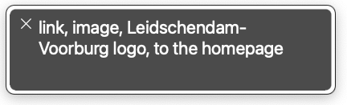

It's a common pattern to use a logo in the header as a link to the homepage.
But what should be the alt-text of that image? 
"the site name" or "homepage" or "logo" or "IMG_123"? Does it even matter?

Fun fact: the alt text of the image inside a link, will be added to the link text.

The problem with linking a logo is that it serves 2 purposes:

- a logo, that tells you which site you are visiting;
- a link, that leads to the homepage.

So add both that info in the alt text. Explain what's on the image and where the link leads to: "Site name logo, to the homepage".

**Note**: Start the alt text with the visible text, then the link will be easier to target for people using voice recognition software.

Let's take as example the logo of my home town Leidschendam-Voorburg.

In code (simplified):

```html
<a href="/">
  
</a>
```

Generated HTML: 

<a href="https://www.lv.nl/en">
  
</a>

VoiceOver in Safari will announce this as:
"Link, image, Leidschendam-Voorburg logo, to the homepage".


All info is there.

There is an advantage of using the alt text instead of an aria-label solution. When the connection is slow, the alt text will show up before the image does and already informs all users of the site name and link destination. It's quite robust. 

## Discussion

### Do I need the word logo? Isn't that redundant, like the word image or picture?
Yes, in this case the fact that this is a logo tells important info.

Not only for blind users, but for all screenreader users. If you are visually impaired but not totally blind, you may see the image vaguely. With the addition of the word logo, you also know what the image is.

The site name is required, but the logo gives extra context.

### Isn't this a violation of [2.5.3 Label in Name](https://www.w3.org/WAI/WCAG22/quickref/?versions=2.1&showtechniques=253#label-in-name)?
No, the visible name is in the alt text, which becomes the accessible name of the link. Adding extra context to the link is common practice.

Compare this with the notorious "Read more" link in a card. A common pattern is to use a sr-only CSS class (or equivalent) with additional text:
`<a href="url">Read more<span class="sr-only"> about cute kitten</a>` .

- You see Read more.
- You hear Read more about cute kitten.

In our case: 

- You see the site name and logo; the visual position tells the link destination.
- You hear the site name, the fact it's a logo and the link destination.

The whole visible text should be in the accessible name, but extra information, like the meaning of the image and link destination can be added for context. That way the [purpose of the link](https://www.w3.org/WAI/WCAG22/quickref/#link-purpose-in-context) is explained.

### Why didn't you use an aria-label?
Of course there are other and also valid solutions. By using plain simple HTML I want to honor the [first rule of ARIA](https://www.w3.org/TR/using-aria/#rule1):
> If you can use a native HTML element or attribute with the semantics and behavior you require already built in, instead of re-purposing an element and adding an ARIA role, state or property to make it accessible, then do so.

Happy Holidays!