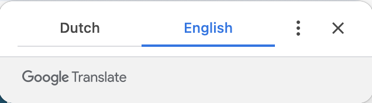

Today, I’d like to talk about the experience of browsing websites where content is fully or partially in a language different from the user’s native one. This situation is common for users navigating government portals or local service providers in a country where they don't speak the language well, and for international marketplaces, where essential information might appear in unfamiliar language. Or just a user has a different language preference set in their browser because it's convenient for them. In these cases, users often rely on the browser’s auto-translate feature, which many modern browsers offer by default. When you open a page in a different language from your preferred setting, the browser will prompt you to translate it automatically.



Browser auto-translation relies on the lang attribute set on the HTML element:

```html
<html lang="en"></html>
```

However, automatic translations can sometimes be inaccurate or misleading, especially when it comes to proper and branded names, or technical terms that should remain untranslated.

For example, let’s see what happens when a user’s name, like _Joke_ (a Dutch feminine name pronounced [ˈjoːkə]), is displayed on an English page that is then auto-translated into Dutch:

```html
<!-- Original content in English -->
<p>Name: Joke</p>

<!-- Translated content in Dutch -->
<p>Naam: Grap</p>
```

The Dutch word _“Grap”_ means _“joke”_ — a thing said to cause amusement — turning the name into something unintended and causing confusion.

To prevent such misinterpretations, we can use the <code>[translate](https://html.spec.whatwg.org/multipage/dom.html#the-translate-attribute)</code> attribute, which indicates whether an element content should or should not be translated. The attribute can appear on any element, and it takes just two values: `yes` or `no`. In our case, we need to use the value `no` to disable automatic translation for specific pieces of content:

```html
<!-- Original content in English -->
<p>Name: <span translate="no">Joke</span></p>

<!-- Translated content in Dutch -->
<p>Naam: <span translate="no">Joke</span></p>
```

## Translation in Context

Translation engines have improved significantly over time and can often understand whether certain content, like email addresses or well-known names (e.g., _Pain au chocolat_), should be translated or not. However, it's still crucial to manually test your content to avoid unexpected issues. For instance, email addresses that appear as part of a search results page might be wrapped in additional HTML tags, which can cause translation errors. Let’s compare these two examples:

```html
<!-- Original content in English -->
<p>E-mail: joke@example.com</p>
<p>E-mail: <mark>joke</mark>@example.com</p>

<!-- Translated content in Dutch -->
<p>E-mailadres: joke@example.com</p>
<p>E-mailadres: <mark>grap</mark>@voorbeeld.com</p>
```

The issue can be easily avoided by using the `translate="no"` attribute to ensure that the email address stays untranslated:

```html
<!-- Original content in English -->
<p>
  E-mail: <span translate="no"><mark>joke</mark>@example.com</span>
</p>

<!-- Translated content in Dutch -->
<p>
  E-mailadres: <span translate="no"><mark>joke</mark>@example.com</span>
</p>
```

With this adjustment, the display remains accurate across languages, preventing incorrect translations and enhancing user trust. Misleading translations can create uncertainty and may cause users to double-check information unnecessarily, impacting accessibility, usability, and overall experience. Ideally, users should navigate with confidence, and as developers, we can do this small trick to make their experience smoother.

## Non-standardized approach

Before the `translate` attribute was part of the HTML specification, [translation engines offered similar tools](https://www.w3.org/International/questions/qa-translate-flag#stickyness). For example, Google and Microsoft’s translation engines support the class `notranslate`</code>, which worked similarly:

```html
<p>Name: <span class="notranslate">Joke</span></p>
```

However, using the `translate="no"` attribute, which is now part of the HTML specification, is a more robust and reliable approach, ensuring consistency across current and future translation APIs and localization standards.

<p class="highlight"><strong>Note:</strong> All examples were tested in Chrome Version 129.0.6668.103 (Official Build, x86_64).</p>
