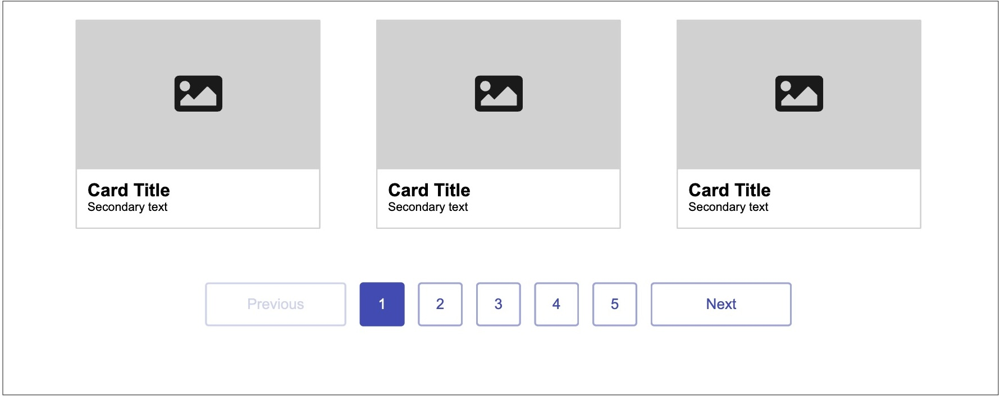
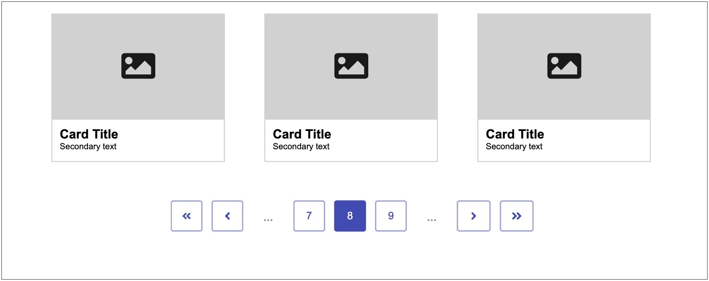

Imagine you’re reading a book that seems perfect for cozy winter evenings. But as soon as you turn the page, you suddenly find yourself somewhere else, rather than on the next page of the story. Now, you have to painstakingly search through the book to find where the story continues — as if someone had bound the pages in the wrong order.
Would you keep reading? Or recommend the book to others?

For about [16% of the world’s population](https://www.who.int/news-room/fact-sheets/detail/disability-and-health#:~:text=Key%20facts,1%20in%206%20of%20us.) (roughly the population of China), the web often feels like a maze. People who rely on assistive technologies experience the web like a poorly bound book, one they must tediously navigate page by page rather than simply moving to the next relevant section.

Another example: imagine you're searching on Google and find the answer on page 2. However, to get there, you first need to enter the [Konami Code](https://en.wikipedia.org/wiki/Konami_Code) to unlock the link. Such obscured navigation elements are, unfortunately, a daily reality for many web users.  
On some websites, pagination links are hidden behind inaccessible images without labels, or they use faulty ARIA attributes that make navigation difficult for screenreader users.

While an accessible pagination doesn't make the entire web accessible, it does ensure that everyone, whether reading a book or browsing the web, can seamlessly turn from page to page and easily find the next part of the story.

## Pagination I

Let’s start with a simple example — a pagination that’s perfect for smaller blog pages or product overviews with a limited number of items.



```html
<nav aria-label="More Christmas cookie recipes">
  <ul>
    <li>
      <a role="link" aria-disabled="true">Previous</a>
    </li>
    
    <li>
      <a href="#" aria-current="page">1</a>
    </li>
    
    <li>
      <a href="/2/">2</a>
    </li>
    
    <li>
      <a href="/3/">3</a>
    </li>
    
    <li>
      <a href="/4/">4</a>
    </li>
    
    <li>
      <a href="/5/">5</a>
    </li>
    
    <li>
      <a href="/2/" aria-label="Next, Page 2">Next</a>
    </li>
  </ul>
</nav>
```

**Clear Page Structure** 
- The `<nav>` element with a descriptive `aria-label` provides orientation for screenreader users and makes the [page structure](https://www.htmhell.dev/tips/landmarks/) immediately recognizable. 
- If `<nav>` cannot be used, the root element of the pagination can be assigned `role="navigation"` to ensure assistive technologies interpret the navigation correctly. 
- Distinct `aria-label`s (e.g. "Pagination of product listings" or "More cookie recipes") help differentiate between navigation areas and provide additional context for the links.

**Using** `<ul>` **or** `<ol>` **for Flexibility** 
- A list can improve the user experience for screenreader users. However, screenreaders interpret `<ul>` and `<ol>` differently, which can lead to confusion depending on the context:
	- With a `<ul>` element, a link to the second page might be read as "Bullet, Link, 2," signaling that the pages are considered equal and no strict order is implied.
	- With an `<ol>` element, the same link might be read as "3, Link, 2," because the position within the list (in this case, the third `<li>` element) is also announced. This can be confusing when the announced number doesn’t match the actual page number in the link, such as in paginations that begin with additional links like “Previous.”
- For small, sequential navigation, such as a multi-page news article, an `<ol>` is a good choice. Here, the announced order matches the page structure, helping assistive technologies convey the context. For non-linear content, where order doesn’t matter—like pages with multiple Christmas cookie recipes—a `<ul>` can be the better option.

**Proper Deactivation** 
- A [disabled link](https://www.scottohara.me/blog/2021/05/28/disabled-links.html), such as “Previous” to the first page, should not have an `href` attribute. Since the `disabled` attribute only applies to form controls like `<button>`, `aria-disabled="true"` is used instead.
- Additionally, the `role="link"` attribute should be added to explicitly define the element’s role as a link. An `<a>` element without an `href` attribute does not have a specific default role and is treated inconsistently by assistive technologies. The combination of `aria-disabled="true"` and `role="link"` ensures that the [link is correctly perceived as disabled](https://w3c.github.io/html-aria/#example-communicate-a-disabled-link-with-aria) without being mistakenly interpreted as “clickable.”
- Alternatively, a `<span>` element can replace the link, e.g. `<span>Previous</span>`. This method is considered a best practice because it simplifies the code and minimizes the use of ARIA attributes. This aligns with the principle that native HTML elements and semantic structures should be preferred to improve code maintainability and clarity. Both approaches are valid as long as they are implemented correctly.

**Intuitive Navigation** 
- The `aria-current="page"` attribute indicates which page is currently open. Screenreaders interpret this as “Current page, Link, 1” or similar. This helps users quickly orient themselves and easily identify which page they are on.

**Clear Link Descriptions** 
- A visible link text such as “2” for the second page is sufficient for assistive technologies and their users to interpret the link correctly. However, if an additional `aria-label="Page 2"` were added, the link would be announced by screenreaders as “Page 2”. 
- Sighted users relying on voice control might attempt to activate the link by saying “2” because they see that number. The voice control software, would not find the link because the link name (accessible name) does not match the visible text. To avoid this, the visible text should always be identical to the accessible name. 
- Furthermore, the `aria-label` of the surrounding `<nav>` element (e.g. `aria-label="More pages of product listings"`) already provides the necessary context that the links are for pagination.  
- An exception can be made if the visible link text is integrated at the beginning of the `aria-label`, such as `aria-label="next, page 2"`. Here, “next” comes first to describe the function of the link, while “page 2” provides additional context. This structure is helpful as it emphasizes where the link leads.

## Pagination II

Let’s look at a pagination that’s particularly suited for blog pages with many entries or product listing pages with extensive products. This advanced pagination allows users to skip multiple pages in the display while maintaining a clear structure.

This pagination builds on the principles of the simple pagination. The same recommendations for using `<nav>`, `<ul>`, `aria-label`, `aria-current`, and `aria-disabled` apply here as well.



```css
/* styles for elements that are only relevant for screenreader users */
.sr-only {
	position: absolute;
	width: 1px;
	height: 1px;
	padding: 0;
	margin: -1px;
	overflow: hidden;
	clip: rect(0, 0, 0, 0);
	white-space: nowrap;
	border-width: 0;
}
```

```html
<nav aria-label="More Christmas cookie recipes">
  <ul>
    <li>
      <a href="/1/">
        <span class="sr-only">First Page</span>
        <svg role="presentation" xmlns="http://www.w3.org/2000/svg" width="16" height="16" viewBox="0 0 24 24">
          <path d="M14 18l-6-6 6-6L12.59 4 6.59 10 12.59 16 14 18z" />
          <path d="M20 18l-6-6 6-6L18.59 4 12.59 10 18.59 16 20 18z" />
        </svg>
      </a>
    </li>

    <li>
      <a href="/7/">
        
      </a>
    </li>

    <li>
      <span>...</span>
      <span class="sr-only">skipping pages 1 to 6</span>
    </li>

    <li>
      <a href="/7/">7</a>
    </li>

    <li>
      <a href="#" aria-current="page">8</a>
    </li>

    <li>
      <a href="/9/">9</a>
    </li>

    <li>
      <span>...</span>
      <span class="sr-only">skipping pages 10 to 12</span>
    </li>

    <li>
      <a href="/9/">
        
      </a>
    </li>

    <li>
      <a href="/12/">
        <span class="sr-only">Last Page, Page 12</span>
        <svg role="presentation" xmlns="http://www.w3.org/2000/svg" width="16" height="16" viewBox="0 0 24 24">
          <path d="M10 6l6 6-6 6 1.41 1.41L18.41 12 11.41 4.59 10 6z" />
          <path d="M4 6l6 6-6 6 1.41 1.41L12.41 12 5.41 4.59 4 6z" />
        </svg>
      </a>
    </li>
  </ul>
</nav>
```

**Using SVGs**
- Icons should always have descriptive text to make their function clear for screenreader users. Instead of describing the SVG itself (e.g. “Double arrow pointing left”), the purpose should be communicated (e.g. “First page”).
- Using a `<span>` element with the [screenreader-only class .sr-only](https://webaim.org/techniques/css/invisiblecontent/) can be a practical approach. This class hides the text visually for sighted users but makes it accessible to screenreaders. In certain cases, it may have an advantage over using an `aria-label` on the `<a>` element because screenreaders read the text with the correct language and pronunciation preferences.
	- Tested Behavior: When using NVDA (Version 2024.4) with Chrome (Version 130) and German as the language preference, English text in an `aria-label` was read with a German voice and pronunciation. However, when the text was provided via the `.sr-only` class, it was read correctly with an English voice. This behavior also has been documented in [NVDA GitHub Issue #16285](https://github.com/nvaccess/nvda/issues/16285).
	- With VoiceOver on macOS, no difference between the two methods was observed.
	- Note: This has not been tested with JAWS or other screenreaders and may vary depending on the browser and screenreader combination.
- The `role="presentation"` attribute should be added to SVG elements to prevent some screenreaders from announcing them as standalone elements (e.g. “Link, Image, First page”). This ensures they are interpreted as purely decorative and not announced (e.g. “Link, first page”).

**Using Images**
- When an `` element is the only child of a link, the text of the `alt` attribute is automatically read by screenreaders as the link text. Therefore, the `alt` attribute should include a descriptive text that clearly conveys the function of the link (e.g. `alt="Next Page, Page 9"`). This method is a best practice as it is natively supported by screenreaders and requires no additional effort.
- If it is not possible to modify the `alt` attribute of the image due to technical constraints, an `aria-label` on the `<a>` element can be used instead to describe the function of the link. However, this solution should only be applied in exceptional cases.

**Skipping Multiple Pages**
- In reading mode, screenreaders typically do not announce ellipses (“...”) used to indicate skipped pages. Instead, the list item is often read as an empty bullet, which can confuse users as it does not explain why no additional information is provided at that point.
- To ensure that skipping pages is clearly communicated, an explanatory text such as “skipping pages 10 to 12” should be added using the [screenreader-only class .sr-only](https://webaim.org/techniques/css/invisiblecontent/). This text will be read by screenreaders but remain invisible to sighted users. An `aria-label` is not a suitable alternative here, as it cannot be applied to generic elements like `<span>` or `<div>`.
- This approach is particularly helpful when page skipping occurs in the middle of pagination, as it provides screenreader users with context and prevents confusion about why navigation jumps from one page (e.g. page 2) to another (e.g. page 7). The additional context improves orientation and reduces potential misunderstandings.

## The final chapter

Accessible pagination is more than just a design detail—it provides orientation, simplifies navigation, and greatly improves the user experience, especially for those relying on assistive technologies.

The semantic HTML elements and ARIA attributes presented here create an accessible structure that remains easy to use across all devices, from desktop to smartphone.

Accessible pagination ensures that all users can navigate the web without "getting lost as if reading a book with pages bound out of order."  This makes the web not only more inclusive but also more accessible for everyone looking to find content efficiently and directly.

## Testing and validation

To ensure the proposed solutions deliver on their promise, I conducted tests in different environments:
- HTML Validation: The code was tested using the [W3C HTML Validator](https://validator.w3.org/nu/) with no errors or warnings found.
- Tested on [AssistivLabs](https://assistivlabs.com/), a platform for remote testing of assistive technologies:
	- Screenreader: NVDA (Version 2024.4)
	- Browser: Chrome (Version 130)
- Tested on a real device:
	- Operating System: macOS 15.1.1
	- Screenreader: VoiceOver
	- Browsers: Chrome (Version 131) and Firefox (Version 133)

However, additional testing with other screenreader and browser combinations is recommended to ensure compatibility across a wider range of devices and tools.
