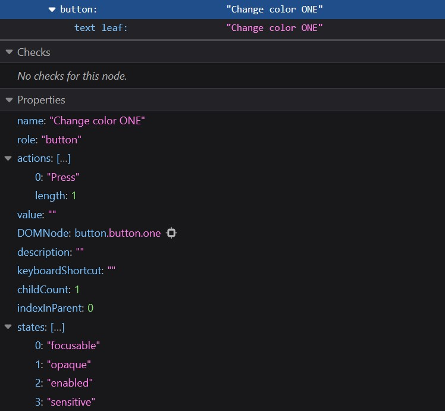
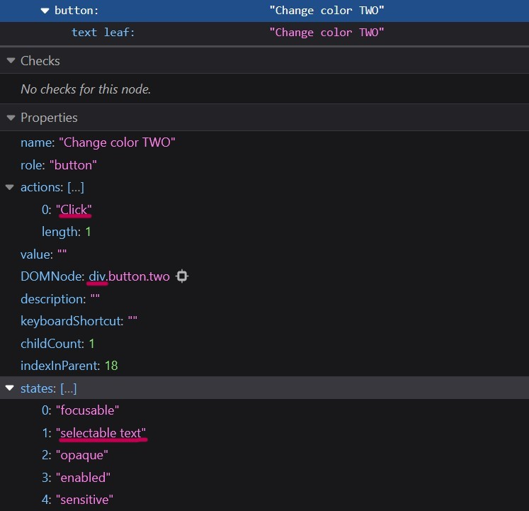
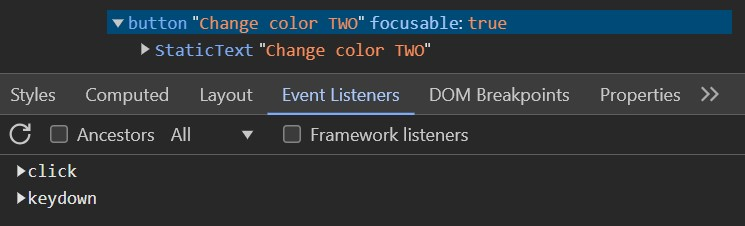

<!-- MM: Great post, thank you! -->
<!-- KS: Outstanding, well written post. Thank you! -->

With the right CSS makeup and a click event, almost anything can pretend to be a button. In accessibility work, we spot these fakes and fix them, but teaching others why and how to do it is just as important. It’s not just about correcting a single mistake; it’s about introducing developers to accessibility concepts and approaches that they can confortably return to and reuse across all their projects. More importantly, it encourages them to think beyond the sighted user with a mouse and consider the needs of those who rely on assistive technologies. 

## Really, How Bad Can a Fake Button Be?!

So, how do we answer this question? I used to demo the problems using a screen reader, but I've found that it can be overwhelming for developers new to accessibility. I prefer now a different approach, using simpler tools: the keyboard and the accessibility tree. They are easy to pick up and give developers a good feel for what’s really going on.

No, the message is not to avoid screen readers, but to start with tools that have a gentler learning curve. The tree itself gives developers plenty of clues about how each node may (or may not!) be recognized by assistive tech like screen readers or voice recognition software. And for whatever the tree can’t reveal, keyboard testing can fill in some of the gaps. 

Using tools that are straightforward makes it more likely that developers will keep coming back to them to build better in the long run. Of course, no tool is perfect, and the accessibility tree does have its limitations. It’s important that we remind developers of them as well.

So, what exactly does this approach entail? 

## Build a Genuine Button with a `<button>`

```html
<button type="button" class="button one">
    Change color ONE
</button>
```

```javascript
function changeColor(event) {
    const element = event.currentTarget; 
    element.style.backgroundColor = element.style.backgroundColor === "gray" ? "white" : "gray";
}

const buttonOne = document.querySelector('.button.one');
buttonOne.addEventListener('click', changeColor);
```

First, we create a genuine button using the `<button>` tag and then examine how it appears in the accessibility tree. We focus on the attributes and properties exposed for this node, discussing what each one means in terms of interaction with assistive technologies. At every step, we also test with a keyboard.

Note: I regularly work on a Windows computer and am familiar with the accessibility tree in both Firefox and Chromium browsers. For this exercise, I’ll mostly use Firefox since it offers specific clues about the shortcomings of fake buttons, and, as a bonus clue, a way to spot a fake button just from the UI.



So, what is the view from the accesssibility tree revealing?

- The node has the role `button`, which comes with some privileges: it will be announced as a button by a screen reader, and since buttons support name from content, its text becomes its `accessible name`. So, a screen reader will announce it as `Theme Toggle, button`. Users relying on voice recognition software can activate it by voice command, such as saying `Click Theme Toggle`.

- The `states` array shows that the button is focusable, so we know we can reach it via the `tab` key. 

But where does the keyboard come in? It helps us confirm the `focusable` property by allowing us to navigate to the button with the `tab` key. Plus, it confirms that we can activate the button using the `Enter` key or the `Space` bar, another built-in perk of genuine buttons that is not immediately obvious from the accessibility tree. But more on that later.

Next step: build a fake button.

## Build a Fake Button with a `<div>`
```html
<div class="button two">
    Change color TWO
</div>
```

```javascript
const buttonTwo = document.querySelector('.button.two');
buttonTwo.addEventListener('click', changeColor);
```

We simply attach a click event to a `div`, and with nearly the same CSS as we’d use for a genuine button, we create something a sighted user will recognize as a button.

Here’s the view from Firefox’s accessibility tree:


What should we be looking or testing for? The same attributes and behaviors we found for the genuine button:
- role, 
- name, 
- focusable property, and 
- keydown events. 

The node’s role defaults to `generic` since the building block is a `div`. It also remains unnamed because generic nodes don’t have naming privileges, despite containing text. Keyboard users will not reach it, let alone activate it, and we don’t even have to test with a keyboard to prove it. We simply notice that the `states` array does not list the `focusable` property.

We can't test for `keydown` events since the fake button is not focusable. Once we make it focusable by adding a `tabindex="0"` we notice that we can't activate it with the `Enter` key or the `Space` bar. Is this lack of functionality reflected in the accessibility tree as well? Sort of. The genuine button lists a `Press` event under the `actions` property, while the fake button only shows `Click`. 

Firefox is also explicitly warning us about the lack of focus and "interactive semantics", and it's connecting us to MDN for more information. So, what are we still missing? We need:
- `keydown` events for activation via `Enter` or `Space` bar, and
- a `button` role to assign it a name based on its content, like `Theme Toggle`, and to have it announced properly by screen readers.

Here's what the HTML would look like with all the additions:

```html
<div class="button two" role="button" tabindex="0">
    Change color TWO
</div>
```

while the JavaScript would have to include the following as well:
```javascript
buttonTwo.addEventListener('keydown', function(event) {
    if (event.key === 'Enter' or event.key === ' ') {
        event.preventDefault();
        changeColor;
    }
});
```
<!-- MM: Cool, I didn't know that `event.key === ' '` worked -->
<!-- MM: Is "or" valid JS? -->
<!-- MM: Shouldn't it say changeColor(event);? Did you test this code? -->
<!-- MM: That would create a different behavior compared to the native button. A native <button> fires on key down when Enter is pressed and on key up when Space is pressed -->

For developers it might seem tempting to add these missing features one by one. The advice, of course, is that the simpler and more robust solution is to replace the `<div>` with a `<button>`. However, for the sake of exploring what the accessibility tree reveals — or fails to! — we’ll go ahead and add all the necessary code to make this `<div>` fully functional.

## Don't Give the Impression that the Accessibility Tree is Perfect

Is the retrofitted `div` recognized as a button now? Yes! It has the role `button`, it has a name, and it's focusable.



Is the retrofitted button's tree view different in any way from the one of the genuine button? Yes again!

First, the `DOMNode` property reveals that we started with a div. Then, the `states` array continues to list `selectable text` just like it did for the fake button.
<!-- MM: But that's not a shortcoming of Firefox. If you disable it (`user-select: none;`) it behaves like the native button and the property goes away. -->

Since we’ve added the keydown events we would not expect any differences betwwen the `actions` arrays, right? Wrong! The updated tree still shows `Click` instead of `Press`. Whether this is a Firefox oversight or a subtle dig at fake buttons (just kidding!), we now have to remember that the absence of `Press` doesn’t mean keydown events won’t work. In fact, `Press` is a specific Firefox keyword. Chromium browsers handle this differently. When keydown events are explicitly added, Chromium’s event listeners include both `click` and `keydown` for the div button. For the genuine button (with built in keydown events!), it would only list `click`!
<!-- MM: just a reminder to change this accordingly because we don't just have key down but key up events, too -->
<!-- MM: I'd love to know the difference between Click and Press. I asked a friend at Firefox: https://front-end.social/@matuzo/113473891024615301 If he replies, you may be able to add more info. -->



### Takeaways for Developers

1. Semantic HTML is powerful. Always consider it first.

2. No tool is perfect, and the accessibility tree is no exception. In this particular case, testing with the keyboard is enough to compensate for its shortcomings, but in other scenarios testing with a screen reader will be necessary. In general, accessibility requires a holistic approach and that we select tools and tests based on the specific functionality we are assessing.

## Wrapping Up

Does this approach work? At the minimum, it introduces developers to the accessibility tree and reinforces the usefulness of a familiar tool, the ubiquitous keyboard. If it ends with "Now I know I shouldn't just add a click event to a div" then yes, it does work. 

From experience, it can sometimes make developers nervous about their ability to choose the right tools or worry about overlooking crucial details. This is still a win. It shows they care. If you've had any accessibility mishaps in your past, this might be actually a good moment to reveal them, and prove that progress is possible. If you've had none, feel free to use one of mine: before I started using screen readers, I used to add a `tabindex` to headings. 

What should we encourage developers to focus on, no matter their initial reaction? Know their HTML, consider the needs of different types of users, lean into testing. And ask questions.

## PS: How About that "Selectable Text" Property?

Here’s a fun question: How can we spot a fake button, or even a retrofitted one, just from the UI?

You guessed it! If the text is selectable, then we know it likely started as a div.

<div style="display: flex; gap: 20px; margin-block:20px; text-align: center">
    
<button class="button one" onclick="changeColor(this)" style="background-color: gray;">
    Change color ONE
</button>

<div 
    class="button one" onclick="changeColor(this)" style="display: inline-block; background-color: gray;"  tabindex="0">
    Change color TWO
</div>

</div>

<style>
    .button {
        border: 2px solid black;
        border-radius: 5px;
        color: black;
        cursor: pointer;
        font-size: 1rem;
        font-weight: 500;
        font-family: Arial;
        text-align: center;
        width: 12rem;
    }
</style>

<script>
    function changeColor(element) {
        element.style.backgroundColor = element.style.backgroundColor === "gray" ? "white" : "gray";
    }
</script>


Note: I only tested this in Chromium and Firefox. To check:
- With a mouse: Hover over the button, left-click, and try selecting the text by dragging the cursor over it.
- With a keyboard (for me it only work in Firefox!): Move focus to the button, or click on it and keep cursor in place. Hold `Shift` and press the right arrow key. If the text highlights, it’s selectable!

So, the next time you're testing a button, remember: if you can select its text, it's probably a div in a button's clothing!
<!-- MM: Sorry to say that, but I guess this entire chapter needs to be replaced or removed. -->

