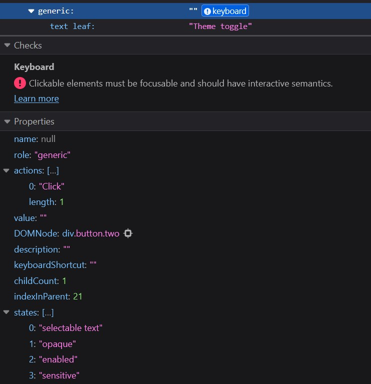
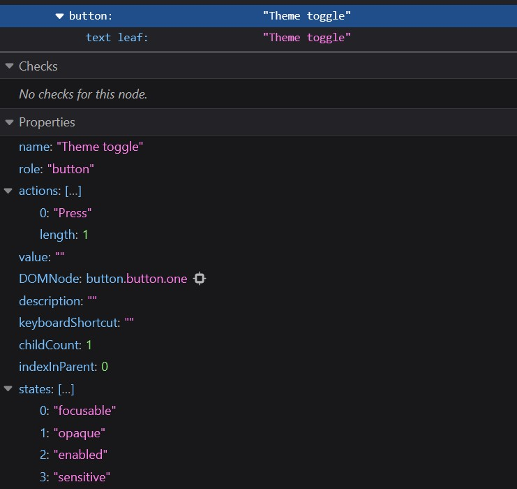
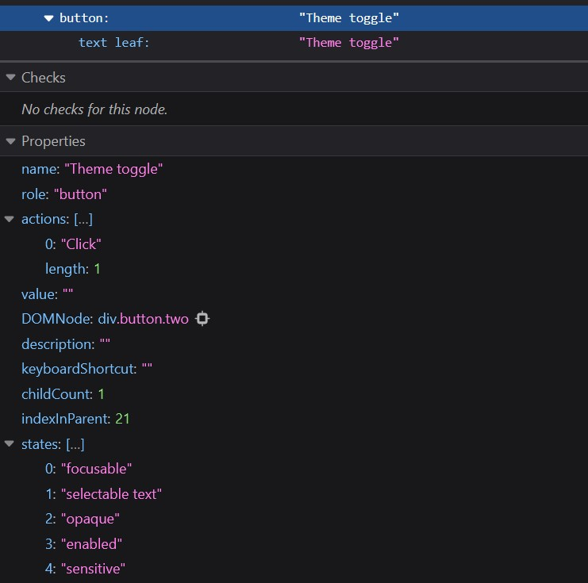
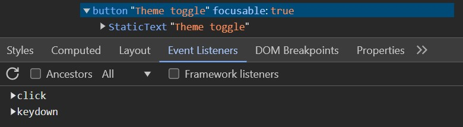

The magic of a button lies in its built-in features, ones we often overlook. Browsers recognize it's a button simply by seeing the `<button>` tag. This recognition extends to the accessibility tree, where it’s assigned a button role, something a screen reader announces to users. It’s also focusable by default, no tabindex needed. And the best part? We can activate it with the Enter key or the Space bar. 

But here’s the catch — once you swap that `<button>` for a `<div>`, all those built-in perks vanish. Suddenly, it only really works for sighted users with a mouse. If it’s not accessible to everyone, should we even call it a button?

## Really, How Bad Can a Fake Button Be?!

I often get asked this question by both junior and senior developers starting with accessibility. I used to turn on a screen reader to demonstrate the issues, but now I prefer using simpler tools: the keyboard and the accessibility tree. Each tool on its own does not reveal every issue with a fake button, but they work well together. The reason I favor this approach is because of the steep learning curve associated with screen readers. For those just beginning with accessibility, mastering the tree and keyboard navigation first is significantly easier.

So, what exactly does this approach entail? First, we'll build a "fake" button using a `<div>` and attach a click event to it. We'll look its corresponding node in the accessibility tree, paying close attention to its attributes and properties, particularly how these will be exposed to assistive technologies like screen readers or voice recognition software. When in doubt, and for reassurance, we test with the keyboard. Then, we'll repeat the process with a `<button>` and a click event.

Note: I regularly work on a Windows computer and am familiar with the accessibility tree in both Firefox and Chromium browsers. For the purpose of this exercise, I will mostly use Firefox since it offers specific clues about the accessibility shortcomings of fake buttons.


### Build a Button with a `<div>`
```html
<div class="button two">
    Theme toggle
</div>
```

```javascript
function toggleTheme() {
    const app = document.querySelector('body');
    app.classList.toggle('dark');
}

const buttonTwo = document.querySelector('.button.two');
buttonTwo.addEventListener('click', toggleTheme);
```

We simply attached a click event to a div, and now we'll examine its corresponding node in the accessibility tree. The question we are trying to answer is, "How will this node be exposed to assistive technologies like screen readers?" 

Here’s the view from Firefox’s accessibility tree:



Notice how the node’s role defaults to generic since the building block is a `div`, and it remains unnamed because generic nodes don’t have naming privileges, despite containing text. Keyboard or screen reader users will not reach it, let alone activate it, and we don’t even have to test with a keyboard to prove it. Any element that can be reached via a keyboard has a `focusable` property listed in the accessibility tree. In Firefox, it would be listed within the `states` array, and it’s clear that this node does not have it.

I do love how Firefox warns us about the absence of focus and interactive semantics, and it's even connecting us to MDN for more information. So, what are we missing? We need:
- a `tabindex` to make it focusable,
- `keydown` events for activation via `Enter` or `Space` bar, and
- a `button` role to assign it a name based on its content, like `Theme Toggle`, and to have it announced properly by screen readers.

Here's what we lack in actual code:


// HTML
```html
tabindex="0"
role="button"
```

// JavaScript
```javascript
buttonTwo.addEventListener('keydown', function(event) {
    if (event.key === 'Enter' or event.key === ' ') {
        event.preventDefault();
        toggleTheme();
    }
});
```

We could retrofit these features, or more sensibly, just …

### Build a Button with a `<button>`

```html
<button class="button two">Theme toggle</button>
```


We replaced the `<div>` with a `<button>`, and just like that we can see the improvements in accessibility:
- The `states` array now shows that the button is focusable, so tabbing to it is not at issue anymore. 
- The `name` is not null, so a screen reader would announce `Theme Toggle, button`. 
- Users relying on voice recognition software can activate it by voice command, such as `Click Theme Toggle`.

### Don't Think the Accessibility Tree is Perfect

Are all differences in functionality between the two buttons reflected in the accessibility tree? Not quite. That’s why using the keyboard is crucial. Sure, we can predict what a screen reader will say by observing the `role` and `name`, and whether it's focusable from the `states` array. But how do we verify if `keydown` events are in place? That requires actual testing. Remember, keydown events are always attached by default with `<button>` tags.

To be fair, the tree does provide some clues, but we should take them with a grain of salt. 
In Firefox, the genuine button lists a `Press` event, while the fake button shows a `Click`. This distinction might suggest that only the genuine button supports activation through various inputs beyond mouse clicks, though this isn't always foolproof. Suppose we fix our div-based button by adding `tabindex`, `role`, and `keydown` events. This is a snapshot of that node in the accessibility tree:




The updated accessibility tree shows it as a button that's focusable and named, but it still lists `Click` instead of `Press` despite the `keydown` events. Whether this is an oversight by Firefox or a subtle dig at fake buttons (just kidding!), remember: the absence of `Press` doesn't always mean the absence of `keydown` events. Stay on the safe side and always test!

Chromium browsers display a different behavior: when `keydown` events are explicitly added, the list of event listeners includes `keydown`, while the genuine button lists only `Click`. Again, always test.



## Wrappin Up

Does this approach work? I believe it does. It typically ends with developers realizing, "Now I know I shouldn't just add a click event to a div." This method not only introduces them to the accessibility tree but also reinforces the usefulness of a familiar tool — the ubiquitous keyboard. The key takeaway is always to test and envision how the component they are building will be accessible to users based on their specific accessibility needs.
