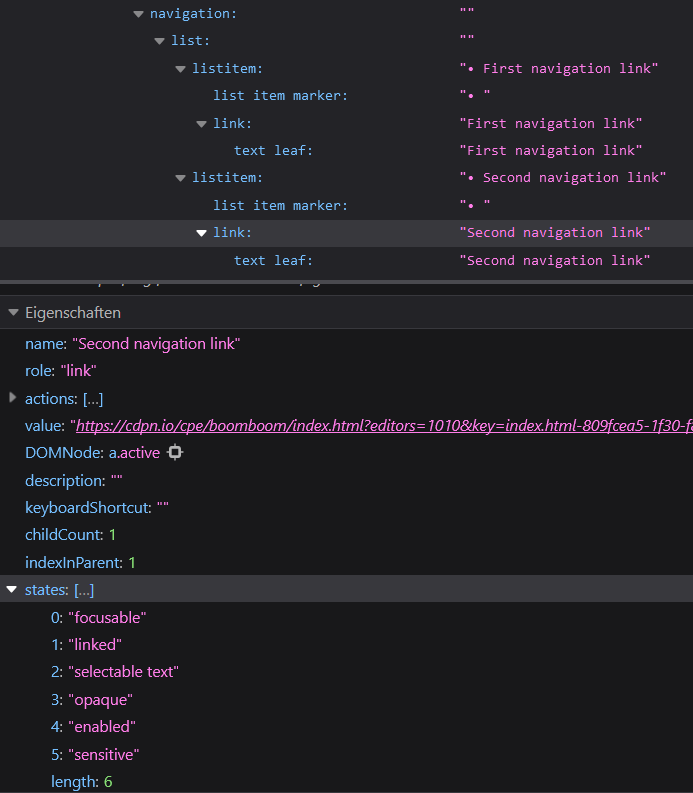
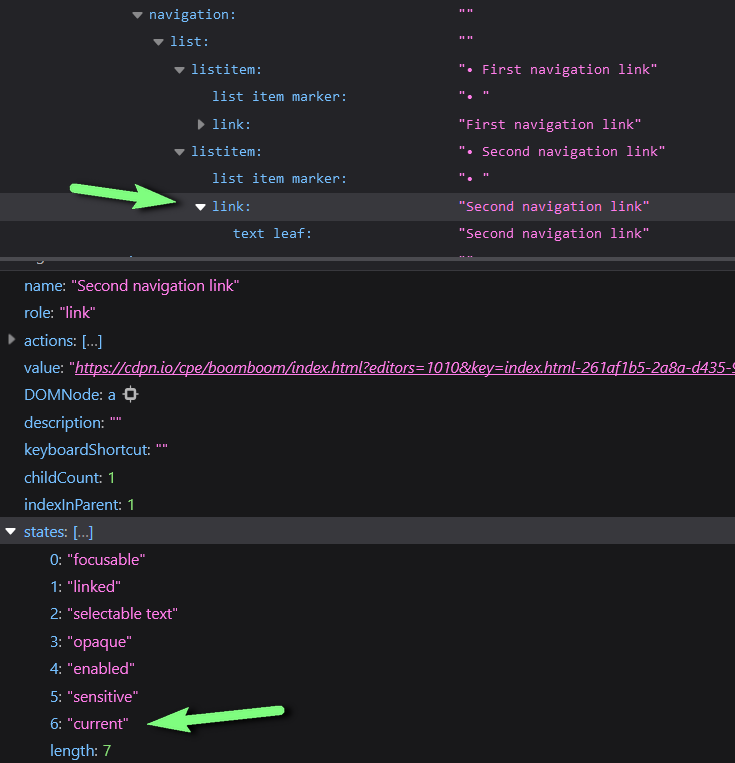
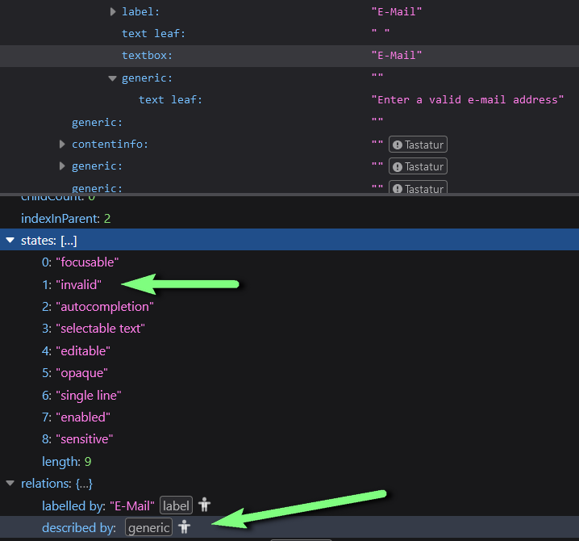

Can you remember the day you first learnt about ARIA? Maybe the first fact you learnt about [ARIA was the first rule](https://www.w3.org/TR/using-aria/#NOTES) “Don't use ARIA, use native HTML instead“ - and so did I.
<!-- MM: Du kannst davon ausgehen, dass Leute auf Social Media schreiben werden, dass das nicht die erste Regel ist. -->
As someone who has been able to speak native HTML for many years, I always thought that ARIA is not relevant for a developer like me.
How incredibly wrong I was...

## My “Wait a minute” moment

With the entry into force of the [European Accessibility Act](https://employment-social-affairs.ec.europa.eu/policies-and-activities/social-protection-social-inclusion/persons-disabilities/union-equality-strategy-rights-persons-disabilities-2021-2030/european-accessibility-act_en), accessibility has also become more important in our products, which are mainly used internally by banks.
For this reason, we have subjected our products to an accessibility audit.
One thing that really surprised me was that the auditor found fault with the following code.

```html
<nav>
  <ul>
    <li>
      <a href="#">First navigation link</a>
    </li>
    <li>
      <a href="#" class="active">Second navigation link</a>
    </li>
    <!-- more navigation links -->
  </ul>
</nav>
```

```css
.active {
  /* Highlight the selected navigation entry */
}
```

When it comes to supporting people with visual impairments, it is our job as developers to convey as much information as possible that we also display to sighted people.
People with visual impairments usually use a screen reader to consume the information on a page or application. A screen reader in turn obtains its information from the accessibility tree, which - together with the DOM tree - is generated in the browser.

<figure class="u-mb">
  
  <figcaption>The code example above represented in the accessibility tree
  </figcaption>
</figure>

The information that the second entry in the navigation references the currently active page is not transported - unlike for sighted people.

## A better approach

By using ARIA, we can influence how the browser builds the accessibility tree. Specifically, ARIA provides the `aria-current` attribute for highlighting the currently active page.

```html
<nav>
  <ul>
    <li>
      <a href="#">First navigation link</a>
    </li>
    <li>
      <a href="#" aria-current="page">Second navigation link</a>
    </li>
    <!-- more navigation links -->
  </ul>
</nav>
```

```css
[aria-current="page"] {
  /* Highlight the selected navigation entry */
}
```

Now, the information that the second navigation entry references the currently displayed page is also transferred to the accessibility tree and can be used by screen readers.



In addition, the `aria-current` attribute can also be used as a CSS hook for styling for sighted users. The `active` class initially used for this has therefore become obsolete.

## Other examples

There are other examples where we can enrich the accessibility tree using ARIA attributes, such as error messages for form fields.

```html
<label for="email">E-Mail</label>
<input type="e-mail" id="email" class="error">
<div>Enter a valid e-mail address</div>
```

The class `error` is used here to indicate fields that have been filled in incorrectly. For sighted users, the field is then styled accordingly using the class. Unfortunately, this information is not available in the accessibility tree.
There is also an error message, but it is only visually linked to the input field and not programmatically (e.g., the label is linked to the input field).
Unfortunately, we cannot enhance the accessibility tree with pure HTML. With ARIA, however, we can.

```html
<label for="email">E-Mail</label>
<input type="e-mail" id="email" aria-invalid="true" aria-describedby="e-mail-error">
<div id="e-mail-error">Enter a valid e-mail address</div>
```



In the accessibility tree, we can see that the input field is marked as invalid and a relation to the error message is created. 
Once again, we can use the `aria-invalid` attribute as a CSS hook for styling. An `error` class is not required anymore.

## Conclusion

By using ARIA, we can influence the accessibility tree and enrich it with information that the browser cannot derive from native HTML. Screen reader vendors can use the information to create a better user experience for people who rely on assistive technologies.

The accessibility tree is built up of nodes that are typified by ARIA roles. The [WAI ARIA specification](https://www.w3.org/TR/wai-aria-1.2/#roles_categorization) recognises around 90 different ARIA roles. They were defined because there is a sensible use for each of them.  By using native HTML, however, only half of these roles are met.  We can use the `role` attribute to influence the types of the nodes in the accessibility tree and achieve the entire spectrum - if it is appropriate for the use case.  Ignoring ARIA and ‘only’ using native HTML means that we are only using just under half of the richness that the accessibility tree provides.

I still don't know exactly when I heard about ARIA for the first time. But I can name the exact day when I had my wait a minute moment. Today, I know that the [first rule of ARIA](https://www.w3.org/TR/using-aria/#rule1) is often abbreviated and a crucial detail of the rule is lost. Certain things cannot be expressed semantically in HTML at all and if ARIA offers a possibility here, we should make use of it.

Perhaps we should see ARIA as a counterpart to CSS. While we use CSS to enrich our HTML document for sighted users (progressive enhancement), we can use ARIA to enrich the accessibility tree for non-sighted users.
<!-- MM: Hmm, ich weiß nicht. Das ist schon HTML und nicht ARIA. Du verleist mit dem Satz ARIA viel zu viel Bedeutung. Man kann keine Website ohne HTML bauen und eigentlich auch keine Website ohne CSS, aber man kann sehr wohl eine Website ohne ARIA bauen. Der vorherige Absatz ist eh schon ein gutes Schlusswort. -->