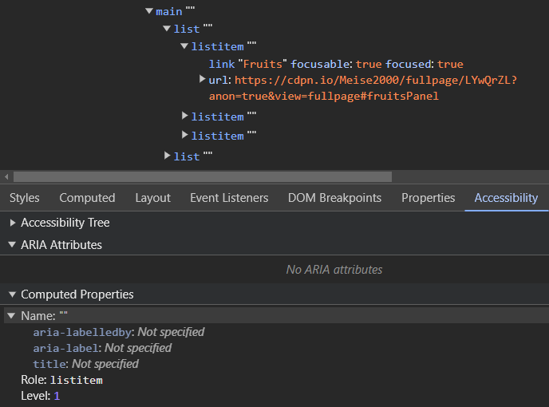
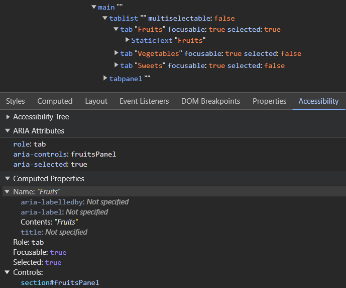

<!-- SS: I think MM has covered everything I had to say. No additional comments from me. -->
<!-- MM: I like the post but an issue I have is that it's not clear enough how using ARIA benefits users. You talk about accuracy and the importance of a rich accessibility tree but how is the second example better than the first one for users? Which problems does it solve? -->

One of the first things you learn about ARIA as a developer is the rule ‘Don't use ARIA, use native HTML instead’. This suggests that you don't need to learn ARIA at all and leads to the richness of the language rarely being utilised in its diversity. In fact, the first rule about ARIA in the W3C specification is ‘If you can use a native HTML’, which is a big difference to the rule quoted at the beginning.
<!-- MM: You are talking about the same rule, it's just that the first phrasing is shortened. When people say it, they usually also say "if possible" which is just a paraphrased version of the other rule you're citing.  -->
<!-- MM: "leads to the richness of the language rarely being utilised in its diversity" <- are you sure about that? If yes, then please elaborate. What do you base this observation on? Do you have examples where there isn't enough ARIA on a site? Which attributes are underused? Because if there's a set of roles that's quite well known and used then it's tablist, tab, and tabpanel. -->
<!-- MM: I feel like your intro would work better if you rewrote it. Instead of saying that people misinterpret the rule and thus don't use ARIA as much as they should, I'd rather take a more positive stance and say how the advice is good because HTML is accessible by default, etc. but that sometimes ARIA can give HTML a hand and help improve a11y and UX. That would align much better with your conclusion.  -->
<!-- MM: Please link to the rules: https://www.w3.org/TR/aria-in-html/#NOTES -->

This will be illustrated using the example of an HTML tab list.

```html
<main>
  <ul class="tablist">
    <li><a href="#fruitsPanel" class="active">Fruits</a></li>
    <li><a href="#vegetablesPanel">Vegetables</a></li>
    <li><a href="#sweetsPanel">Sweets</a></li>
  </ul>
  <section id="fruitsPanel">
    <ul>
      <li>🍎 Apple</li>
      <li>🍐 Pear</li>
      <li>🍌 Banana</li>
    </ul>
  </section>
  <section id="vegetablesPanel">
    <ul>
      <li>🥒 Cucumber</li>
      <li>🥕 Carrot</li>
      <li>🫒 Olive</li>
    </ul>
  </section>
  <section id="sweetsPanel">
    <ul>
      <li>🍪 Cookies</li>
      <li>🍫 Chocolate</li>
      <li>🍦 Gelato</li>
    </ul>
  </section>
</main>
```
<!-- MM: The emojis causes redundancy. VoiceOver reads red apple apple, pear pear, banana banana,... -->

With a little [CSS and JavaScript](https://codepen.io/Meise2000/full/LYwQrZL), you can display the tab list horizontally and ensure that only the area selected in the tab list is displayed. If JavaScript is not available, the user still has access to all information, as the links simply link to the corresponding position. 

## The dark side of the solution

The above solution may use semantic HTML elements, but these are not mapped in the accessibility tree with sufficient accuracy.
<!-- MM: What does sufficient accuracy means and how does it affect users? -->



The ARIA language currently recognises over 80 different roles that individual nodes can take on in the accessibility tree. Less than half of these roles have a native equivalent in HTML. In particular, there are special roles for the display of tab lists that can be used to semantically enrich the accessibility tree. Manufacturers of assistive technologies that are based on the accessibility tree can use the information to offer users a better user experience.

## A better approach

The accessibility tree can be semantically improved with the appropriate ARIA roles and attributes.

```html
<main>
  <ul role="tablist" aria-owns="tab1 tab2 tab3">
    <li><a id="tab1" href="#fruitsPanel" role="tab" aria-selected="true" aria-controls="fruitsPanel">Fruits</a></li>
    <li><a id="tab2" href="#vegetablesPanel" role="tab" aria-controls="vegetablesPanel">Vegetables</a></li>
    <li><a id="tab3" href="#sweetsPanel" role="tab" aria-controls="sweetsPanel">Sweets</a></li>
  </ul>
  <section id="fruitsPanel" role="tabpanel">
    <ul>
      <li>🍎 Apple</li>
      <li>🍐 Pear</li>
      <li>🍌 Banana</li>
    </ul>
  </section>
  <section id="vegetablesPanel" role="tabpanel">
    <ul>
      <li>🥒 Cucumber</li>
      <li>🥕 Carrot</li>
      <li>🫒 Olive</li>
    </ul>
  </section>
  <section id="sweetsPanel" role="tabpanel">
    <ul>
      <li>🍪 Cookies</li>
      <li>🍫 Chocolate</li>
      <li>🍦 Gelato</li>
    </ul>
  </section>
</main>
```

The [enriched example](https://codepen.io/Meise2000/full/XWvRgYM) uses three ARIA roles, with which some nodes in the accessibility tree receive a semantic change:

* `tablist`: Converts the element into a tab list
* `tab`: Draws the element as a clickable tab
<!-- MM: "Draws" sounds like it's chaging the visuals of the link. -->
* `tabpanel`: Indicates that this element is an area that can be displayed via the tab of a tab list

In addition, some ARIA attributes are used to mark the relationship between different elements - very similar to a for-id link with which a label can be linked to the associated input element in HTML.

* `aria-controls`: The tab element is linked to the tab panel that is displayed via this specific tab.
<!-- MM: It's worth mentioning that `aria-controls` isn't well supported and probably doesn't make a difference for users. Or you could even remove it. -->
* `aria-owns`: In the accessibility tree, the direct children of a tablist must be elements with the ‘tab’ role. Unfortunately, this does not quite harmonise with the HTML structure, as the direct children of a UL element must be elements of type LI. ARIA has the ‘aria-owns’ attribute for this circumstance. This has the effect that the referenced elements are integrated into the accessibility tree as direct children.
<!-- MM: Why do you need a <ul> and <li> in the first place when you're overwriting their roles? Why not just use <div>s? -->
* `aria-selected`: The currently selected tab can be labelled with this attribute.
<!-- MM: Using "label" here might let people think that `aria-selected` is similar to `aria-label` or `aria-labelledby` -->

The result is an accessibility tree with significantly more semantic information:



Manufacturers of assistive technologies can use this information to significantly improve the user experience. Even if not all manufacturers do this yet, it should still be the responsibility of front-end developers to create an accessibility tree that is as semantically rich as possible. Here are a few reasons:
<!-- MM: Again, you're talking about the importance of the semantically rich a11y tree. Except for maybe the first point here, none of them benefits users directly. They only improve the DX. So, what are the benefits for the user? -->

* Standards are only fully effective if they are applied as widely as possible. Utilising them therefore also means counteracting a chicken-and-egg problem.
<!-- MM: Since your approach is "HTML-first", you're already using the standard. You're just overwriting it with another standard. -->
<!-- MM: Why is this a chicken-and-egg problem?  -->
* ARIA roles and attributes can be used as CSS hooks for styling. This avoids CSS classes whose values do not follow a standard, but are always application-specific (was it now called ‘tablist’ or ‘tabList’ or ‘tabContainer’)
* Developers are likely to understand the code better as they may have already familiarised themselves with the ARIA standard in other projects

## Conclusion

When it comes to creating the markup in front-end development, the following order of priority should be applied:

1. Use native HTML in the first place
2. In addition, enrich the code with semantic descriptions provided by the ARIA language
<!-- MM: …if necessary -->
3. Add further necessary semantics with your own CSS class names as a last resort
<!-- MM: What do you mean with adding semantics using class names? -->
