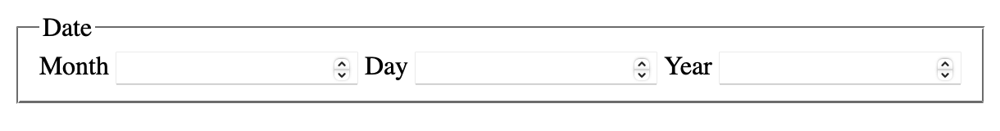

When I first stumbled upon `fieldset` and `legend`, I didn’t know much about HTML and especially not about accessibility. Everything I noticed was the special way a `legend` is displayed inside a `fieldset` – or rather: alongside the border of a `fieldset`. 

Fast forward to (kind of) today: while working on a contact form, I first could get my hands on this element and learned more about it.

## What is a `fieldset`?

Every so often I’m surprised how well chosen names in HTML are. `fieldset` is no exception here. It’s basically a list of form fields (inputs, selects, textareas). It groups all fields inside of it, and makes it a set of fields. And the `legend` is used as caption of the `fieldset` (and ultimately it becomes a caption for all of the grouped form fields).

A simple example of a `fieldset` looks like this:

```html
<fieldset>
  <legend>Date</legend>
  <label for="date-month">Month</label>
  <input name="date[month]" type="number" id="date-month">
  <label for="date-day">Day</label>
  <input name="date[day]" type="number" id="date-day">
  <label for="date-year">Year</label>
  <input name="date[year]" type="number" id="date-year">
</fieldset>
```

Which results in this:



If you can see the image, you may notice the special default design for a `fieldset`: It has a border, that is party interrupted by the `legend`. Something, that is not the easiest to achieve with other elements with CSS only. However, in the wild, you won’t often see it like this.

## Why does it matter?

While for users capable of browsing websites visually, a `fieldset` often stays hidden, since the default styling usually is changed. Only the `legend` is visible as caption for a group of fields. For screen reader users, it’s a whole different story if they use it to navigate through the content via keyboard. For every field inside the `fieldset`, the screen reader announces that it is part of a group as well as the caption. It makes sure that the user is always aware of the context of the group and that the current active field is part of a specific group.

VoiceOver for example will announce the `fieldset` as “Date, group”:


When navigating to the first form field “month”, VoiceOver will announce it as “Month, incrementable edit text number field, Date, Date, group”


Additionally, by using the `disabled` attribute, you can easily disable a whole group of fields within the `fieldset`. Feels a little bit like magic. Such disabled fields are neither editable (they ignore user inputs completely), nor will they be submit in a form.

One note though: think about it first before using it. That is also true for a `fieldset` as a whole.

Make sure fields inside a `fieldset` are actually connected to each other and even require an identical context. Otherwise, it just makes filling them slower as it should be, since the value of the `legend` will always be announced to screen reader users (in case of VoiceOver users often even twice). Use it only if the connected fields are not self-explaining if they are used alone, if you can’t properly edit a field the right way without knowing about the context of the group. While connecting multiple fields to enter a date with month/day/year actually will tell you (by a properly set `legend`) that you’re about to fill out a date, connecting two fields for first and last name won’t have any positive effect, since they can be filled correctly by their own without knowing that the other field exists.

## Usage examples

Having multiple choice questions, e.g. in a survey, is an ideal example in grouping form fields. You can use the `legend` as question and radio buttons as the answers:

```html
<fieldset>
	<legend>When did you hear about fieldsets the first time?</legend>
	
	<input type="radio" id="before-2000" name="eyes-opened" value="before 2000" />
	<label for="before-2000">Before 2000</label><br />
	
	<input type="radio" id="between-2000-2009" name="eyes-opened" value="2000 – 2009" />
	<label for="between-2000-2009">Between 2000 and 2009</label><br />
	
	<input type="radio" id="between-2010-2019" name="eyes-opened" value="2010 – 2019" />
	<label for="between-2010-2019">Between 2010 and 2019</label><br />
	
	<input type="radio" id="today" name="eyes-opened" value="2020 – today" />
	<label for="today">Between 2020 and today</label><br />
</fieldset>
```     

It could also be used to connect fields for a day, a month and a year for individual input fields to select a specific date (as seen in the first example), as well as hours and minutes to select a time (if native date and time pickers aren't an option). Or you could have different fields for a credit card number by splitting them into four digits each. You see, there are many possibilities to use `fieldset` elements, just don’t overuse them – because with many possibilities comes great responsibility – or so.

Make also sure to always test your `fieldset` elements with a screen reader to see whether adding a context in such a way is useful. This will make it easier to distinguish whether you should use a `fieldset` or better use non-connected single form fields.

