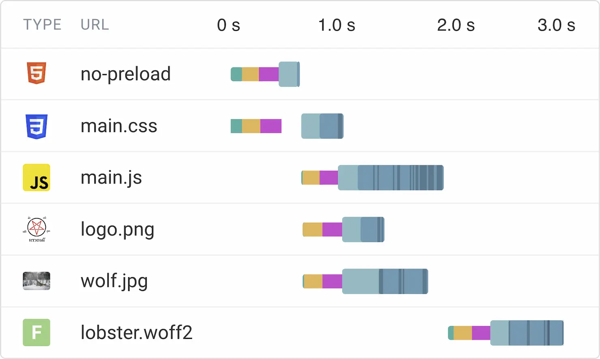
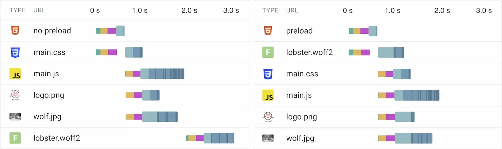

Web performance is incredibly important. If you were here for the advent calendar last year you may have already read many of my thoughts on the subject. If not, read [Getting started with Web Performance](/adventcalendar/2023/14/) when you’re done here!

This year I’m back for more web performance, this time focusing on my favourite HTML snippet for **improving the loading performance of web fonts using preloads**. This short HTML snippet added to the `head` of your page, can make a substantial improvement to both perceived and measured performance.

```html
<link
  rel="preload"
  href="/nova-sans.woff2"
  as="font"
  type="font/woff2"
  crossorigin="anonymous"
>
```

Above we have a `link` element that instructs the browser to preload the `/nova-sans.woff2` font. By preloading your critical *above-the-fold* font we can make a huge impact by reducing potential flashes of unstyled or invisible text and layout shifts caused by font loading, like here in the following video:

<figure style="margin-bottom:2.4rem">
  <video controls width="904" height="680">
    <source src="no-preload.mp4" type="video/mp4">
  </video>
  <figcaption>Recording of a page load illustrating how a font loading late can result in a jarring layout shift</figcaption>
</figure>

## How web fonts are loaded

To explain how preloading fonts can make such an impact, let’s go through the process of how web fonts are loaded. Font files are downloaded later than you may think, due to a combination of network requests and conservative browser behaviour.

In a standard web page, there will be the main HTML document which will include a CSS file using a `link` element in the `head`. If you’re using self-hosted custom fonts you’ll have a `@font-face` rule within your CSS that specifies the font name, the `src`, and possibly some other font-related properties.

In other CSS rules you specify a `font-family` so elements use your custom font.

Once our browser encounters our page it:

1. Starts streaming the HTML document, parsing it as it goes
2. Encounters the `link` element pointing to our CSS file
3. Starts downloading that CSS file, blocking the render of the page until it’s complete
4. Parses and applies the contents of that file
5. Finds the `@font-face` rule with our font URL

Okay let’s pause here for a moment —  It may make sense for step 6 to be *“Starts downloading our font file”*, however that’s not the case. You see, if a browser downloaded every font within a CSS file when it first encountered them, we could end up loading much more than is needed. We could be specifying fonts for multiple different weights, italics, other character sets/languages, or even multiple different fonts.

If we don’t need all these fonts immediately it would be wasteful to download them all, and doing so may slow down higher priority CSS or JS.

Instead, the browser is more conservative and simply takes note of the font declaration until it’s explicitly needed. The browser next:

6. Takes a note of our `@font-face` declarations and their URLs for later
7. Finishes processing CSS and starts rendering the page
8. Discovers a piece of text on the page that needs our font
9. Finally starts downloading our font now it knows it’s needed!

So as we can see there’s actually a lot that happens between our HTML file arriving in the browser and our font file being downloaded. This is ideal for lower priority fonts, but for the main or headline font this process can make our custom font appear surprisingly late in the page load. This is what causes the behaviour we saw in the video above, where the page starts rendering but it takes some time before our custom font appears.

<figure style="margin-bottom:2.4rem">
  
  <figcaption>A waterfall graph showing how our custom ‘lobster.woff2’ font doesn’t start being downloaded until 2 seconds into the page load and isn’t available until after 3 seconds</figcaption>
</figure>

This is an intentional decision by browser makers and spec writers to ensure that pages with lots of fonts aren’t badly impacted by having to load many font files ahead of time. But that doesn’t mean it can’t be optimised!

## Preloading our font with a link

```html
<link
  rel="preload"
  href="/nova-sans.woff2"
  as="font"
  type="font/woff2"
  crossorigin="anonymous"
>
```

The purpose of my favourite HTML snippet is to inform the browser that this font file will be needed with high priority, before it even has knowledge of it. We’re building our page and know more about how our fonts are used — so we can provide hints to be less conservative! If we start downloading the font as soon as possible then it can be ready ahead of when the browser ‘realises’ it’s needed.

Looking back at our list above, by adding a preload we move the start of the font download from step 9 to step 2!

1. Starts streaming the HTML document, parsing it as it goes
2. Encounters our preload and starts downloading our font file in the background
3. Encounters the `link` element pointing to our CSS file
4. *Continues as above*

Taking a closer look at the snippet, we’re using a `link` element and `rel="preload"` to ask the browser to preload a file with the intention of using it early in the page load. Like a CSS file, we provide the URL with the `href` attribute.

We use `as="font"` and `type="font/woff2"` to indicate this is a font file in `woff2`. For modern browsers `woff2` is the only format you need as it’s universally supported.

Finally there’s `crossorigin="anonymous"`. This comes from the wonderfully transparent and clear world of Cross Origin Resource Sharing. I jest of course, CORS is anything but transparent and clear!

For fonts you almost always want `crossorigin="anonymous"` on your link element, **even when the request isn’t cross-origin**. Omitting this attribute would mean our preload wouldn’t be used and the file would be requested again. But why?

Browser requests can be sent either with or without credentials (cookies, etc), and requests to the same URL with and without credentials are fundamentally different. **For a preload to be used by the browser, it needs to match the type of request that the browser would have made normally.** By default fonts are always requested without credentials, so we need to add `crossorigin="anonymous"` to ensure our preload matches a normal font request.

By omitting this attribute our preload would not be used and the browser would request the font again. If you’re ever unsure of how your preloads are working, check your browsers’ devtools. In Chrome the Network pane will show a duplicate request, and the Console will log a warning telling you a preload wasn’t used.

<figure style="margin-bottom:2.4rem">
  
  <figcaption>Screenshot showing the Chrome devtools Console pane, with warnings for an incorrect font preload</figcaption>
</figure>

## Result and conclusion

By preloading our critical fonts we ensure our browser has the most important fonts available earlier in the page loading process. We can see this by comparing our recording and waterfall charts from earlier:

<figure style="margin-bottom:2.4rem">
  <video controls width="1808" height="680">
    <source src="side-by-side.mp4" type="video/mp4">
  </video>
  <figcaption>Side-by-side recording of the same page loading in different ways. ‘no-preload’ shows a large layout shift caused by the font switching and finishes loading at 4.4s. ‘preload’ doesn’t have a shift and finishes loading at 3.1s.</figcaption>
</figure>

<figure style="margin-bottom:2.4rem">
  
  <figcaption>Side-by-side comparison of two waterfall charts of the same site with font file `lobster.woff2`. For the ‘no-preload’ document the font loads after all other assets and finishes at 3s. The ‘preload’ document shows the font loading much earlier, in parallel with other files and finishing at 2s.</figcaption>
</figure>

As I mentioned in [Getting started with Web Performance](/adventcalendar/2023/14/), it’s best to use preloads sparingly so limit this to your most important font or two. Remember that it’s a balance. By preloading too many resources you run the risk of other high-priority resources such as CSS being slowed down and arriving late. I would recommend preloading just the heading font to start with. With some testing you can see if preloading your main body font is worth it also!

With care, font preloads can be a simple and impactful optimisation opportunity and this is why it’s my favourite HTML snippet! This is a great step to improving font loading, and there are [plenty of other web font optimisations](/adventcalendar/2023/14/#6-be-bold-optimise-your-fonts) to try also!
