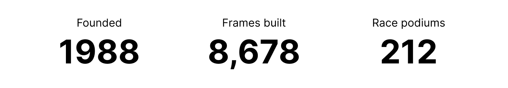
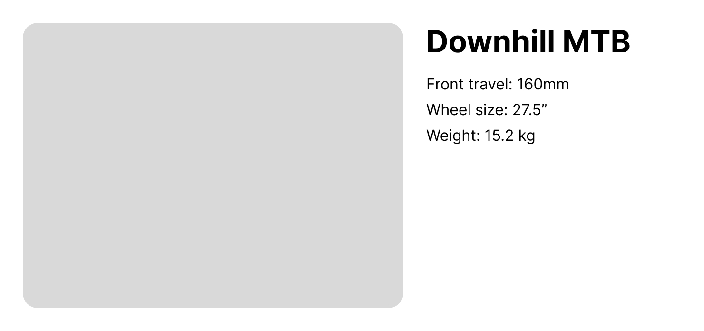

The Description List (`<dl>`) element is underrated.

It's used to group terms with their definitions, but is also a great fit for many common visual design patterns that have a key/value structure, such as product attributes or cards that have several supporting details.

Developers often mark up these patterns with overused heading or table semantics, or neglect semantics entirely. With the Description List (`<dl>`) element and its dedicated Description Term (`<dt>`) and Description Definition (`<dd>`) elements, we can improve the semantics and accessibility of these design patterns.

The `<dl>` has a unique content model:
- A parent `<dl>` containing one or more groups of `<dt>` and `<dd>` elements
- Each term/definition group can have multiple `<dt>` (Description Term) elements per `<dd>` (Description Definition) element, or multiple definitions per term
- The `<dl>` can optionally accept a single layer of `<div>` to wrap the `<dt>` and `<dd>` elements, which can be useful for styling

## Examples

An initial example would be a simple list of terms and definitions:


```html
<dl>
	<dt>Compression damping</dt>
	<dd>Controls the rate a spring compresses when it experiences a force</dd>
	<dt>Rebound damping</dt>
	<dd>Controls the rate a spring returns to it's extended length after compressing</dd>
</dl>
```

A common design pattern is "stat callouts", which feature mini cards of small label text above large numeric values. The `<dl>` is a great fit for this content:



```html
<dl>
	<div>
		<dt>Founded</dt>
		<dd>1988</dd>
	</div>
	<div>
		<dt>Frames built</dt>
		<dd>8,678</dd>
	</div>
	<div>
		<dt>Race podiums</dt>
		<dd>212</dd>
	</div>
</dl>
```

And, a final example of a product listing, which has a list of technical specs:



```html
<h2>Downhill MTB</h2>

<dl>
	<div>
		<dt>Front travel:</dt>
		<dd>160mm</dd>
	</div>
	<div>
		<dt>Wheel size:</dt>
		<dd>27.5"</dd>
	</div>
	<div>
		<dt>Weight:</dt>
		<dd>15.2 kg</dd>
	</div>
</dl>
```

## Accessibility

With this markup in place, assistive technology such as screen readers will expose a list role, the total count of term/definition groups, and offer some navigation options.

If the design doesn't include visible labels, you can at least include them as visually hidden text for assistive technology users.

## Wrapping up

The `<dl>` is a versatile element that unfortunately doesn't get much use. The next time you're building out a design, look for opportunities where the underrated Description List is a good fit.
