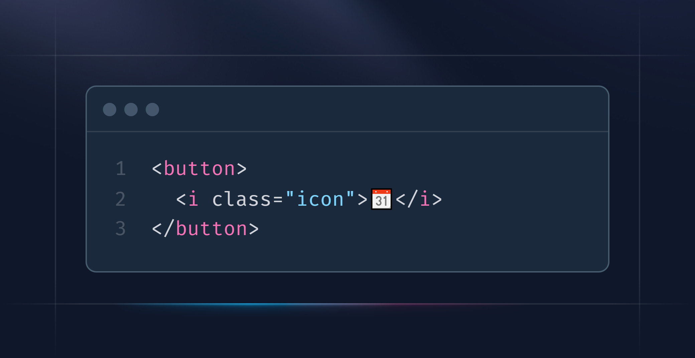
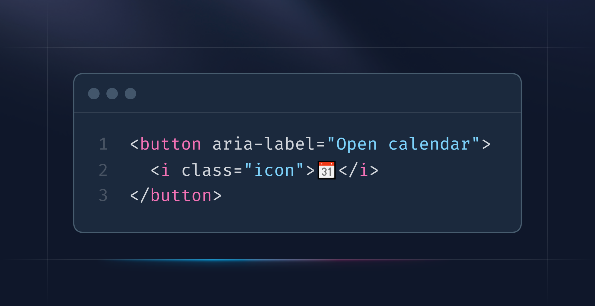
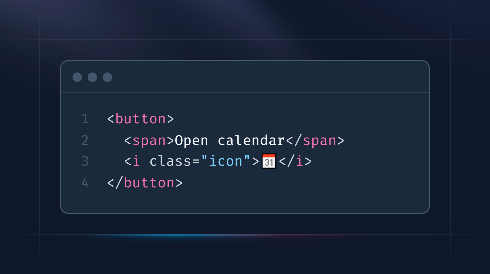
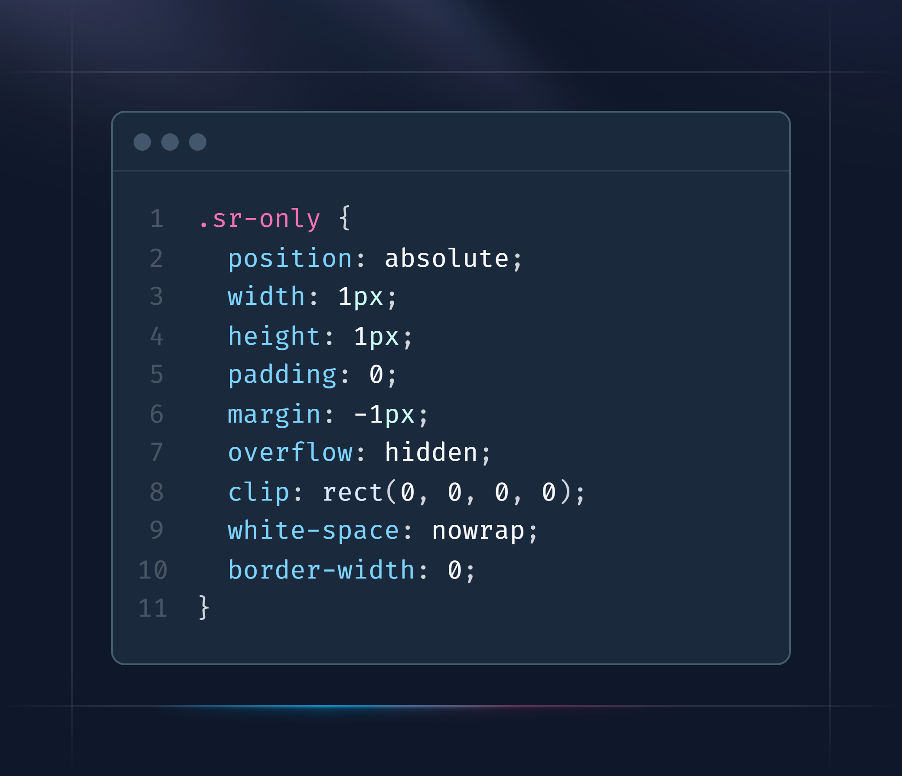
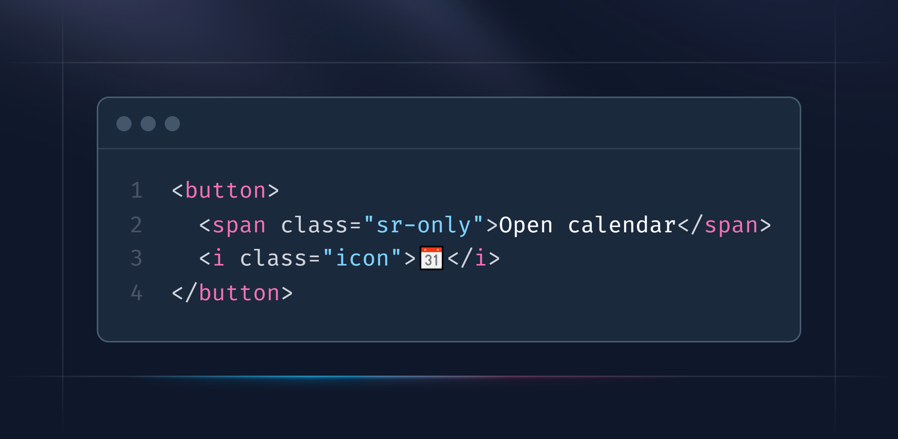
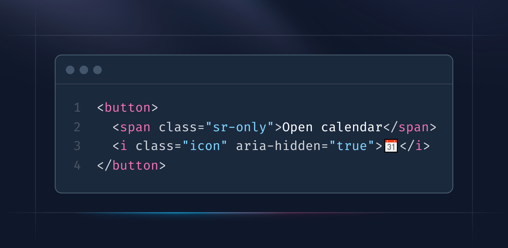

<!-- MM: Great post. I don't have much to say except that your post isn't critical enough of aria-label. I'd love to read why you prefer aria-label over .sr-only because for me it's the other way around. 

* it can be a problem with translation tools https://heydonworks.com/article/aria-label-is-a-xenophobe/ https://adrianroselli.com/2019/11/aria-label-does-not-translate.html
* devs like to forget that content can also com from attributes which often causes aria-label to contain wrong or untraslated content (based on my experience)
* when css doesn't load aria-label doesn't become visible unline .sr-only

Some posts about the topic:

https://adrianroselli.com/2020/01/my-priority-of-methods-for-labeling-a-control.html
https://ericwbailey.website/published/aria-label-is-a-code-smell/
https://www.tpgi.com/context-is-king-long-live-the-king/

And generally I'd advocate for showing text. Hidden text is problematic.

* The only users who will know it is there are screen reader users.
* It is not visible. 
* It does not help the click/tap size of the control. 
* It is not available to voice users to select a control. 
* It cannot be copied.

(Copied from https://adrianroselli.com/2020/01/my-priority-of-methods-for-labeling-a-control.html)

 -->

<!-- MM: Can we remove the screenshots since we already have the snippets in text? Doesn't look as nice but text is more accessible and the page loads faster. -->

## Introduction

Imagine you’re tasked with building a cool new feature for a product. You dive into the work with full energy, and just before the deadline, you manage to finish it. Everyone loves your work, and the feature is set to go live the next day.
A few days later, you receive an email from a user who can’t access the new feature. The user points out that they don’t understand what the button does. What do they mean? You review your code, locate the button, and start digging into the problem.



```html
<button>
  <i class="icon">📆</i>
</button>
```

## The Problem

You find some good resources explaining that there are people with disabilities who need to be considered in these cases. This is known as accessibility. For example, some individuals have motor impairments and cannot use a mouse. In this particular case, the user is visually impaired and relies on assistive technology like a screen reader, which reads aloud the content of the website or software. The button you implemented doesn’t have any descriptive text, so only the icon is read aloud. In your case, the screen reader says, “Tear-Off Calendar button”. While it describes the appearance of the icon, it doesn’t convey the purpose of the button. This information is meaningless to the user. A button should always describe what action it will trigger when activated. That’s why we need additional descriptive text.

## The Challenge

Okay, you understand the problem now and agree that it should be fixed. However, you don’t want to add visible text to the button. For design and aesthetic reasons, sighted users should only see the icon. Is there a way to keep the button “icon-only” while still providing a meaningful, descriptive text for users who rely on assistive technologies like screen readers?

## The Solution

In HTML, you are allowed to use specific attributes for accessibility, and in this case, the attribute **aria-label** is what you need. ARIA stands for [“Accessible Rich Internet Applications”](https://www.w3.org/TR/wai-aria/) and is an initiative to make websites and software more accessible to people with disabilities.

With **aria-label**, you can assign a descriptive, accessible text to a button without it being visible to sighted users. The purpose of **aria-label** is to provide a description for interactive elements that lack a visible label or descriptive text. All you need to do is add the attribute **aria-label** to the button.



```html
<button aria-label="Open Calendar">
  <i class="icon">📆</i>
</button>
```

With this adjustment, the screen reader will now announce “Open calendar”, completely ignoring the icon. This clearly communicates to the user what the button will do when clicked.

## Alternatives

There is another alternative, though it is a bit more cumbersome to implement. Instead of using the **aria-label**, you can place the text for the screen reader directly within the button element.



```html
<button>
  <span>Open Calendar</span>
  <i class="icon">📆</i>
</button>
```

However, this would make the text visible to sighted users as well. To prevent this, additional CSS is required.



```css
.sr-only {
  position: absolute;
  width: 1px;
  height: 1px;
  padding: 0;
  margin: -1px;
  overflow: hidden;
  clip: rect(0, 0, 0, 0);
  white-space: nowrap;
  border-width: 0;
}
```



```html
<button>
  <span class="sr-only">Open Calendar</span>
  <i class="icon">📆</i>
</button>
```

The CSS ensures that the text inside the span-element is hidden from sighted users but remains readable for screen readers. This approach is so common that well-known CSS libraries like TailwindCSS, Bootstrap, and Material-UI include such a class by default.

Since you’re no longer using the attribute **aria-label**, the entire content of the button will be read aloud, including the icon — something you want to avoid. ARIA provides an attribute to hide elements from screen readers so that their content isn’t read. All you need to do is add the attribute **aria-hidden** with the value “true” to the icon element, which in this case is the “i”-element.



```html
<button>
  <span class="sr-only">Open Calendar</span>
  <i class="icon" aria-hidden="true">📆</i>
</button>
```

With this approach, you achieve the same result, just with a bit more code.

## Browser compatibility

Both **aria-label** and **aria-hidden** are supported by all modern browsers and can be used without concern. The only exception is Internet Explorer. Microsoft has discontinued support for Internet Explorer, and if possible, it should no longer be used due to security reasons.

<!-- MM: IE is no longer a concern. I'd remove the last two sentences -->

## Conclusion

Ensuring accessibility in web design is more than just a nice-to-have—it’s a necessity. By implementing simple solutions like **aria-label** or combining CSS with **aria-hidden**, you can create a user experience that is both aesthetically pleasing and accessible for everyone, including those who rely on screen readers. While there may be different approaches to solving accessibility challenges, the key is to be mindful of all users' needs. A few small adjustments can make a world of difference, ensuring that your features are truly usable by everyone.

Cheers
Alex

# Resources / Links

- [Unicode Character “Tear-Off Calendar”](https://www.compart.com/en/unicode/U+1F4C6)
- [comport Unicode Website](https://www.compart.com/en/unicode/)
- [mdn web docs aria-label](https://developer.mozilla.org/en-US/docs/Web/Accessibility/ARIA/Attributes/aria-label)
- [mdn web docs aria-hidden](https://developer.mozilla.org/en-US/docs/Web/Accessibility/ARIA/Attributes/aria-hidden)
- [WAI-ARIA Standard Guidlines](https://www.w3.org/WAI/standards-guidelines/aria/)
- [Tailwind CSS Screen Readers (sr-only)](https://tailwindcss.com/docs/screen-readers)
