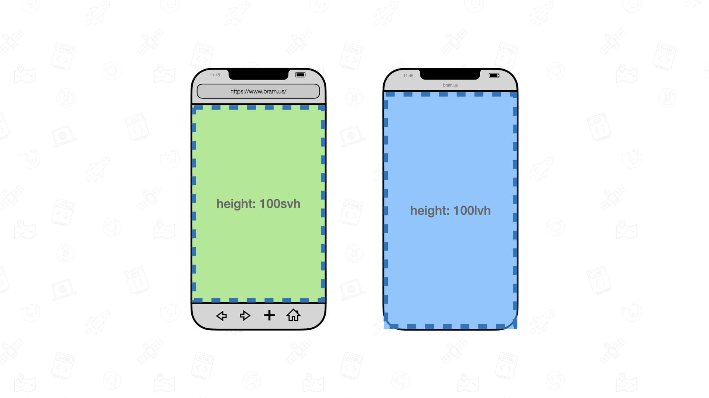
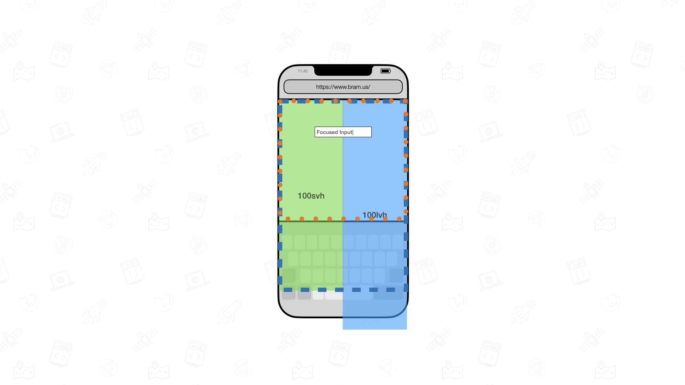
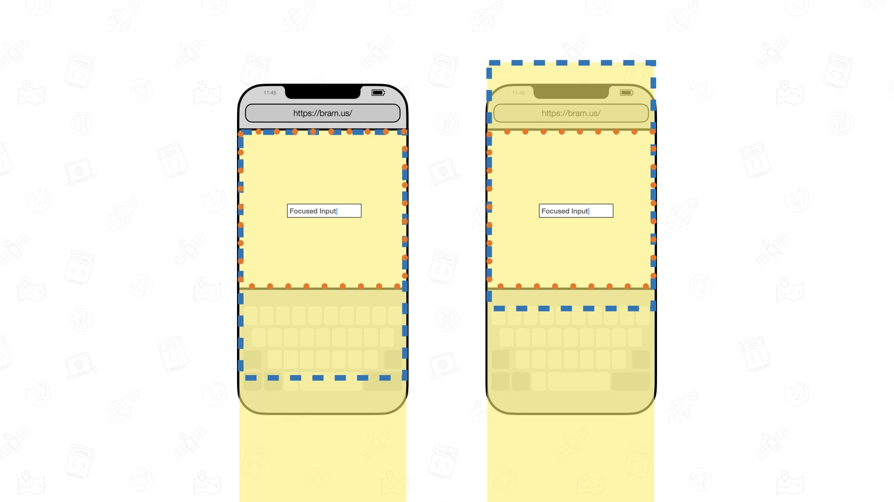
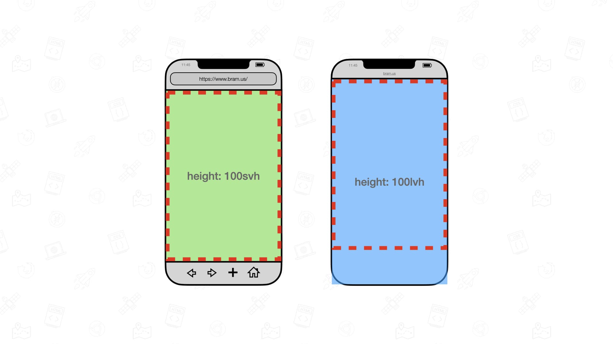
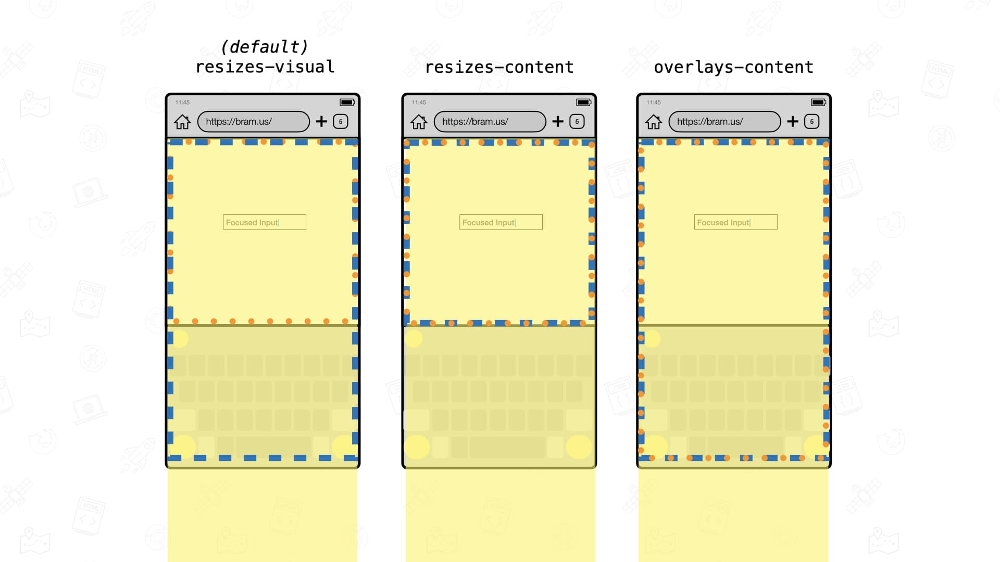
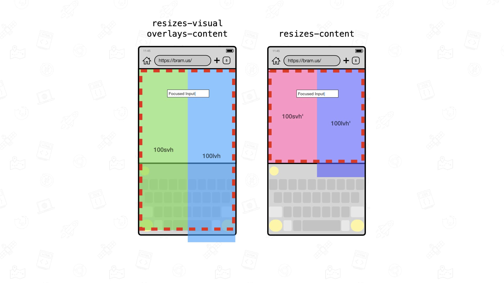

<style>
  figcaption {
    font-size: 0.8em;
    text-align: center;
  }
</style>

[Viewports units](https://github.com/web-platform-tests/interop-2022-viewport/blob/main/explainers/viewport-units.md) on mobile have been a problem for a long time. Using `100vh` is most likely not exactly what you initially expected it to be. To fix this, the CSS Working Group came up with more units over time for you to use. The [dynamic viewport units](https://web.dev/blog/viewport-units) got introduced, which include `svh` and `lvh` which represent 1% of the small and large viewport height respectively.

<figure class="u-mb">
  
  <figcaption>Two mobile browser visualizations positioned next to each other. One has an element sized to be <code>100svh</code> (left, green) and the other <code>100lvh</code> (right, blue). The blue red line represents the Layout Viewport.</figcaption>
</figure>

While these units are _fairly_ interoperable at the time of writing – there are still some interop issues, mainly related to webviews – there is one big gripe that a lot of people have with it: when the Virtual Keyboard gets shown, these units do not take the presence of that Virtual Keyboard into account. Depending on what you are building, you might want to have these units get resized when the Virtual Keyboard is shown.

## The default viewport resize behavior

When the Virtual Keyboard gets shown on mobile, it gets laid over the content. As a result, the [Visual Viewport](https://github.com/web-platform-tests/interop-2022-viewport/blob/main/explainers/visual-viewport.md) gets resized but the [Layout Viewport](https://github.com/web-platform-tests/interop-2022-viewport/blob/main/explainers/layout-viewport.md) - the one that is used to position out `position: fixed` elements – remains unchanged.

<figure class="u-mb">
  
  <figcaption>Visualization of a mobile browser with the virtual keyboard opened. The elements that have a height of <code>100svh</code> and <code>100lvh</code> are not affected by the virtual keyboard’s presence.</figcaption>
</figure>

Because the Layout Viewport does not change, the Viewport Units also don’t change. The only thing that changes is the size of the Visual Viewport, wich represents only the visual part that you see on screen.

_Note: Prior to Chrome 108, Chrome on Android used to resize the Layout Viewport when the Virtual Keyboard was shown. To align with MobileSafari, Chrome adjusted its behavior to resize only the Visual Viewport instead. Firefox did the same with the release of Firefox 132._

What sometimes also happens is that browsers shift the Layout Viewport upwards (or the Visual Viewport downwards depending on how you look at it) in order to keep the focused input at the center of the screen.

<figure class="u-mb">
  
  <figcaption>Visualization of the Visual Viewport <em>(orange dotted outline)</em> on a page with the Virtual Keyboard shown. On the right, the Layout Viewport <em>(blue dashed outline)</em> got shifted up so that the focused input is centered on the screen.</figcaption>
</figure>

## Intermezzo

If you want to know all the details about Viewports, [check out this HTTP 203 episode](https://www.youtube.com/watch?v=xl9R8aTOW_I):

<div class="video">
<iframe width="560" height="315" src="https://www.youtube.com/embed/xl9R8aTOW_I?si=5jEnH9fWKF3im80C" title="YouTube video player" frameborder="0" allow="accelerometer; autoplay; clipboard-write; encrypted-media; gyroscope; picture-in-picture; web-share" referrerpolicy="strict-origin-when-cross-origin" allowfullscreen></iframe>
</div>

The relevant part for you to know here is that the size of the [Initial Containing Block (ICB)](https://github.com/web-platform-tests/interop-2022-viewport/blob/main/explainers/icb.md) is based on the Layout Viewport – more specifically the Small Layout Viewport – and that the Viewport Units are based on the size of the ICB.

<figure class="u-mb">
  
  <figcaption>Visualization of the Initial Containing Block or ICB for short <em>(red dashed outline)</em>. It’s size is taken from the Small Layout Viewport.</figcaption>
</figure>

If you prefer reading, there are also [a bunch of explainers](https://github.com/web-platform-tests/interop-2022-viewport/blob/main/explainers/README.md) for you to review.

## The `interactive-widget` keyword in the viewport meta tag

To control the viewport's size and shape there is the viewport meta tag. Most likely you have used the following before:

```html
<meta name="viewport" content="width=device-width, initial-scale=1" />
```

In the `content` there are two properties listed, each with their own value:

- `width`: Sizes the width of the ICB. The value `device-width` indicates that it should be size in relation to the device’s width.
- `initial-scale`: Sets the zoom level when the page is first loaded. It is set to `1`, which is also the default _(in most cases)_.

Other keywords that you might have used before include `height`, `minimum-scale`, `maximum-scale`, and `user-scalable`.

A fairly new keyword that you can use in the viewport meta tag is `interactive-widget`. It allows you to specify how the various viewports should behave when _“interative widgets”_ such as the Virtual Keyboard get shown.

- `resizes-visual`: Resize only the Visual Viewport but not the Layout Viewport.
- `resizes-content`: Resize both the Visual Viewport and Layout Viewport.
- `overlays-content`: Do not resize any viewport. This is similar to using the [Virtual Keyboard API](http://brm.us/virtual-keyboard) with `overlaysContent` set to `true`.

<figure class="u-mb">
  
  <figcaption>The impact of the various values for <code>interactive-widget</code>. The orange dotted box is the Visual Viewport. The blue one is the Layout Viewport. Both resize differently depending on the value of <code>interactive-widget</code>.</figcaption>
</figure>

By setting `interactive-widget` to `resizes-content`, you can have the Layout Viewport resize. As a result the ICB will also resize, and therefore the Viewport units will also yield different values.

<figure class="u-mb">
  
  <figcaption>Visualization of the impact of setting <code>interactive-widget</code> to <code>resizes-content</code>. When that’s the case and the Virtual Keyboard is shown, the ICB resizes and the Viewport Units get adjusted.</figcaption>
</figure>

`interactive-widget` is supported in Chrome 108+ and Firefox 132+. If you would like to see this become available in WebKit/Safari, please go give <a href="https://github.com/WebKit/standards-positions/issues/65">https://github.com/WebKit/standards-positions/issues/65</a> a thumbs up.

## Summary

Use the `interactive-widget` keyword in the viewport meta tag to control the viewport resize behavior when the Virtual Keyboard gets shown. By default the Visual Viewport resizes. To also have the Layout Viewport resize, set the value of `interactive-widget` to `resizes-content`.

```html
<meta name="viewport" content="width=device-width, initial-scale=1.0, interactive-widget=resizes-content">
```

To not resize any of those viewports, set its value to `overlays-content`.

The `interactive-widget` keyword is supported in Chrome 108+ and Firefox 132+.

## Further Reading

- [The large, small, and dynamic viewport units](https://web.dev/blog/viewport-units)
- [Viewport vs Virtual Keyboard Resize Behavior](https://github.com/bramus/viewport-resize-behavior/blob/main/explainer.md)
- [Prepare for viewport resize behavior changes coming to Chrome on Android](https://developer.chrome.com/blog/viewport-resize-behavior)
- [It’s Viewports all the way down | HTTP 203](https://www.youtube.com/watch?v=xl9R8aTOW_I)
