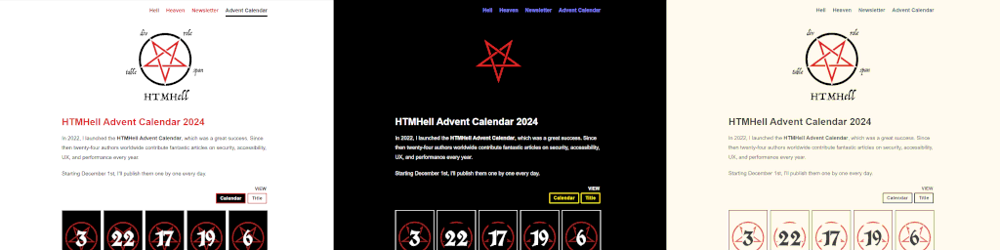
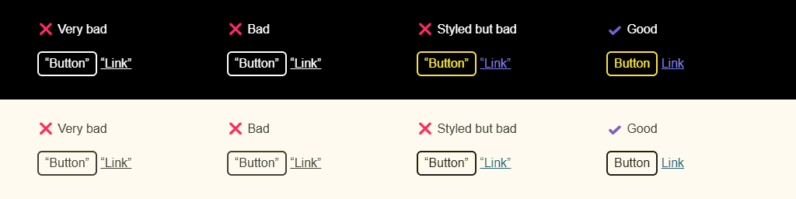

<!-- MM: Thank you, great post. For many people forced colors is still uncharted territory. So, I feel like a screenshot here and there would help, e.g. how does the button look like compared to the "button". -->
<!-- SS: Article looks good. Also, good to see a lot of reference links and codepen. I agree with MM that some screenshots about how things look in forced color mode would be nice. -->
<!-- MZ: Good idea, I've added two screenshots. -->

Are you aware of [Forced Colors Mode](https://blogs.windows.com/msedgedev/2020/09/17/styling-for-windows-high-contrast-with-new-standards-for-forced-colors/)? If not, there are some [resources](#resources) at the end. If so, did you also know that this accessibility feature can be used as an entry-level debugging tool?

<figure>
<figcaption>From left to right: The HTMHell Advent Calendar 2024 in its intended theme, when viewed in Windows&nbsp;11 contrast theme “Night Sky”, and “Desert”.</figcaption>
</figure>
<style>figure{margin-bottom:2.4rem}figure img{aspect-ratio:4;border: 6px solid #000}figcaption,style+p,section:has(#resources) span,section:has(#fns) ol{font-size:smaller}sup{position:relative;top:-.5em;vertical-align:baseline}</style>

**Note:** I’ve created a [CodePen with all the upcoming examples](https://codepen.io/cssence/pen/BaXMNyv), so you can follow along.

## Premise

When the forced colors feature is turned on, colors will be replaced with [CSS System Colors](https://adrianroselli.com/2021/02/whcm-and-system-colors.html#CSS4). Elements like buttons and links get special colors assigned, so wherever improper elements are used, things will fall out of place.

## Bad advice

Okay, surely there’s a way around this, in true HTMHell.dev spirit‽

Let’s use a `<div>` to create a button, and `<u>` to create a link. By doing the latter, our links are already underlined, but we avoid this pesky menu on right-click that feels out of place in our carefully crafted user interface.<sup><a id="ref-fn-1" href="#fn-1" role="doc-noteref" aria-label="Footnote #1">[1]</a></sup>

```html
<div class="button">“Button”</div>
<u data-href="https://example.com/very-bad">“Link”</u>
```

Thanks to the `data-href` on the link we know where to go. And yes, this means a little JavaScript will be needed to actually go there. Most likely we anyhow have a Single Page Application, so we’ll stay put.

Now all that is left to be done is style our buttons and add color to our links.<sup><a id="ref-fn-2" href="#fn-2" role="doc-noteref" aria-label="Footnote #2">[2]</a></sup>

```css
.button {
  border: .125rem solid; /* etc. */
}
u {
  color: light-dark(oklch(0.43 0.3 264.05), oklch(0.69 0.17 281.16));
}
```

All good? Sadly no, I’m sure the accessibility police will soon be all over the place.

Fine, let’s make our elements interactive. For brevity, I’m not gonna talk about all the JavaScript required, but rest assured to make things accessible we’ll need a metric fuckton of it.<sup><a id="ref-fn-3" href="#fn-3" role="doc-noteref" aria-label="Footnote #3">[3]</a></sup>

To fix the HTML, I asked artifical “intelligence”, and several prompts later I learned that we need to sprinkle some ARIA roles and tabindexes on top.

```html
<div role="button" tabindex="0" class="button">“Button”</div>
<u role="link" tabindex="0" data-href="https://example.com/bad">“Link”</u>
```

We’re good? Again, no, this is where **Forced Colors Mode** comes in. [No amount of ARIA](https://htmhell.dev/adventcalendar/2022/2/) turns our carefully crafted elements into their semantic counterparts. As such, they all will be displayed in plain CanvasText color.

Alright, let’s manually add those colors, but inside a media query, so they won’t leak into our regular theme.

```css
@media (forced-colors: active) {
  .button {
    color: ButtonText;
    background-color: ButtonFace;
  }
  u {
    color: LinkText;
  }
}
```

I was about to ask “Is this it?”, but I just realized we need a database to keep track of all the links that have already been clicked, so we can visually indicate them as `.visited`, ... — I’m gonna stop myself right there.

## Good advice

Enough of the Sisyphean labor. Let’s do the following instead.

```html
<button type="button">Button</button>
<a href="https://example.com/good">Link</a>
```

For styling, all you have to do is inherit the font for buttons, which is what your [CSS reset](https://www.joshwcomeau.com/css/custom-css-reset/#six-inherit-fonts-for-form-controls-7) might do anyhow for all form controls.

In Forced Colors Mode, things just work, buttons and links will be shown in proper CSS system colors. **Semantics for the win!**<sup><a id="ref-fn-4" href="#fn-4" role="doc-noteref" aria-label="Footnote #4">[4]</a></sup>
<!-- MM: This also applies to all the other form elements, right? Are there other elements, too? What about details/summary? -->
<!-- MZ: Well, yes and no, with the notable exception of the `mark` element, other elements are way more subtle, or anyhow displayed in CanvasText color, so it made sense to focus on buttons/links. But point taken, for the curious ones I've now added a 4th footnote that links to another CodePen, where readers can learn more. -->

<figure>
<figcaption>The <a href="https://codepen.io/cssence/pen/BaXMNyv">accompanying CodePen</a> in “Night Sky” (top) and “Desert” (bottom) contrast theme.</figcaption>
</figure>

## Full disclosure

I didn’t need to write this article, because common sense exists, right? Then again, there’s a reason why HTMHell.dev exists. (<abbr title="By the way">BTW</abbr>, thanks for having me, it’s been an honor to be part of the [2024 advent calendar](https://htmhell.dev/adventcalendar/2024/) among all those talented people.)

Initially I wrote something else, but it ended up being too long for a calendar entry. _The original article_ is now [available on my blog](https://cssence.com/2024/forced-colors-mode-strategies/). If you are up for **actual Forced Colors Mode advice,** may I suggest you read it, and then consider joining my movement to make December <q cite="https://cssence.com/2024/forced-colors-mode-strategies/">the least colorful time of the year</q>.

<section aria-labelledby="resources">

## Resources

* [Forced colors explained: A practical guide](https://polypane.app/blog/forced-colors-explained-a-practical-guide/), <span>18min read by Kilian Valkhof</span>
* [Forced colors and CSS](https://youtu.be/yYGLEy7CiT0), <span>16min video by Kevin Powell</span>
* [Windows High Contrast Mode, Forced Colors Mode And CSS Custom Properties](https://www.smashingmagazine.com/2022/03/windows-high-contrast-colors-mode-css-custom-properties/#styling-the-modal-for-forced-colors-mode), <span>11min read by Eric W. Bailey</span>
* [Forced Colors Mode Strategies](https://cssence.com/2024/forced-colors-mode-strategies/), <span>14min read by yours truly</span>

</section>
<section aria-labelledby="fns" class="section">
<h2 id="fns">Footnotes</h2>
<ol>
<li id="fn-1">Some even argue underlined links go against an app-like feel, but let’s not go there. <a href="#ref-fn-1" role="doc-backlink" aria-label="Back to article">↩︎</a></li>
<li id="fn-2">Look at those CSS functions our Fancy&nbsp;Pants author uses to add color to a link. <a href="#ref-fn-2" role="doc-backlink" aria-label="Back to article">↩︎</a></li>
<li id="fn-3">And it’s very likely that we’ll still fail to do so. <a href="#ref-fn-3" role="doc-backlink" aria-label="Back to article">↩︎</a></li>
<li id="fn-4">Mmm 🤤, semantics! If you wanna dig deeper, here’s a <a href="https://codepen.io/cssence/pen/RwXmEYN">CodePen with HTML elements</a> (unstyled, and with CSS system colors for reference) for you to view in Forced Colors Mode. Bonus points if you explore the differences between browers. <a href="#ref-fn-4" role="doc-backlink" aria-label="Back to article">↩︎</a></li>
</ol>
</section>
