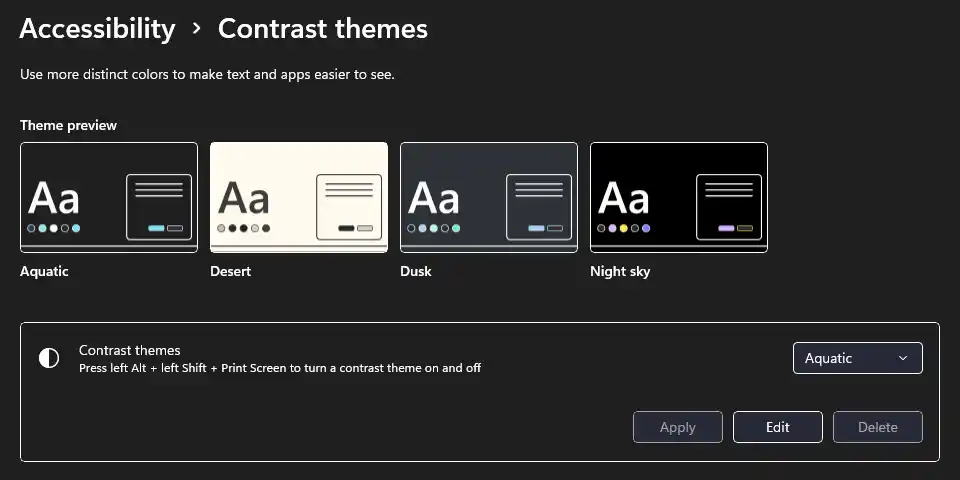

I use Linux on my personal laptop. In the corporate world I’ve been using MacOS for many years, but after my MacBook had deteriorated beyond repair, I opted against replacing it with some shiny Apple silicon. Instead, I wanted a machine where I could run Windows. Not because it’s good, but because I wanted to be able to experience screen readers like Narrator and NVDA. Up to that point I’ve only been using VoiceOver on MacOS/iOS and TalkBack on Android.

This isn’t a story about screen readers.

Instead, this is a story about Forced Colors, which is another thing I’ve started enjoying after switching to Windows. Did you ever click on _Accessibility > Displays > Increase contrast_ in MacOS, realizing that the effect is barely noticable? Well, unlike the Apple setting, [selecting a Contrast Theme in Windows](https://support.microsoft.com/en-us/windows/change-color-contrast-in-windows-fedc744c-90ac-69df-aed5-c8a90125e696#WindowsVersion=Windows_11) drastically changes the operating system’s appearance.

<figure style="margin-bottom: 2.4rem"> Contrast Themes” settings page in Windows 11, there are four predefined themes to choose from. Their names are Aquatic, Desert, Dusk, and Night Sky.">
<figcaption>You can choose one of the themes, or even create your own. Interestingly, only one of the predefined choices uses dark text on light background.</figcaption>
</figure>

This accessibility setting was called _High Contrast_ in Windows&nbsp;10, then Microsoft renamed it to _Contrast Themes_ in Windows&nbsp;11. No matter how an operating system calls the feature, on the web we only talk about Forced Colors Mode.

This isn’t a Forced Colors Mode introduction.

Instead, I’d like to share my strategies on how to tackle Forced Colors Mode in the real world. I added these strategies to my toolbelt over time, and in doing so, the topic became a first-class citizen among all the other accessibility work I do.

Why isn’t this an introduction? After all, I even gave such an introduction when I spoke at _CSS in Graz_ earlier this year. Well, to be honest, great introductions are already out there. Kilian Valkhof wrote [Forced colors explained: A practical guide](https://polypane.app/blog/forced-colors-explained-a-practical-guide/) on the Polypane blog. If you are more into video, Kevin Powell (who else?) talks about [Forced colors and CSS](https://youtu.be/yYGLEy7CiT0) on his YouTube channel.

Here’s an introductory quote from Kilian’s article:

> The main feature is that it **limits and controls the range of colors,** making it easier for users to emphasize content and UI in a way that works for them.  
> In other words, they force colors.

If this is all news to you, I encourage you to get familiar with Forced Colors before we proceed.

I’ll have some eggnog and wait for you to come back.

_\*Slurp.\*_

Good to go? Great. But to play it safe, let’s do a quick recap, to ensure we are all on the same page.

## In a nutshell

What happens when Forced Colors Mode is active?

* Background colors are removed, and
* most other colors are replaced, expect for SVG’s `fill` and `stroke`.
* Only [CSS system colors](https://developer.mozilla.org/en-US/docs/Web/CSS/system-color) are kept.
* Box and text shadows are removed.
* Background images based on `url()` are kept.
* Other background images (e.g. gradients) are removed.
* A so-called backplate gets drawn behind text to make it more legible.

This may be an oversimplification, but it’ll do. If you recall how many CSS properties can take a color, it becomes clear that this isn’t an exhaustive list.

## Why is this important?

According to Microsoft, 4% of Windows users have the feature activated. I wouldn’t be surprised if the number of people using Forced Colors is already on par with those that use Firefox as their browser. So if you care about Firefox (and you should), then you should also care about Forced Colors.

Speaking of Firefox, I’ve been using it as my main browser for years, but it wasn’t until I’ve read Kilian’s article to learn that you can activate Forced Colors Mode in settings under _General > Colors > Manage colors > Override the colors: Always._ Obviously, doing so only affects web sites and not the OS. If you are on team Chrome, you can open DevTools, hit <kbd>Ctrl/Cmd</kbd>+<kbd>Shift</kbd>+<kbd>P</kbd>, type “forced”, and you’ll find the option to _Emulate CSS forced-colors: active._

Forced Colors Mode has actually quite some history, it goes back all the way to Internet Explorer 10, when Microsoft introduced their `-ms-high-contrast` media query. Do you remember how we misused the old query to [detect Internet Explorer 10 and 11 in CSS](https://stackoverflow.com/questions/18907131/detecting-ie-version-using-css-capability-feature-detection)? Back then that was the reason I knew about the feature’s existence. Luckily these days are over. If you encounter any kind of outdated documentation, move on. Though certain articles like Adrian Roselli’s [WHCM and System Colors](https://adrianroselli.com/2021/02/whcm-and-system-colors.html) are always worth a read.

The good news is, nowadays you only have to care about the `forced-colors` media query and everything related to it. So let’s dive in.

## How to design for Forced Colors Mode?

You don’t.

<figure style="margin-bottom: 2.4rem">
<blockquote cite="https://developer.mozilla.org/en-US/docs/Web/CSS/@media/forced-colors#accessibility_concerns" style="margin-bottom: 0">In general, web authors should not be using the forced-colors media feature to create a separate design for users with this feature enabled. Instead, its intended usage is to make small tweaks to improve usability or legibility when the default application of forced colors does not work well for a given portion of a page.</blockquote>
<figcaption><a href="https://developer.mozilla.org/en-US/docs/Web/CSS/@media/forced-colors#accessibility_concerns">Accessibility concerns</a> mentioned on MDN’s <code>forced-colors</code> page.</figcaption>
</figure>

Tweaks become necessary primarily because backgrounds and shadows get removed, therefore we need other means to denote separation and hierarchy. The reduced color palette on the other hand shouldn’t cause trouble, because to be accessible we anyhow cannot convey meaning with color alone.

So we are down to white space and separator lines (borders and outlines). In reality it is only the latter, we don’t want our content to shift around by adding padding/margin in Forced Colors Mode, in other words we should only make use of the white space we already have in place.

If you’ve read [the summary in Kilian’s article](https://polypane.app/blog/forced-colors-explained-a-practical-guide/#in-summary), you’re already off to a good start.

## Strategies

I’m writing this piece for the [HTMHell.dev Advent Calendar](https://htmhell.dev/adventcalendar/2024/), so it’s time to state the obvious: Your `<div role="button">` won’t get the ButtonText system color applied, nor will your onclick-infused `<u tabindex="0">` be shown with LinkText. Instead of using the following strategies to adjust the styling of such nonsense, make sure you have semantic HTML to begin with.

### 1. Do nothing

As mentioned, we should not resort to creating a dedicated stylesheet. Instead, how about we craft our site in a way that just works for our users that have Forced Colors activated?

That would be ideal, and sometimes it’s possible. But quite often, certain tweaks may be necessary.

### 2. Hide in plain sight

Shall we start making small adjustments, but without resorting to a media query just yet?

This is where `transparent` becomes your friend. When used as `background-color`, it behaves as intended, there’s is no background color. However, when used as e.g. `border-color`, `transparent` will be replaced with the text color, so it becomes visible. This means, wherever you use a background color in your regular theme, there’s a chance you also want to add a transparent border or outline.

This strategy would not be complete without the Forced Colors poster child technique concerning the focus ring. TL;DR, never remove the `outline`, only set its color to `transparent`. Then add your regular theme’s fancy focus ring based on box shadow. Yes, the shadow will be removed in Forced Colors, but the outline will take over. (Though personally I’d recommend to just go with `outline`, now that it adheres to `border-radius`.)

```css
*:focus {
  /* `outline: none;` 👈 DO NOT do this */
  outline-color: transparent; /* 👈 do this instead */
  box-shadow: 0 0 0 .125rem var(--color-focus);
}
```

### 3. Go the extra mile

Eventually we need to implement something specifically for Forced Colors, something that should not leak into our regular theme. Media query `forced-colors` to the rescue! In addition, we can even differentiate between light and dark mode, because `prefers-color-scheme` will report one or the other depending on which contrast theme is selected. We’ll combine or nest our media queries and make adjustments accordingly.

```css
@media (forced-colors: active) {
  /* theme-independent styles for Forced Colors Mode */
  @media (prefers-color-scheme: light) {
    /* styles for themes with dark text on light background */
  }
  @media (prefers-color-scheme: dark) {
    /* styles for themes with light text on dark background */
  }
}
```

### 4. Use the force

Next up, we have the `forced-color-adjust` property. If we set it to `none`, we instruct the browser to keep the colors as they are. While this sounds like it would turn the whole Forced Colors idea on its head, the directive has its uses. Imagine a color picker: If all its colors would be set to CanvasText in Forced Colors Mode, the component would make no sense.

I have another use for the property. Sometimes I want a component to stand out in Forced Colors by inverting the colors. Badges and tooltips come to mind. Instead of displaying them CanvasText on Canvas, I flip them around. Fine, but they are both CSS system colors, as such they remain untouched in Forced Colors Mode. Why do we additionally need `forced-color-adjust`? Well, we don’t, at least not in Firefox. But the Chromiums rightfully go a bit overboard. I’ve mentioned the backplate that “gets drawn behind text to make it more legible”: After inverting the colors, the Chromiums shove a Canvas-colored backplate between our color and background color, so we end up with invisible text, i.e. not legible at all.

```css
@media (forced-colors: active) {
  .badge {
    background-color: CanvasText;
    color: Canvas;
    forced-color-adjust: none; /* prevent backplate */
  }
}
```

Keep in mind that preventing the forced color adjustment on an element also affects all of its children. Which is why this should only be done for simple UI elements. Having a link among the children would already be a problem, as the link would then be shown in its regular theme color.

### 5. Be bold

We’ve reached the opposite end of doing nothing. Sometimes it’s okay to get creative.

Consider a modal dialog. It is placed on top of other content, so the modal needs a background color. We deemphasize the still visible content around the modal with a backdrop, to visually indicate that the rest of the page is inert. A stark box shadow is attached to the modal to mimic elevation. In Forced Colors Mode we are derived of many of those things. To compensate, we can [add a thick outline around the modal](https://www.smashingmagazine.com/2022/03/windows-high-contrast-colors-mode-css-custom-properties/#styling-the-modal-for-forced-colors-mode).

When it comes to the size of separator lines, I tend to use at least ten pixels for modals, three or four for custom dropdowns, two for buttons and one for most other things, like table rows. And whenever I need even more variety, I change the border/outline style to dotted, dashed, or double.

### 6. Know where to stop

We have quite a few system colors at our disposal, and even AccentColor and AccentColorText will hopefully get Baseline support soon. But I urge you to not use these colors beyond their intended purpose, as you may end up confusing people. If you do make an exception, use good judgement. Case in point, I like what Eric W. Bailey did for Forced Colors when [he updated his A11Y Syntax Highlighting](https://ericwbailey.design/published/a11y-syntax-highlighting-has-been-updated/).

Having made it this far, you already know we are not dealing with the [alpha channel](https://developer.mozilla.org/en-US/docs/Glossary/Alpha) of a color in Forced Colors Mode. So it may seem counterintuitive to hear that `opacity` does work. That said, my recommendation would be to not use it, or limit its use to styling `:disabled` controls.

### 7. Over to you

Are you already a Forced Colors Mode expert? Anything you’d like to add? Let me know [on Mastodon](https://mas.to/@CSSence).

## The real world

Web browsers have made a lot of progress in recent years, so much so that we’ve become rather comfortable and assume that things work cross-browser. Sadly, in Forced Colors Mode that is not the case. How long a feature has been with us seems to make no difference. For instance, [the complex but awesome CSS `border-image` property](https://www.smashingmagazine.com/2024/01/css-border-image-property/) is probably not something you want to make use of, as Chromium-based browsers keep actual images and also gradients, but Firefox removes both. New features can also be a breading ground for inconsistencies, the other day I ran into [an issue with `color-mix()`](https://cssence.com/2024/color-mix-in-forced-colors-mode/). How browsers apply the backplate would warrant a dedicated article, expect inconsistencies there too. I could go on.

The cross-browser issues I’ve mentioned imply that **you have to test** in Firefox and at least one of the Chromiums. Until Apple decides to support Forced Colors, don’t fret about Safari. I encourage you to test twice, first with a theme that uses light text on dark background, and then the other way round. In doing so, you’ll be able to spot content that is invisible in just one of the two themes.

## Before you go

When I first selected a contrast theme in Windows, I immediately liked how slick and clean the user interface looked. Contrary to when I’m testing with screen readers, where after prolonged periods of time I end up feeling exhausted, this is something I don’t mind leaving turned on.

Do you use Forced Colors all year around? If not, do you have Windows (or Firefox) nearby? How about you make **December** the month where you have Forced Colors turned on? Maybe you find it as comforting as I do. In that case, the least colorful time of the year can become [the most wonderful time of the year.](https://youtu.be/AN_R4pR1hck)
