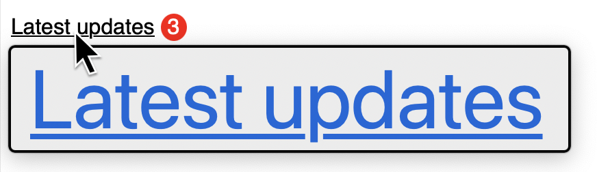

<!-- KS: Agreed that a more tangible, less spec-sounding intro w/ example
     would help readers understand where you're going a bit better. -->

By default, UI components have their accessible name (the programmatically associated label that assistive tech, like screen readers announce) computed from their own contents. That's part of the [spec'd algorithm](https://www.w3.org/TR/accname-1.1/) that browsers implement.

<!-- SS: Agree with the comments left by MM. No additional comments. -->

<!-- MM: A simple example + caption whould be great here. Something like:
<figure class="u-mb">

  ```html
  <a href="/updates">
    Latest updates
  </a>
  ```

  <figcaption>A link with the accessible name "Latest updates"</figcaption>
</figure> -->

`aria-labelledby` can be used to point the algorithm somewhere else in the DOM. Or not.

What happens if `aria-labelledby` points within?

## Purgatory

```html
<a href="/updates" aria-labelledby="contents">
  <span id="contents">Latest updates</span>
</a>
```

## Testing

The above snippet should be equivalent to `<a href="/updates"><span>Latest updates</span></a>`. Are there any issues besides being unnecessarily verbose code (and breaking the [first rule of ARIA](https://www.w3.org/TR/using-aria/#rule1))?

Technically, the [WAI-ARIA spec](https://www.w3.org/TR/wai-aria/#aria-labelledby) does not limit the DOM location of the element you point to.

I also checked how each major browser computes the element's accessible name via their developer tools (for example, [Chrome's DevTools](https://developer.chrome.com/docs/devtools/accessibility/reference#computed)):

- Chrome (129) ✅
- Edge (129) ✅
- Firefox (131) ✅
- Safari (18.1) ✅

I did only test those browsers on macOS, and I didn't test with different assistive technologies. But I trust that if the browser's tools show an accessible name of `"Latest updates"`, screen readers and voice control will have that value too.

## Judgement

As is, I'd feel like I was nitpicking by requesting the unnecessary `aria-labelledby` to be removed.

But imagine this is in a large codebase with many developers working on it. Consider how easy it would be for someone tasked with adding a notification badge to the link, for example, to miss the implications of `aria-labelledby`:

```html
<a href="/updates" aria-labelledby="contents">
  <span id="contents">Latest updates</span>
  <span class="notification-badge">{{ updates.length }}</span>
</a>
```

<!-- MM: Wrap in figure and use a caption "A link with the accessible name "Latest updates"" -->

Now the count of updates is **not** part of the link's accessible name. Screen readers will not announce it. macOS Voice Control users will not be able to say "click Latest updates three" (you would need to omit the "three", macOS Voice Control requires you to say the accessible name exactly). [macOS Hover Text](https://support.apple.com/guide/mac-help/view-a-larger-version-text-reading-typing-mchlb203bc78/mac) will miss the count as well.



And it's a failure of [WCAG SC 2.5.3 Label in Name](https://www.w3.org/TR/WCAG22/#label-in-name) to boot.

So put this link on a heavenly path and drop the `aria-labelledby`! Your future self will thank you.

## Caveats

There are good reasons to point `aria-labelledby` within an element. For example, to [give an accessible name to a region](https://www.w3.org/TR/wai-aria/#example-27) based off of the heading within it.

<!-- MM: To make a case for the usefuleness of the technique, you could also show a code snippet here instead of just linking. -->

I tend to only be wary when the element with `aria-labelledby` is an interactive control (link, button, etc).
