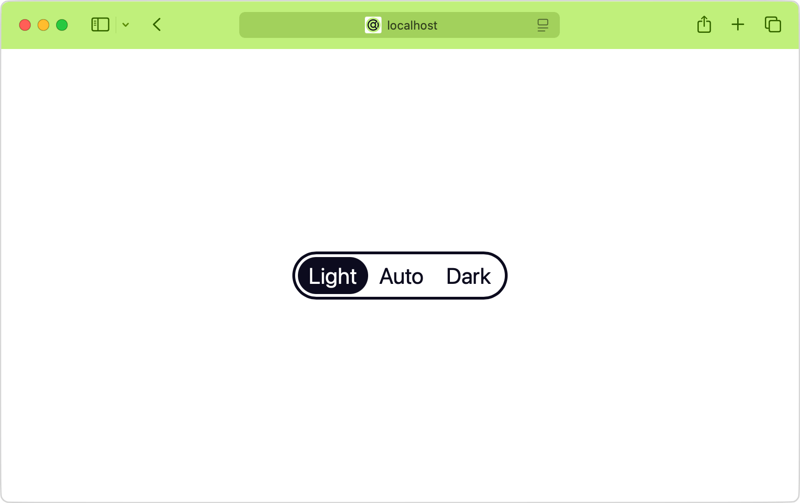
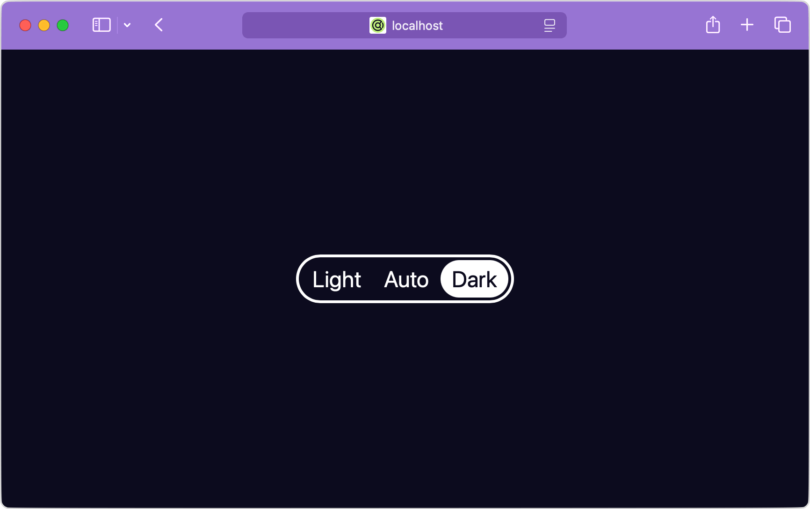

It’s getting dark early in Berlin in the winter. It’s not even close to evening, but my OS and all apps have already switched to dark mode. Well, not all of them, unfortunately. And that’s the thing: dark mode has become a quality-of-life feature for many users, and I often try to avoid using apps or websites that haven’t implemented it, especially in the evening. They literally hurt my eyes!

When it comes to color scheme implementations, they range from rather useless ones that require a page reload to more sensible ones that query the `prefers-color-scheme` media feature and apply changes in CSS on the fly:

```css
body {
  background-color: #000000;
  color: #ffffff;

  @media (prefers-color-scheme: dark) {
    background-color: #000000;
    color: #ffffff;
  }
}
```

<aside style="font-size: smaller">

⭐ I’ll be using [native CSS nesting](https://developer.mozilla.org/en-US/docs/Web/CSS/CSS_nesting/Using_CSS_nesting) in all demos throughout this article. It works in all modern browsers and makes code a bit more compact, especially when it comes to media queries. But if you’re not familiar with CSS nesting, you can use this handy [Lightning CSS playground](https://lightningcss.dev/playground/#%7B%22minify%22%3Afalse%2C%22customMedia%22%3Atrue%2C%22cssModules%22%3Afalse%2C%22analyzeDependencies%22%3Afalse%2C%22targets%22%3A%7B%22chrome%22%3A6225920%7D%2C%22include%22%3A0%2C%22exclude%22%3A0%2C%22source%22%3A%22body%20%7B%5Cn%20%20background-color%3A%20%23000000%3B%5Cn%20%20color%3A%20%23ffffff%3B%5Cn%20%20%5Cn%20%20%40media%20(prefers-color-scheme%3A%20dark)%20%7B%5Cn%20%20%20%20background-color%3A%20%23000000%3B%5Cn%20%20%20%20color%3A%20%23ffffff%3B%5Cn%20%20%7D%5Cn%7D%22%2C%22visitorEnabled%22%3Afalse%2C%22visitor%22%3A%22%7B%5Cn%20%20Color(color)%20%7B%5Cn%20%20%20%20if%20(color.type%20%3D%3D%3D%20'rgb')%20%7B%5Cn%20%20%20%20%20%20color.g%20%3D%200%3B%5Cn%20%20%20%20%20%20return%20color%3B%5Cn%20%20%20%20%7D%5Cn%20%20%7D%5Cn%7D%22%2C%22unusedSymbols%22%3A%5B%5D%2C%22version%22%3A%22local%22%7D) to figure out how it looks without nesting.

</aside>

This approach is already a good start. But it only covers the simplest case and doesn’t allow users to choose a different color scheme for this specific website. Just like light color schemes hurt my eyes in the evening, many people are not comfortable with dark schemes or with particular ones that aren’t good for them. So, it’s all about user choice.

Currently, there’s no way to directly override a user’s OS preference if you want to offer a scheme selector on your page. Fortunately, in the CSS Media Queries Level 5 spec, there’s a [`PreferenceManager` interface](https://drafts.csswg.org/mediaqueries-5/#auto-pref%E2%91%A0) that will solve this problem. Meanwhile, the most popular solution these days is to use JavaScript to set an attribute like `<html data-scheme="dark">` reflecting the forced scheme and use it in CSS:

```css
body {
  background-color: #000000;
  color: #ffffff;

  [data-scheme='dark'] & {
    background-color: #000000;
    color: #ffffff;
  }
}
```

This approach always seemed hacky to me. However, if you know HTML well enough, there are a few much more convenient native options available.

## Setting the CSS color-scheme

If you ever fall into the dark scheme rabbit hole, the first thing you’ll learn is the `color-scheme` CSS property. It’s essential for setting the scene for everything else. Most importantly, it turns on the browser’s default dark scheme support. Which, unfortunately, browsers can’t enable by default for backward compatibility reasons.

```css
:root {
  color-scheme: light dark;
}
```

The `light dark` value means that we’re choosing to support both light and dark schemes in our code. The property will be inherited down the document tree, and the browser will enable some default styling for built-in primitives when needed. Thank you, browser!
<!-- MM: A screenshot of a simple HTML doc in both modes would be great. -->

When switching your schemes, it’s important to switch the value of this property, too: set `color-scheme: light` on the root along with light styles and the other way around for the dark ones. Remember this, it’ll come in handy later.

And somewhere along these lines, you’ll probably read that you can also set this mode right in HTML using the `<meta>` element. Why would you do that? Oh well, who knows? Maybe you don’t use CSS or whatever. So silly, right?

```html
<meta name="color-scheme" content="light dark">
```

It turns out that it’s not just a flag for the browser but a tool you can use to force color schemes using JavaScript! But only if you use the fairly new [`light-dark()`](https://developer.mozilla.org/en-US/docs/Web/CSS/color_value/light-dark) CSS function.

## Switching the HTML color-scheme

Remember the earlier example with media queries and `‌prefers-color-scheme`?

```css
body {
  background-color: #ffffff;
  color: #000000;

  @media (prefers-color-scheme: dark) {
    background-color: #000000;
    color: #ffffff;
  }
}
```

You can also express the same idea like this:

```css
body {
  background-color: light-dark(#ffffff, #000000);
  color: light-dark(#000000, #ffffff);
}
```

<aside style="font-size: smaller">

⭐ By the way, I use `--color-back` and `--color-text` variables in my demos. It makes it easier to set colors even in a small demo, let alone a bigger project. But to make things easier to read, I chose to set colors directly in code samples.

</aside>

Here’s the three-position switch I often use. Along with “light” and “dark” options that force a certain scheme, there’s also the “auto” option that gives the control over the color scheme back to the OS, selected by default.

```html
<section aria-label="Color scheme switcher">
  <button aria-pressed="false" value="light">
    Light
  </button>
  <button aria-pressed="true" value="light dark">
    Auto
  </button>
  <button aria-pressed="false" value="dark">
    Dark
  </button>
</section>
```

And to make it all work, a simple script that takes the button’s value and sets it to the `<meta name="color-scheme">`:

```js
const colorScheme = document.querySelector('meta[name=color-scheme]');
const switchButtons = document.querySelectorAll('button');

switchButtons.forEach(button => {
  button.addEventListener('click', () => {
    const currentButton = button;

    switchButtons.forEach(
      button => button.setAttribute(
        'aria-pressed', button === currentButton
      )
    );

    colorScheme.content = button.value;
  });
});
```

As you can see, once we set `content="dark"` the browser switches to the last value in the `light-dark()` function and the other way around with the `light` one. This HTML’s `color-scheme` turned out not so silly after all!

To make it work properly, you’ll need to decide where to store your global `color-scheme` value, so the script can force it. In this example, I chose to use the HTML one, so I removed the `color-scheme` property from CSS. But you can also keep it in CSS and force it via JavaScript like so:

```html
<html style="color-scheme: dark">
```

<figure style="margin-bottom: 2.4rem">
  <iframe src="color-scheme" style="
    width: 100%;
    height: 256px;
    border: 6px solid #000;
  "></iframe>
  <figcaption>
    Meta <code>color-scheme</code> switcher in action.
    <a href="color-scheme" target="_blank">Open in a new tab</a>
  </figcaption>
</figure>

<aside style="font-size: smaller">

⭐ For a good UX, you’ll also need a way to store user preference somewhere in [`localStorage`](https://developer.mozilla.org/en-US/docs/Web/API/Window/localStorage), so the users won’t have to switch it next time they visit or when opening a new tab. I’m sure you can figure it out on your own!

</aside>

One of the downsides of this approach is the browser support: the `light-dark()` CSS function has been available in all modern browsers since May 2024, which makes it “newly available” on the [Baseline](https://web-platform-dx.github.io/web-features/) scale. It will become “widely available” only around November 2026 or 30 months later. You can transpile it for older browsers using [Lightning CSS](https://lightningcss.dev/) or [PostCSS plugin](https://github.com/csstools/postcss-plugins/tree/main/plugins/postcss-light-dark-function), but make sure you check the output and test it in an older browser. It might be a bit tricky at times.

As for the other major downside, the `light-dark()` function accepts only colors for now. Trust me, I tried to use it with other values, and it didn’t work. So, what’s the problem? You might need to change not just colors but images or font properties that work better with the dark scheme.

In this case, there’s another HTML solution for you!

## Linking a CSS scheme

You all know the most common way of linking CSS to a page: it’s a stylesheet linked from a file.

```html
<link rel="stylesheet" href="index.css">
```

But did you know that you can also set the `media` attribute to conditionally load and apply CSS based on user preferences? Sure you can! But first, you’d need to split your files into light and dark styles:

```html
<link
    rel="stylesheet"
    href="light.css"
    media="(prefers-color-scheme: light)"
>
<link
    rel="stylesheet"
    href="dark.css"
    media="(prefers-color-scheme: dark)"
>
```

It doesn’t look too convenient this way. A much better approach would be to split your styles into _three_ parts! Yes, I’m serious. Hear me out!

1. The main file, called `index.css`, will contain all your styles and use CSS variables for anything you need to change depending on a color scheme.
2. The `light.css` file will contain only CSS variables with values set to everything that makes sense for the light scheme.
3. The `dark.css`, you guessed it, will have everything dark.

Remember to set the appropriate `color-scheme` property values in each color scheme file to help the browser: `color-scheme: light` and `color-scheme: dark`, respectfully.

Interestingly enough, the file that doesn’t fit user preferences will still be loaded by the browser but with lower priority. I went into much greater detail about this in my other “[Condi­tionally adaptive CSS](https://pepelsbey.dev/articles/conditionally-adaptive/)” article if you’re curious.

So, this three-file CSS architecture now has all the inconveniences and no benefits compared to the previously discussed solution with media queries. What now? Don’t you worry, it was just the first step. Now, to the switching.

## Switching linked CSS schemes

When you’re linking your much simpler single-file styles, there’s something else you’re _implicitly_ setting: the `media` attribute. If it’s not _explicitly_ set, it means that you want your styles to apply to all [media types](https://developer.mozilla.org/en-US/docs/Web/CSS/@media#media_types). So, it defaults to `all`:

```html
<link rel="stylesheet" href="index.css" media="all">
```

[There are techniques](https://www.filamentgroup.com/lab/load-css-simpler/) using `media="print"` for lazy-loading CSS, but since we’ve learned that the `media` attribute can take not only media types but complex media queries, you can negate it as `not all` and it won’t be applied to any media.

```html
<link rel="stylesheet" href="index.css" media="not all">
```

But why would you need _not_ to load your styles? Now you see where it’s going. We can use it to switch between color schemes and force user preferences.

Let’s take the same three-position switch from the previous example but change the auto button’s value to `auto` to better match what it does. Our JavaScript function becomes a bit bigger, but the idea stays the same. The only difference this time is that we’re changing the `media` attribute’s value:

```js
const styleLight = document.querySelector('link[rel=stylesheet][media*=prefers-color-scheme][media*=light]');
const styleDark = document.querySelector('link[rel=stylesheet][media*=prefers-color-scheme][media*=dark]');

function switchScheme(scheme) {
  let lightMedia;
  let darkMedia;

  if (scheme === 'auto') {
    lightMedia = '(prefers-color-scheme: light)';
    darkMedia = '(prefers-color-scheme: dark)';
  } else {
    lightMedia = (scheme === 'light') ? 'all' : 'not all';
    darkMedia = (scheme === 'dark') ? 'all' : 'not all';
  }

  styleLight.media = lightMedia;
  styleDark.media = darkMedia;
}
```

In short, if we force the dark scheme, the `dark.css` gets `media="all"` instead of the `prefers-color-scheme` and the `light.css` one gets `‌media="not all"`, and the other way around for the light scheme. Once the user chooses the “auto” option, we stop forcing and restoring all previous `prefers-color-scheme` media values.

<figure style="margin-bottom: 2.4rem">
  <iframe src="link-media" style="
    width: 100%;
    height: 256px;
    border: 6px solid #000;
  "></iframe>
  <figcaption>
    Link <code>media</code> switcher in action.
    <a href="link-media" target="_blank">Open in a new tab</a>
  </figcaption>
</figure>

<!-- MM: Consider adding basic styles for [aria-pressed="true"] -->

Given that scheme files containing only variables are relatively small, and browsers download all CSS files anyway (only the priority differs), the switching happens seamlessly. You can check this method in action [on my website](https://pepelsbey.dev/). And if you happen to use Safari or Vivaldi browsers, you might notice something else changing while you switch the schemes.

## One more thing

There’s the [`theme_color`](https://developer.mozilla.org/en-US/docs/Web/Manifest/theme_color) key in the web manifest that sets the installed app’s chrome color. You can also set it via HTML and even use the `media` attribute to apply different theme colors depending on the color scheme:

```html
<meta
  name="theme-color"
  content="#c1f07c"
  media="(prefers-color-scheme: light)"
>
<meta
  name="theme-color"
  content="#9874d3"
  media="(prefers-color-scheme: dark)"
>
```

I bet you saw that coming: you can also force the theme color while switching the color scheme using `all` and `not all` values via the same script. How cool is that?

<figure style="margin-bottom: 2.4rem">



<figcaption>
  Lime <code>theme-color</code> for the light scheme in Safari.
</figcaption>
</figure>

<figure style="margin-bottom: 2.4rem">



<figcaption>
  Violet <code>theme-color</code> for the dark scheme in Safari.
</figcaption>
</figure>

## Homework

As all of us did, I learned most of what I know from other people’s posts and articles. I want to say a special thank you to Thomas Steiner for his early articles on color scheme switching: [Prefers-color-scheme: Hello darkness, my old friend](https://web.dev/articles/prefers-color-scheme#dark-mode-but-add-an-opt-out) and [Improved dark mode default styling with the color-scheme](https://web.dev/articles/color-scheme). Please also have a look at Darin Senneff’s [Progressively-enhanced dark mode](https://www.darins.page/articles/progressively-enhanced-dark-mode) and Sara Joy’s [Come to the light-dark() side](https://css-tricks.com/come-to-the-light-dark-side/) articles for a different perspective on the matter. And let’s dream about a better future for color scheme switching while reading Bramus’ [What if you had real control over light mode / dark mode on a per-site basis?](https://www.bram.us/2024/04/13/what-if-you-had-real-control-over-light-mode-dark-mode-on-a-per-site-basis/) article.

<!-- MM: Great work, thanks! Probably too much for the scope of this post, but Roma wrote an article about querying color schemes. You might find it interesting https://blog.kizu.dev/querying-the-color-scheme/ -->