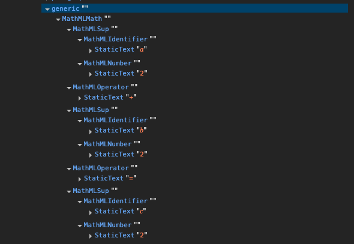

Maybe it has happened to you that you wanted to write some formulas in HTML to display them on a website, and even though there are multiple ways to do it, accessibility is often not considered in the process. How the formula is read by screen readers is crucial to ensure that we don't leave anyone behind.

Even though the web is full of many different and interesting approaches, the reality is that [MathML](https://developer.mozilla.org/en-US/docs/Web/MathML) is usually the best option for this problem. It has its own syntax and was not originally designed for the web, but MathML provides various elements that give the correct semantics to the different parts of a formula.

Let's take the famous Pythagorean Theorem as an example.

<section style="margin-bottom: 2rem" >
  <math xmlns="http://www.w3.org/1998/Math/MathML">
    <msup>
      <mi>a</mi>
      <mn>2</mn>
    </msup>
    <mo>+</mo>
    <msup>
      <mi>b</mi>
      <mn>2</mn>
    </msup>
    <mo>=</mo>
    <msup>
      <mi>c</mi>
      <mn>2</mn>
    </msup>
  </math>
</section>

```html
<math xmlns="http://www.w3.org/1998/Math/MathML">
  <msup>
    <mi>a</mi>
    <mn>2</mn>
  </msup>
  <mo>+</mo>
  <msup>
    <mi>b</mi>
    <mn>2</mn>
  </msup>
  <mo>=</mo>
  <msup>
    <mi>c</mi>
    <mn>2</mn>
  </msup>
</math>
```

Unlike plain HTML with <code>sup</code> or <code>span</code>, which only describe presentation, MathML defines each role explicitly:

- <code>math</code> represents the entire mathematical expression.
- <code>msup</code> defines a superscript relationship (a base and an exponent).
- <code>mi</code> is a mathematical identifier, typically a variable such as <strong>a</strong>, <strong>b</strong>, or <strong>c</strong>.
- <code>mn</code> is a mathematical number, like <strong>2</strong>.
- <code>mo</code> is a mathematical operator, such as <strong>+</strong> or <strong>=</strong>.

<p class="highlight"><strong>Note:</strong> This is only one way to display the formula. If you're interested in how to actually prove it, Mozilla has a very detailed page about <a href="https://developer.mozilla.org/en-US/docs/Web/MathML/Guides/Proving_the_Pythagorean_theorem">proving the Pythagorean theorem with MathML</a>.</p>

Anyway, with this approach, the accessibility tree shows good semantics.



We could enhance this by adding an <code>aria-label</code> to a wrapper that provides some information about the following formula, especially when it's a well-known one. By using a <code>section</code> with an <code>aria-label</code>, we automatically insert a region into the accessibility tree.

```html
<section aria-label="Pythagorean Theorem">
  <math xmlns="http://www.w3.org/1998/Math/MathML">
    ...
  </math>
</section>
```

Alternatively, we also have the <a href="https://developer.mozilla.org/en-US/docs/Web/Accessibility/ARIA/Reference/Roles/math_role"><code>role="math"</code></a> from the ARIA specification. With that, even if you use an image or non-semantic HTML, you can still achieve accessibility. As shown on the <a href="https://developer.mozilla.org/en-US/docs/Web/Accessibility/ARIA/Reference/Roles/math_role">Mozilla page about <code>role="math"</code></a>, we could have:

```html
<div role="math" aria-label="a^{2} + b^{2} = c^{2}">
  a<sup>2</sup> + b<sup>2</sup> = c<sup>2</sup>
</div>
```

```html

```

## The future of MathML

Before we look ahead, it's useful to understand where MathML comes from and why there's both a 'Core' and a 'version 4' in development.

As I mentioned at the beginning, the origin of MathML was not the web, it was more of a general-purpose specification for browsers, office suites, computer algebra systems, EPUB readers, and LaTeX-based generators, [as stated in Mozilla](https://developer.mozilla.org/en-US/docs/Web/MathML). MathML Core arose from the need to make it work with web standards, including HTML, CSS, DOM, and JavaScript. Since June 2025, MathML Core has been a [Candidate Recommendation Snapshot](https://www.w3.org/TR/2025/CR-mathml-core-20250624/).

On another note, at the time of this writing, there is [a Working Draft for MathML 4](https://www.w3.org/TR/mathml4/), the next version of MathML. This version aims to be the next "full" spec that extends Core. It keeps the bigger feature set (e.g., Content MathML) and adds, among others, the <code>intent</code> attribute so authors can guide screen-reader speech. With it, we'll be able to do something like this:

```html
<math>
  <mrow intent="equals(power(a,2)+power(b,2),power(c,2))">
    <msup><mi>a</mi><mn>2</mn></msup><mo>+</mo>
    <msup><mi>b</mi><mn>2</mn></msup><mo>=</mo>
    <msup><mi>c</mi><mn>2</mn></msup>
  </mrow>
</math>
```

<p class="highlight"><strong><abbr title="too long; didn't read">TL;DR:</abbr></strong> MathML Core is what browsers implement today; MathML 4 is the broader language evolving around it..</p>

## Conclusion

As [browser support for MathML continues to evolve](https://caniuse.com/mathml), previous fallback solutions like [mathml.css](https://github.com/fred-wang/mathml.css) are no longer necessary. MathML Core, and soon MathML 4, allow us to express both the visual and semantic meaning of mathematical content without sacrificing accessibility along the way.
