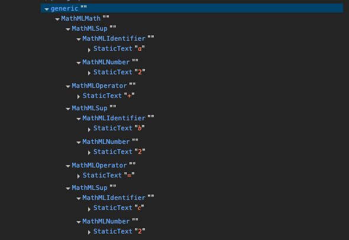
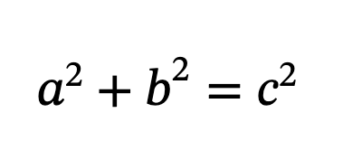

Maybe it has happened to you that you wanted to write some formulas in HTML to display on a website, and even though there are multiple ways to do it, accessibility is often not considered in the process. How the formula is read by screen readers is crucial to ensure that we don't leave anyone behind. And the main assistive technologies are in different stages, as we will see.

The web is full of many different and interesting approaches for representing formulas. To name a few, we have TeX/LaTeX source rendered in the browser in different ways, like MathJax or KaTX, we could Unicode math, Canvas/WebGL or even simple PNG/JPG or SVG pictures. However, using native [MathML](https://developer.mozilla.org/en-US/docs/Web/MathML) is usually one of the best options for this task, even if it wasn’t originally designed for the web. Some of its advantages are that it has its own syntax, MathML provides various elements that give the correct semantics to the different parts of a formula, has good screen reader support, requires no JavaScript dependencies and it can be used beyond the browser, as in EPUB or braille/math speech tooling.

Let's take the famous Pythagorean Theorem as an example.

<section style="margin-bottom: 2rem" aria-labelledby="section-0-heading">
  <h2 id="section-0-heading">Pythagorean Theorem</h2>
  <p>Next, you have the visual representation of the formula together with the MathML code.</p>
  <math xmlns="http://www.w3.org/1998/Math/MathML">
    <msup>
      <mi>a</mi>
      <mn>2</mn>
    </msup>
    <mo>+</mo>
    <msup>
      <mi>b</mi>
      <mn>2</mn>
    </msup>
    <mo>=</mo>
    <msup>
      <mi>c</mi>
      <mn>2</mn>
    </msup>
  </math>
</section>

```html
<math xmlns="http://www.w3.org/1998/Math/MathML">
  <msup>
    <mi>a</mi>
    <mn>2</mn>
  </msup>
  <mo>+</mo>
  <msup>
    <mi>b</mi>
    <mn>2</mn>
  </msup>
  <mo>=</mo>
  <msup>
    <mi>c</mi>
    <mn>2</mn>
  </msup>
</math>
```

Unlike plain HTML with <code>sup</code> or <code>span</code>, which only describe presentation, MathML defines each role explicitly:

- <code>math</code> represents the entire mathematical expression.
- <code>msup</code> defines a superscript relationship (a base and an exponent).
- <code>mi</code> is a mathematical identifier, typically a variable such as <strong>a</strong>, <strong>b</strong>, or <strong>c</strong>.
- <code>mn</code> is a mathematical number, like <strong>2</strong>.
- <code>mo</code> is a mathematical operator, such as <strong>+</strong> or <strong>=</strong>.

Other alternatives, like the ones mentioned above, may offer similar capabilities, but they typically rely on an assistive or hidden MathML layer. In practice, MathML remains the only web-standard markup that expresses mathematical roles natively in the DOM.

With this approach, the accessibility tree shows good semantics and VoiceOver knows well what to do.



However, and this is something we will see through the whole article, screen reader support for the <code>math</code> tag is differently depending on the assistive technology. VoiceOver seems to be doing a pretty good job, [JAWS also makes it easy for both speech and braille](https://www.freedomscientific.com/training/teachers/accessing-math-content-with-jaws-and-fusion/), and [NVDA needs an add-on to make it work called MathCat](https://github.com/nvaccess/nvda/issues/17667) because if not, the <code>math</code> tag will be ignored. A major pull request ([#18323](https://github.com/nvaccess/nvda/pull/18323)) was merged on 17 November 2025 which integrates MathCAT into NVDA core, meaning users won’t have to find/install a separate add-on to handle math.

<section aria-labelledby="example-formula">
  <h3 id="example-formula">How screen readers interpret the formula</h3>
  <details>
    <summary>NVDA + Firefox (Windows with MathCAT add-on)</summary>
    region eigh squared plus b squared is equal to c squared space
  </details>
  <details>
    <summary>VoiceOver + Safari (Mac)</summary>
    a squared + b squared = c squared, with 5 items, maths
  </details>
  <details style="margin-bottom: 2rem;">
    <summary>VoiceOver + Safari (iOS)</summary>
    a squared plus b squared equals c squared, Math
  </details>
</section>

Let's look at a more complicated case. Instead of just the way to display the formula, let's see how to actually prove it and how that will be announced by screen readers.

```html
<math display="block">
  <semantics>
    <mtable>
      <!-- Step one -->
      <mtr>
        <mtd>
          <msup>
            <mrow>
              <mo>(</mo>
              <mi>a</mi>
              <mo>+</mo>
              <mi>b</mi>
              <mo>)</mo>
            </mrow>
            <mn>2</mn>
          </msup>
        </mtd>
        <mtd>
          <mo>=</mo>
        </mtd>
        <mtd>
          <msup>
            <mi>c</mi>
            <mn>2</mn>
          </msup>
          <mo>+</mo>
          <mn>4</mn>
          <mo>⋅</mo>
          <mo>(</mo>
          <mfrac>
            <mn>1</mn>
            <mn>2</mn>
          </mfrac>
          <mi>a</mi>
          <mi>b</mi>
          <mo>)</mo>
        </mtd>
      </mtr>
      <!-- Step two -->
      <mtr>
        <mtd>
          <msup>
            <mi>a</mi>
            <mn>2</mn>
          </msup>
          <mo>+</mo>
          <mn>2</mn>
          <mi>a</mi>
          <mi>b</mi>
          <mo>+</mo>
          <msup>
            <mi>b</mi>
            <mn>2</mn>
          </msup>
        </mtd>
        <mtd>
          <mo>=</mo>
        </mtd>
        <mtd>
          <msup>
            <mi>c</mi>
            <mn>2</mn>
          </msup>
          <mo>+</mo>
          <mn>2</mn>
          <mi>a</mi>
          <mi>b</mi>
        </mtd>
      </mtr>
      <!-- Step three -->
      <mtr>
        <mtd>
          <msup>
            <mi>a</mi>
            <mn>2</mn>
          </msup>
          <mo>+</mo>
          <msup>
            <mi>b</mi>
            <mn>2</mn>
          </msup>
        </mtd>
        <mtd>
          <mo>=</mo>
        </mtd>
        <mtd>
          <msup>
            <mi>c</mi>
            <mn>2</mn>
          </msup>
        </mtd>
      </mtr>
    </mtable>

    <annotation encoding="application/x-tex">
      \begin{aligned} (a + b)^2 &= c^2 + 4 \cdot \left( \frac{1}{2} ab \right)
      \\ a^2 + 2ab + b^2 &= c^2 + 2ab \\ a^2 + b^2 &= c^2 \end{aligned}
    </annotation>
  </semantics>
</math>
```

<math style="margin-bottom: 2rem;" display="block">
  <semantics>
    <mtable>
      <!-- Step one -->
      <mtr>
        <mtd>
          <msup>
            <mrow>
              <mo>(</mo>
              <mi>a</mi>
              <mo>+</mo>
              <mi>b</mi>
              <mo>)</mo>
            </mrow>
            <mn>2</mn>
          </msup>
        </mtd>
        <mtd>
          <mo>=</mo>
        </mtd>
        <mtd>
          <msup>
            <mi>c</mi>
            <mn>2</mn>
          </msup>
          <mo>+</mo>
          <mn>4</mn>
          <mo>⋅</mo>
          <mo>(</mo>
          <mfrac>
            <mn>1</mn>
            <mn>2</mn>
          </mfrac>
          <mi>a</mi>
          <mi>b</mi>
          <mo>)</mo>
        </mtd>
      </mtr>
      <!-- Step two -->
      <mtr>
        <mtd>
          <msup>
            <mi>a</mi>
            <mn>2</mn>
          </msup>
          <mo>+</mo>
          <mn>2</mn>
          <mi>a</mi>
          <mi>b</mi>
          <mo>+</mo>
          <msup>
            <mi>b</mi>
            <mn>2</mn>
          </msup>
        </mtd>
        <mtd>
          <mo>=</mo>
        </mtd>
        <mtd>
          <msup>
            <mi>c</mi>
            <mn>2</mn>
          </msup>
          <mo>+</mo>
          <mn>2</mn>
          <mi>a</mi>
          <mi>b</mi>
        </mtd>
      </mtr>
      <!-- Step three -->
      <mtr>
        <mtd>
          <msup>
            <mi>a</mi>
            <mn>2</mn>
          </msup>
          <mo>+</mo>
          <msup>
            <mi>b</mi>
            <mn>2</mn>
          </msup>
        </mtd>
        <mtd>
          <mo>=</mo>
        </mtd>
        <mtd>
          <msup>
            <mi>c</mi>
            <mn>2</mn>
          </msup>
        </mtd>
      </mtr>
    </mtable>

  </semantics>
</math>

This proof example just added several MathML elements that go beyond simple identifiers and operators. Each of these adds meaning to the expression, which is why assistive technologies can navigate the structure so precisely. For example:

- <code>mtable</code>, <code>mtr</code> and <code>mts</code>: these directly mirror HTML's <code>table</code>, <code>tr</code> and <code>td</code> but are math-specific. They tell the accessibility tree: "this is a mathematical table with aligned steps," not just a generic layout table. Screen readers can move row-by-row, so each step of the proof becomes navigable.

- <code>mrow</code>: groups expressions together. For example <code>(a + b)</code> is wrapped in an <code>mrow</code> to indicate that the parentheses and the interior form a single unit before exponentiation.

- <code>mfrac</code>: defines an actual mathematical fraction, not just text with a slash. This allows speech engines to say "one half" instead of "one over two" depending on preferences and locale.

- <code>semantics</code>: this is key. It wraps the expression and lets you attach alternative meanings or encodings. Assistive technologies prefer the first child (your visual MathML), but can fall back to the annotation if needed.

- <code>annotation</code>: stores auxiliary information. In this case, the TeX version of the proof. It does not affect the visual rendering in the browser. Instead, it's metadata for tools that consume MathML, like converters, EPUB readers, or braille translators.

Check out how this is announced by different screen readers!

<section aria-labelledby="example-proof">
  <h3 id="example-proof">How screen readers interpret the proof</h3>
  <details>
  <summary>NVDA + Firefox (Windows with MathCAT add-on)</summary>
  3 lines
  line 1 open paren eigh plus b close paren squared is equal to c squared plus 4 times 1 half eigh b

line 2 eigh squared plus 2 eigh b plus b squared is equal to c squared plus 2 eigh b

line 3 eigh squared plus b squared is equal to c squared

  </details>
  <details>
    <summary>VoiceOver + Safari (Mac)</summary>
    Table start, Row 1, Column 1, ( a + b ) squared, Row 1, Column 2, =, Row 1, Column 3, c squared + 4 · ( fraction start, 1 over 2, end of fraction, a b ), Row 2, Column 1, a squared + 2 a b + b squared, Row 2, Column 2, =, Row 2, Column 3, c squared + 2 a b, Row 3, Column 1, a squared + b squared, Row 3, Column 2, =, Row 3, Column 3, c squared, table end, maths
  </details>
  <details style="margin-bottom: 2rem;" >
    <summary>VoiceOver + Safari (iOS)</summary>
    1 table, table start, Row 1, Column 1, a plus b squared, Row 1, Column 2, equals, Row 1, Column 3, c squared plus 4 dot fraction start 1 over 2, end of fraction, a b, Row 2, Column 1, a squared plus 2 a b plus b squared, Row 2, Column 2, equals, Row 2, Column 3, c squared plus 2 a b, Row 3, Column 1, a squared plus b squared, Row 3, Column 2, equals, Row 3, Column 3, c squared, table end, Math
  </details>
</section>

<p style="margin-top: 2rem;" class="highlight"><strong>Note:</strong> If you want to deepen your understanding in the topic, Mozilla has a very detailed page about <a href="https://developer.mozilla.org/en-US/docs/Web/MathML/Guides/Proving_the_Pythagorean_theorem">proving the Pythagorean theorem with MathML</a>.</p>

## Some A11y Enhancements

We could enhance this by adding an <code>aria-label</code> to a wrapper that provides some information about the following formula, especially when it's a well-known one. By using a <code>section</code> with an <code>aria-label</code> or <code>aria-labelledby</code> together with another element giving the accessible name, we automatically insert a region into the accessibility tree.

```html
<section aria-labelledby="section-1-heading">
  <h2 id="section-1-heading">Pythagorean Theorem</h2>
  <math xmlns="http://www.w3.org/1998/Math/MathML"> ... </math>
</section>
```

Also, for users who zoom the browser up to 400%, we might want to add a `max-width: 100%` and `overflow-x: auto`, so that the formula remains readable, does not break the page and we allow horizontal scrolling only inside the math block, and not at the entire page level.

## Conveying mathematical meaning with ARIA

As an alternative to using MathML to convey mathematical meaning in simple examples, we also have the <a href="https://developer.mozilla.org/en-US/docs/Web/Accessibility/ARIA/Reference/Roles/math_role"><code>math</code> role</a> from the ARIA specification. With that, we can communicate the mathematical semantics even when we rely on images or non-semantic HTML. However, it does not tend to give good results with VoiceOver on macOS, for example.

As shown on the <a href="https://developer.mozilla.org/en-US/docs/Web/Accessibility/ARIA/Reference/Roles/math_role">MDN page for the <code>math</code> role</a>, we could have:

```html
<div role="math" aria-label="a^{2} + b^{2} = c^{2}">
  a<sup>2</sup> + b<sup>2</sup> = c<sup>2</sup>
</div>
```

<section aria-labelledby="example-div">
  <h3 id="example-div">Markup with a div with the math role and how screen readers interpret it</h3>
  <details>
    <summary>Markup</summary>
    <div style="margin-bottom: 2rem;" role="math" aria-label="a^{2} + b^{2} = c^{2}">
      a<sup>2</sup> + b<sup>2</sup> = c<sup>2</sup>
    </div>
  </details>
  <details>
    <summary>NVDA + Firefox (Windows with MathCAT add-on)</summary>
  just announce the markup, line by line
  </details>
  <details>
    <summary>VoiceOver + Safari (Mac)</summary>
    not read, just announces "with 6 items, maths"
  </details>
  <details style="margin-bottom: 2rem;" >
    <summary>VoiceOver + Safari (iOS)</summary>
    a caret left curly bracket 2 right curly bracket plus b caret left curly bracket 2 right curly bracket equals c caret left curly bracket, Math
  </details>
</section>

```html

```

<section aria-labelledby="example-img">
  <h3 id="example-img">Markup with a img with the math role and how screen readers interpret it</h3>
  <details>
    <summary>Markup</summary>
    
  </details>
  <details>
    <summary>NVDA + Firefox (Windows with MathCAT add-on)</summary>
  just announce the markup
  </details>
  <details>
    <summary>VoiceOver + Safari (Mac)</summary>
    not read, just announces "maths"
  </details>
  <details style="margin-bottom: 2rem;">
    <summary>VoiceOver + Safari (iOS)</summary>
    a caret left curly bracket 2 right curly bracket plus b caret left curly bracket 2 right curly bracket equals c caret left curly bracket, Math
  </details>
</section>

In practice, using the math role helps assistive technologies understand that the content is mathematical, but it still doesn’t provide enough semantic detail for them to announce the expression as accurately as MathML does.

## The future of MathML

<p class="highlight"><strong><abbr title="too long; didn't read">TL;DR:</abbr></strong> MathML Core is what browsers implement today; MathML 4 is the broader language evolving around it.</p>

First, we are going to focus on where MathML comes from and why there's both a 'Core' and a 'version 4' in development. As I mentioned at the beginning, the origin of MathML was not the web, it was more of a general-purpose specification for browsers, office suites, computer algebra systems, EPUB readers, and LaTeX-based generators, [as stated in Mozilla](https://developer.mozilla.org/en-US/docs/Web/MathML). MathML Core arose from the need to make it work with web standards, including HTML, CSS, DOM, and JavaScript. Historically, the full MathML spec was broad and partly underspecified for browsers, which led to uneven or incomplete implementations across engines. MathML Core therefore narrows the language to the subset that can be precisely defined on top of the Web Platform, improving testability and cross-browser interoperability. Since June 2025, MathML Core has been a [Candidate Recommendation Snapshot](https://www.w3.org/TR/2025/CR-mathml-core-20250624/). On another note, at the time of this writing, there is [a Working Draft for MathML 4](https://www.w3.org/TR/mathml4/), the next version of MathML. This version aims to be the next "full" spec that extends Core. It keeps the larger feature set (e.g., Content MathML) and adds, among others, the <code>intent</code> attribute so authors can guide screen-reader speech. With it, we'll be able to do something like this:

```html
<math>
  <mrow intent="equals(power(a,2)+power(b,2),power(c,2))">
    <msup>
      <mi>a</mi>
      <mn>2</mn>
    </msup>
    <mo>+</mo>
    <msup>
      <mi>b</mi>
      <mn>2</mn>
    </msup>
    <mo>=</mo>
    <msup>
      <mi>c</mi>
      <mn>2</mn>
    </msup>
  </mrow>
</math>
```

## Conclusion

As [browser support for MathML continues to evolve](https://caniuse.com/mathml), previous fallback solutions like [mathml.css](https://github.com/fred-wang/mathml.css) are no longer necessary. MathML Core, and soon MathML 4, allow us to express both the visual and semantic meaning of mathematical content without sacrificing accessibility along the way.

Screen-reader support is also steadily improving. Each assistive technology handles MathML in its own way, but the overall trajectory is positive. VoiceOver offers consistent navigation and speech for many common patterns across macOS and iOS. JAWS, especially when paired with Fusion, provides rich support for both speech and braille. And NVDA, which historically required an add-on, is now moving toward a built-in MathCAT integration, making MathML speech and braille support more accessible out of the box for Windows users.
