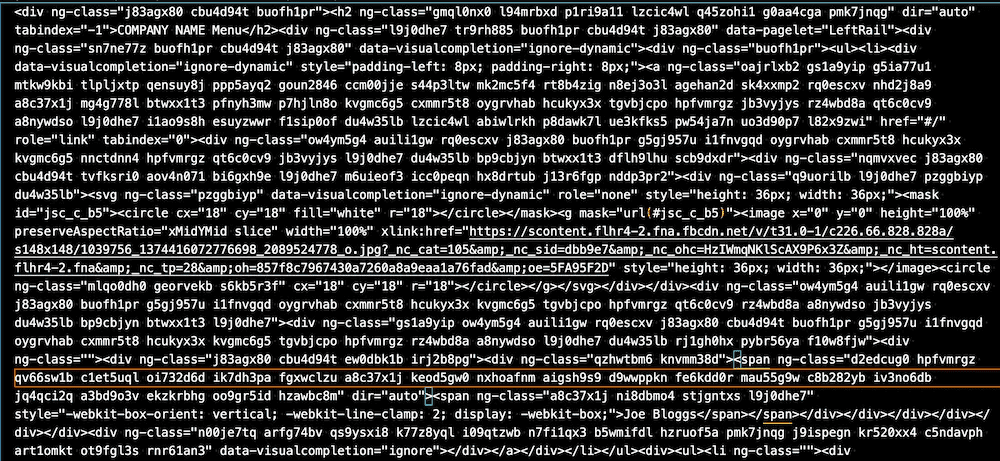
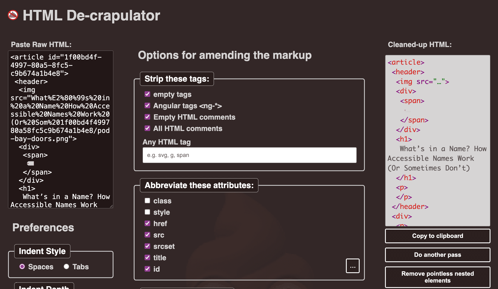
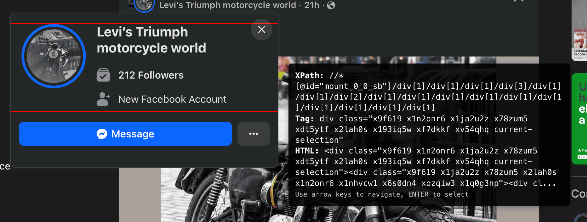
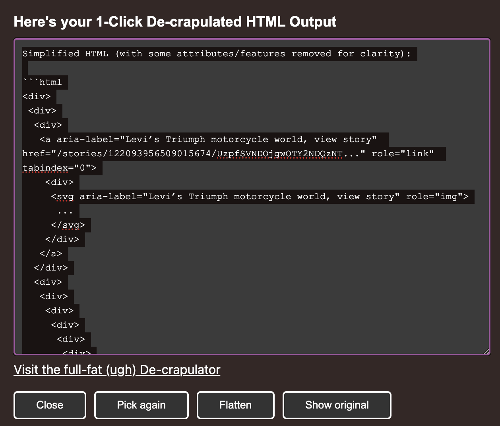
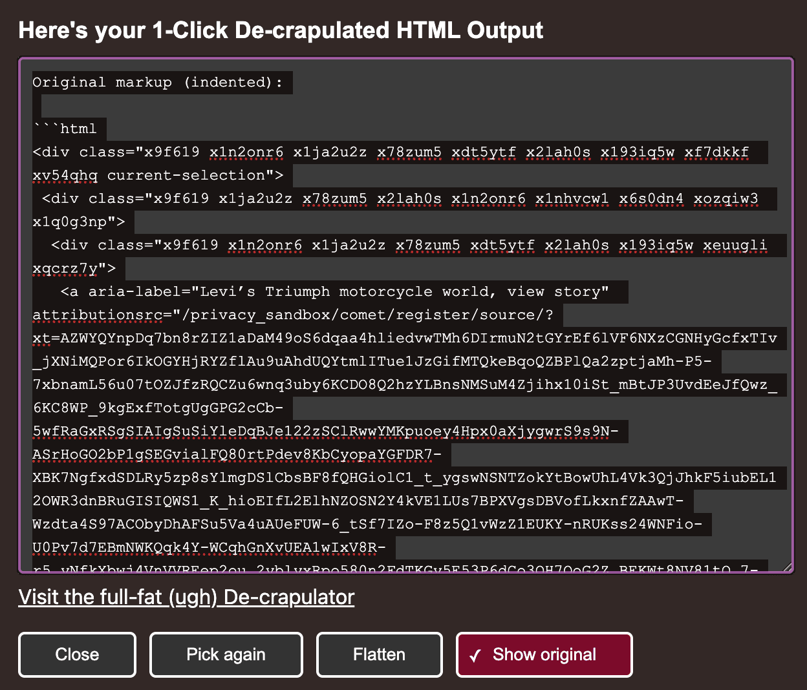
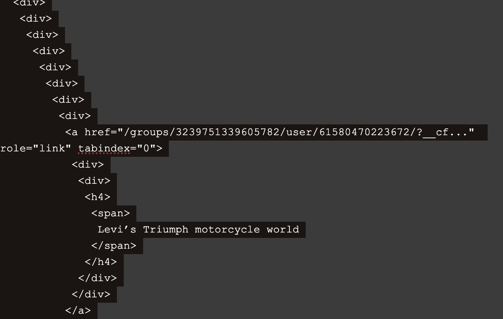
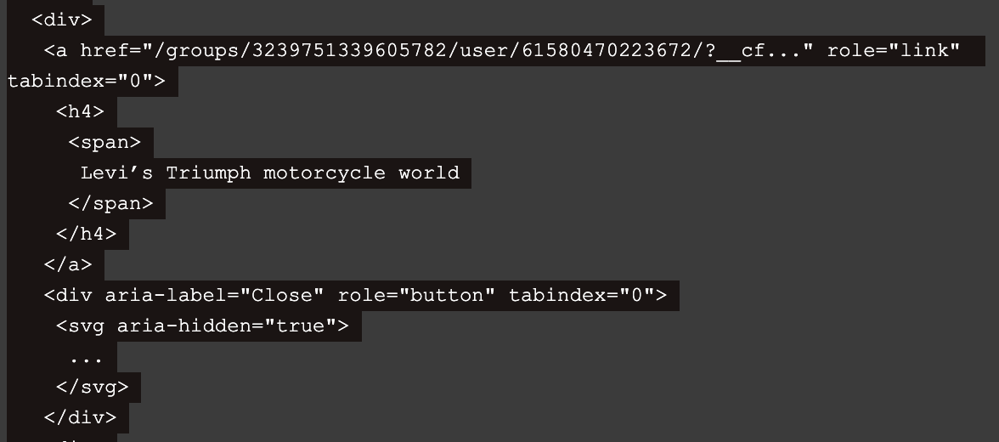

[HTMLHell](https://www.htmhell.dev) started as a site that showed some of the finest, and by that I mean most **awful**, examples of crimes against markup the world has to offer (and how these crimes can be put right). We’ve all seen some shit, man. But somewhere along the line, Manuel started [HTML Heaven](https://www.htmhell.dev/tips/), covering decent markup and clever techniques. It's a good mix of dark and light, yin and yang. And what I wanted to cover in my offering to this annual advent calendar sits firmly in the middle. I can't prevent you from witnessing markup that makes you want to gouge your eyes out with rusty soup spoons, but I may have a solution that helps you understand what you can see in the browser a little more easily.

Before I continue, it might be worth explaining a bit about what I do in my day-to-day role to provide context about why this all came about. 

I carry out accessibility audits for multiple clients at [TetraLogical](https://tetralogical.com/about/) (or [assessments](https://tetralogical.com/services/assessments/) as we refer to them internally). When I encounter something that doesn't behave as it should when trying to navigate using a keyboard, or doesn't sound right when using a screen reader, the first thing I need to check is what is the markup (HTML) behind the elements with issues. Typically, that means right-clicking on the part of the screen where the problem exists and looking at the **Elements** tab in the browser's built-in DevTools feature. I'm also likely to need to check the **Accessibility** panel in DevTools to see what that markup exposes to assistive technology users.

Here's a supoer simple example of TetraLogical's website, showing details of the top navigation element:

* What I hope to see whan I check the markup showing in DevTools: semantic markup that provides structure/meaning to what is rendered on the page (as in the example above).
* What I increasingly find: non-semantic markup that is often heavily nested, stuffed full of attributes, and which usually requires multiple steps to expand each node to get the full picture.

A few years back, I created a tool that was very much borne out of frustration while doing an audit of a very well known web site. Everything that I checked was just an [absolute WALL of attribute-laden markup](https://www.tpgi.com/seeing-the-wood-for-the-trees-demystifying-markup-in-2021/).

The markup might have been structurally fine, but it really took some effort to discern that that was the case. I had to go through various passes to work out what I was actually looking at to be able to make sense of things. The frustration led me to create the [HTML De-crapulator](https://a11y-tools.com/markup-de-crapulator/), a tool that I would use many, many times in audits that I carried out for years after. But ... I still felt it could be more useful.

The HTML De-Crapulator can provide many ways to simplify markup, such as:

* Removing specific attributes
* Abbreviating specific attributes
* Removing empty tags
* Removing framework-specific comment tags

Most of the time, pressing the 'Check (almost) all of the above' button did the bulk of what is needed to strip selected markup to its bare bones. *Most of the time* ... Inevitably, with each new site I had to check, I'd find a new collection of custom attributes or tagnames that the tool didn't have in its defaults, so I'd have to customise again and again. The tool does take out a lot of the manual work required to clean up the markup, but I was still finding it to not be as quick as it could be.
What do I want? I want to look at how a given part of the page is built, quickly. Yet *this* still doesn't feel all that speedy to me:

1. Right click on an element on the page
2. Select **Inspect**
3. Right click on the node revealed in the **Elements** panel in Dev tools
4. Copy the Outer HTML
5. Go to the HTML De-Crapulator and paste
6. Try the **Check (almost) all of the above** button and see what the results are
7. Get frustrated by the remnants still there that I really don't care about
8. Refine, refine, refine until I have the cleaned up markup just so

I just wanted to get the markup that **matters**, quickly. What do I mean by markup that matters?

* Anything that exposes the `role` of an element to assistive technology users
* Anything that exposes the state of an element to assistive technology users
* Any attribute that may affect the focusability of an element

Anything else is just noise. With that in mind, a few months back I came up with the [1-Click De-Crapulator](https://a11y-tools.com/bookmarklets/#one-click-decrapulator).

How does it work? You run the script (as a bookmarklet or you can use [the version in the Chrome extension](https://chromewebstore.google.com/detail/a11y-tools-bookmarklets/fedddpaapeedmkanpenidomfbebacgoa) if you prefer) and then do the following:

1. Click on the thing you want to get simplified markup for
2. That's it. There is no step 2

OK, so there *sort of* is a step 2 ... if you need it, and that's to copy the markup that's presented. But essentially, with one click you can see the markup for the selected node in a super-simplified format, ready to copy and paste if you choose to.

At a glance, you can understand the structure of the item that you selected. All classes and trivial attributes are jettisoned. Only those that may have an impact on how the page is exposed to assistive technology users remain (text alternatives, states, `ARIA-*` attributes, `id` attributes ... but only where something else is referencing that element and needs it otherwise all the `id`s are stripped).

Went too far? You can also quickly switch between the original markup with all attributes intact, should you want to make a quick comparison.

Didn't go far enough? Perhaps you're seeing endless levels of `
` nesting that really isn't contributing to meaning or structure? You have the option of flattening it. Here's the before version:

And here is the after:

Of course, you really are messing with the original markup here, but for the noble reasons of making it understandable and simplified. To save you having to explain each and every time that you simplified the markup when writing up an issue, the tool also wraps the output with Markdown block code backticks and an explanatory phrase that should work for almost every scenario: "Simplified HTML (with some attributes/features removed for clarity)". 

As with the original full-fat HTML De-Crapulator, this won't address the root of the problem: namely, developers producing shoddy markup. But if you spend much of your day trying to decipher and remediate other people's markup, which can be hell, this tool can save you a lot of fuss and bother in getting to the bottom of the issue.

