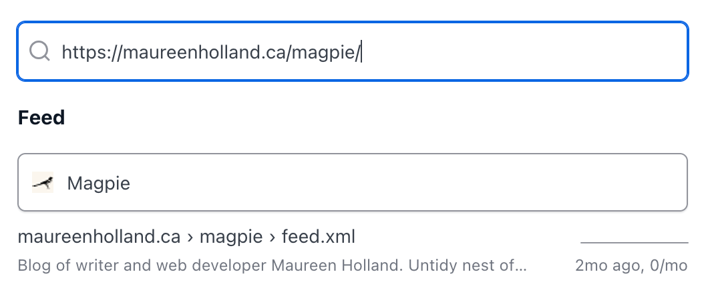

Web feeds are incredible! And a bit confusing! Why are the feed links often called “RSS”? And why is this “RSS” feed in an <code>atom.xml</code> file… hang on, what is <code>feed.json</code> for?  What are they even feeding into anyway?

To start, web feeds are often referred to as “RSS” because RSS is the oldest format. [RSS](https://www.rssboard.org/rss-specification) stands for Really Simple Syndication. It is an XML-based specification for web content syndication ([including podcasts](https://help.apple.com/itc/podcasts_connect/#/itcb54353390)).

In [broadcast syndication](https://web.archive.org/web/20091009143514/http://www.museum.tv/archives/etv/S/htmlS/syndication/syndication.htm), networks sell reruns of their original shows to other platforms. In web content syndication, feeds package web content into a format that can “rerun” on a feed reader application. Notably, web content creators are not selling their content to feed readers. Most feeds and readers are free. A subscriber is in the middle, choosing what content they want to follow and what reader they want to follow it on.

Other web content syndication specifications include [Atom](https://datatracker.ietf.org/doc/html/rfc4287) (also XML-based) and [JSON](https://www.jsonfeed.org/version/1.1/). If you’re interested, [CSS Tricks has a breakdown of the technical distinctions between these formats](https://css-tricks.com/working-with-web-feeds-its-more-than-rss/#aa-rss-vs-atom-vs-json). A web feed (even one that says it’s an “RSS” feed) could be any of these formats under the hood.

A very basic web feed looks like this: https://maureenholland.ca/magpie/feed.xml

Simplified example below:
```xml
<rss version="2.0">
	<channel>
		<atom:link href="https://maureenholland.ca/magpie/feed.xml" rel="self" type="application/rss+xml"/>
		<title>Magpie</title>
		<link>https://maureenholland.ca/magpie/</link>
		<description>
		Blog of writer and web developer Maureen Holland. Untidy nest of shiny things.
		</description>
		<language>en-ca</language>
		<item>
			<title>A Vanilla Personal Site</title>
			<link>
			https://maureenholland.ca/magpie/a-vanilla-personal-site
			</link>
			<guid isPermaLink="true">
			https://maureenholland.ca/magpie/a-vanilla-personal-site
			</guid>
			<pubDate>Tue, 18 Apr 2023 12:00:00 GMT</pubDate>
			<description>
			I rebuild my personal site every few years. This time, I decided I wanted to go as minimal as possible. It's been the most enjoyable iteration.
			</description>
		</item>
	</channel>
</rss>
```

This XML file includes general info about the feed (`channel`) and lists one `item` which contains a `title`, `link`, `description`, publication date (`pubDate`), and globally unique identifier (`guid`).

A feed reader, like [Feedbin](https://feedbin.com/home), [NetNewsWire](https://netnewswire.com/), or [NewsBlur](https://www.newsblur.com/), is able to parse that information and serve it in a human-readable format that will look something like this: 


It uses the unique identifier to determine if an item in the feed is new. It can do this for any number of feeds, constantly updating a reading list of your favourite web content.

Importantly, feed readers have no proprietary control over your feed list. If you are dissatisfied with your reader, you can export your feeds to an [OPML](https://opml.org/spec2.opml) (Outline Processor Markup Language) file and import them to a new reader later.

## The Joy of Autodiscovery

Remember all that stuff about RSS and Atom and XML and JSON? Forget it!

A subscriber shouldn’t have to know any of that technical detail. This is where [RSS Autodiscovery](https://www.rssboard.org/rss-autodiscovery) comes in.

You can implement autodiscovery with a single line of HTML in the <code>head</code> of your website (and if you’re using a blog platform, chances are it’s already there by default):
```html
<link rel="alternate" type="application/rss+xml" title="Magpie" href="https://maureenholland.ca/magpie/feed.xml">
```

Now, no one has to hunt for your site’s subscribe link (or “RSS” link or whatever). They can copy/paste the website address into their feed reader and let the application do the work of finding the feeds.



If you want, you can also include separate links for different categories. [WordPress](https://codex.wordpress.org/Customizing_Feeds), for example, automatically generates feeds for entries and comments. [Ghost](https://ghost.org/integrations/custom-rss/) includes a main post index, author archive, and tag archive.

This is not required but can be helpful if your site has a lot of frequently updated content or a wide range of topics. Subscribers may prefer a subset of content (i.e. long form articles or short “Today I Learned” posts).

```html
<link rel="alternate" type="application/rss+xml" title="Everything" href="https://example.com/feed.xml">
<link rel="alternate" type="application/rss+xml" title="Articles" href="https://example.com/articles.xml">
<link rel="alternate" type="application/rss+xml" title="TIL" href="https://example.com/til.xml">
```

## What now?

If you’re already a fan of web feeds, check you’ve made it easy for others to find your feed with autodiscovery. If you’re new to web feeds, pick a reader and try it out for a month. Then switch to a different one, <em>just because you can</em>.

<p class="highlight">
This post owes a lot to Matt Webb’s great work on <a href="https://aboutfeeds.com/">https://aboutfeeds.com/</a>.
</p>
