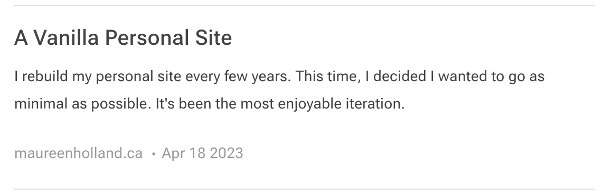

## Web Feeds

Web feeds are incredible! And a bit confusing! Why are the feed links often called “RSS feeds”? And why is this “RSS feed” in an <code>atom.xml</code> file… hang on, what is <code>feed.json</code> for?  What are they even feeding into anyway?

Let’s start by addressing the confusing parts. Web feeds are often referred to as “RSS feeds” because RSS is the oldest and most common format.

[RSS](https://www.rssboard.org/rss-specification) stands for Really Simple Syndication. It is an XML-based specification for web content syndication. [Atom](https://datatracker.ietf.org/doc/html/rfc4287) is also XML-based and [JSON](https://www.jsonfeed.org/version/1.1/) is unsurprisingly JSON-based. If you’re interested, [CSS Tricks has a breakdown of the technical distinctions between these formats](https://css-tricks.com/working-with-web-feeds-its-more-than-rss/#aa-rss-vs-atom-vs-json).

I’m going to use the term “web feeds” because, at the end of the day, the purpose of all these formats is the same: provide information about web content that allows feed reader applications to notify users when new content appears.

I find web feeds incredible for two main reasons:

1. <strong>You are the algorithm.</strong>
There is no third party with questionable motives pushing extra feeds into your reader. You see something you like, you subscribe. That’s what you get!
2. <strong>You are not locked into a single vendor to generate or consume feeds.</strong>
Blog platforms like [WordPress](https://codex.wordpress.org/Customizing_Feeds) and [Ghost](https://ghost.org/integrations/custom-rss/) provide web feeds out-of-the-box while static site generators like [11ty](https://www.11ty.dev/docs/plugins/rss/) offer plugins to help generate feeds. Reader applications like [Feedbin](https://feedbin.com/home), [NetNewsWire](https://netnewswire.com/), and [NewsBlur](https://www.newsblur.com/) have no proprietary control over your feed list. If you want to leave, you can take your feeds with you by exporting them to an [OPML](https://opml.org/spec2.opml) (Outline Processor Markup Language) file. 

This is the self-curated, standards-based web I want.


## Where to Find Them

A very basic feed looks like this: https://maureenholland.ca/magpie/feed.xml

Simplified example below:
```xml
<rss version="2.0">
	<channel>
		<atom:link href="https://maureenholland.ca/magpie/feed.xml" rel="self" type="application/rss+xml"/>
		<title>Magpie</title>
		<link>https://maureenholland.ca/magpie/</link>
		<description>
		Blog of writer and web developer Maureen Holland. Untidy nest of shiny things.
		</description>
		<language>en-ca</language>
		<item>
			<title>A Vanilla Personal Site</title>
			<link>
			https://maureenholland.ca/magpie/a-vanilla-personal-site
			</link>
			<guid isPermaLink="true">
			https://maureenholland.ca/magpie/a-vanilla-personal-site
			</guid>
			<pubDate>Tue, 18 Apr 2023 12:00:00 GMT</pubDate>
			<description>
			I rebuild my personal site every few years. This time, I decided I wanted to go as minimal as possible. It's been the most enjoyable iteration.
			</description>
		</item>
	</channel>
</rss>
```

An <code>item</code> from that feed will show up in a feed reader like this:



Does this feel similar to a podcast feed? It should! It’s the same underlying specification. Check out the [iTunes RSS guide](https://help.apple.com/itc/podcasts_connect/#/itcb54353390) for an example of how feed information shows up in a podcast app.

Now, you might notice when a site has a subscribe link that explains what web feeds are available. But feed links often don’t lead to user-friendly styled pages, if you can find them at all.

This is where [RSS Autodiscovery](https://www.rssboard.org/rss-autodiscovery) comes in handy.

One line of HTML in the <code>head</code> makes it easy for reader applications to find a feed from the main URL:
```html
<link rel="alternate" type="application/rss+xml" title="Magpie" href="https://maureenholland.ca/magpie/feed.xml">
```

Of course, you don’t have to stop there. You can include separate links for different formats:
```html
<link rel="alternate" type="application/rss+xml" title="RSS Feed" href="https://example.com/rss.xml">
<link rel="alternate" type="application/atom+xml" title="Atom Feed" href="https://example.com/atom.xml">
<link rel="alternate" type="application/json" title="JSON Feed" href="https://example.com/feed.json">
```

Or different categories:
```html
<link rel="alternate" type="application/rss+xml" title="Everything" href="https://example.com/feed.xml">
<link rel="alternate" type="application/rss+xml" title="Articles" href="https://example.com/articles.xml">
<link rel="alternate" type="application/rss+xml" title="TIL" href="https://example.com/til.xml">
```
Let the feed reader do the discovery work. Let the subscriber get on with their reading!

## Wrapping up
If you’re already a fan of web feeds, check you’ve made it easy for others to find your feed with autodiscovery. If you’re new to web feeds, pick a reader and try it out for a month. Then switch to a different one, <em>just because you can</em>.

<p class="highlight">
This post owes a lot to Matt Webb’s great work on <a href="https://aboutfeeds.com/">https://aboutfeeds.com/</a>.
</p>
