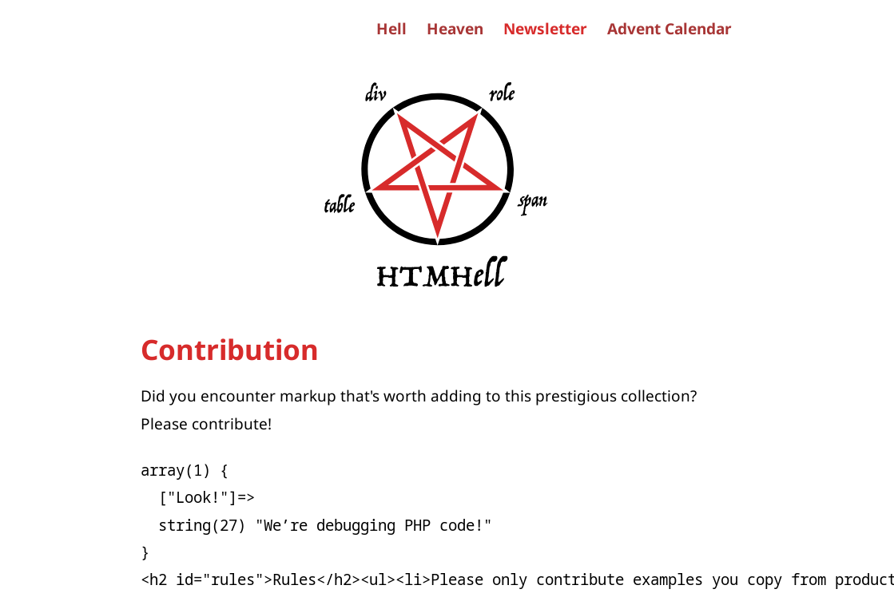
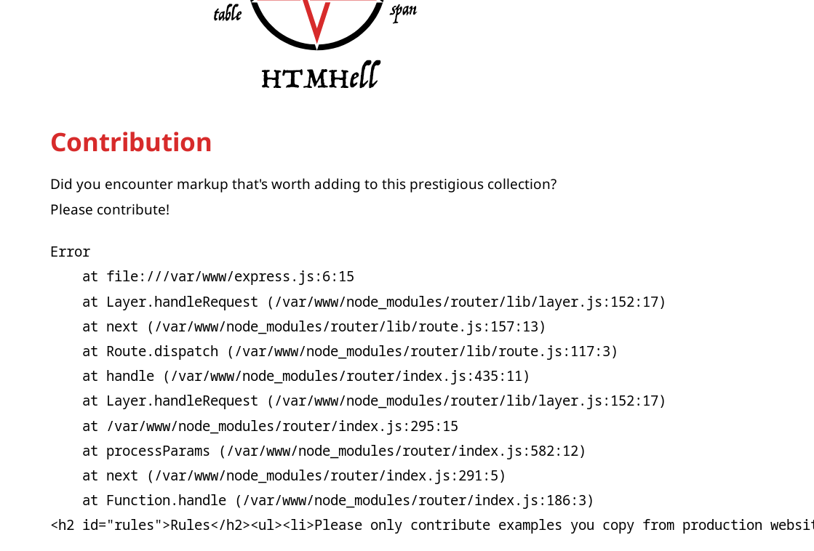
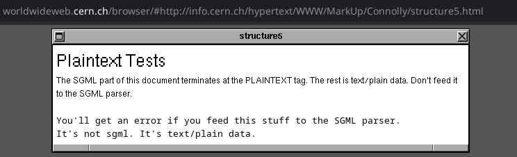

Deep down in the dark voids of HTML specs long gone sleeps a terrifying thing. Imagine, if you will, a DOM node so mighty, that it can change the `content-type` of parts of the document. An HTML element that makes the parser tremble and withdraw, and that cannot be stopped even by its own end tag.

The wise people of W3C try to keep the knowledge of this terror away from the mere mortals’ eyes to spare us the danger of its madness. They advise us not to use the magic tag name that is the incantation for this ancient malice.

We will, of course, do exactly this today. We’ll take a deep look at the

```html
<plaintext>
```

element and what fun things we can use it for.

## A Quick Warning

This being said, I’d like to point out one important thing: Do not use this element in production. The HTML living standard is [quite clear about this](https://html.spec.whatwg.org/multipage/obsolete.html#plaintext):

> Elements in the following list are entirely obsolete, and must not be used by authors: [...] `plaintext`

So, what does `<plaintext>` do that earned it its place on HTML’s list of deprecated elements? In a nutshell, it ends the HTML parser and instructs the browser to interpret _everything_ following as plain text.

That is to be taken literally. Really everything, including any closing `</plaintext>` or `</html>`, will be printed as if a rogue, unclosed `<pre>` would suddenly go haywire and slurp up the rest of the page. By the way, this makes `<plaintext>` the only non-empty element that has no end tag at all.

## What Do We Use this Power For?

On first sight that sounds like a really stupid superpower. On second sight, it still does. We look into how that element became part of HTML below. But now we will use it for one specific purpose: debugging server-side code.

Of course, specialized debuggers like XDebug for PHP or built-in error pages in frameworks like Django take over the heavy lifting here. And even the good ol’ `print "<script>console.log('here!')</script>"` is often helpful. Those tools should be high up in your utility belt.

But imagine this: You are deep in your code, chasing an elusive bug that affects only part of the HTML output, and you want to spot on the rendered page exactly where it shows up. The fastest way is to put a quick `<plaintext>` close to the offending place, reload the page, and presto! Just scan down to where the markup starts to show through.

This is especially useful to access formatted debugging output. A `var_dump()` in PHP, for example. Or an `error.stack` stack trace in NodeJS. Slap a `<plaintext>` in front of it before writing it to the HTML output, so that the string is immediately readable:

```php
<?php
# TODO delme!
echo '<plaintext>'; var_dump($strange_variable);
```



If you’re working on an expressJS application, it could look like this:

```js
try {
    some_method();
} catch (error) {
    response.send(`<plaintext>${error.stack}`);
}
```



## The History behind this Evil

How ended this seemingly fringe feature up in all mainstream browsers? It was indeed there from the very beginning of HTML as this [historic W3C document](https://www.w3.org/History/19921103-hypertext/hypertext/WWW/MarkUp/Tags.html) from 1992 proves:

> **Plaintext**
>
> This tag indicates that all following text is to be taken litterally [!], up to the end of the file. Plain text is designed to be represented in the same way as example XMP text, with fixed width character and significant line breaks. Format:
>
> ```html
> <PLAINTEXT>
> ```
>
> This tag allows the rest of a file to be read efficiently without parsing. Its presence is an optimisation. There is no closing tag.

This also tells us the reason for its invention. Back at the time Sir Tim Berners-Lee’s high-end NeXT PC that he used to write the first web browser had a quarter of the power of a hand-me-down 2009 smartphone. It was important to optimize wherever you could.

Given that the early WWW was meant as a place to share scientific information, having a large blob of plain text as part of your fancy new HTML page was relatively common. The possibility to end the costly HTML parser and fall back to simply printing the remainder of the file as plain text was a powerful tool.

<figure style="margin-block-end:2.4rem">

<figcaption>Screenshot: This is a rendering of <a href="https://www.w3.org/History/19921103-hypertext/hypertext/WWW/MarkUp/Connolly/structure5.html">a 1992 example for the use of the <code>&lt;plaintext></code> element</a> by <a href="https://worldwideweb.cern.ch/">an emulation of the very first web browser at CERN</a>. (I had to trick it a bit, though, because the file that the emulator would try to access returned a 404 error.)</figcaption>
</figure>

Such a feature isn’t unique to HTML, either. For example, the programming language Perl uses a [special marker](https://perldoc.perl.org/perldata#Special-Literals) to tell the Perl parser to stop processing the remainder of the file:

```perl
print 'this is Perl code';
__END__
cout << 'this isn’t anymore';
```

(Perl programmers use this not for performance reasons but to embed additional data into their programs.)

Of course, nowadays, in the face of multi-megabyte JS payloads, this optimization has become completely unnecessary.

## How Safe Are We?

But the element _is_ still looming in all browsers, so it's worth keeping a bit of a working knowledge of it at the back of our minds.

To give you an example of how this feature could be mis-used, assume a comment function on a blog, where the commenter was able to smuggle in the string `<plaintext>`. As good developers we know never to trust users’ input, so we put the comment through a sanitizer. Let’s take a look at where things can go south from here.

We use the test string

```html
<p><b>hello<plaintext>world!</plaintext></b></p>
```

to check how several sanitizer libraries react to it.

### There Goes the Sanity!

We run each sanitizer in the most minimal configuration that produces any output. This is by design: sanitizers are security products. They should produce safe output by default.

The results are quite surprising, though. (Click on a library’s name below to reveal the horrifying details.) You will notice that no two libraries (apart from the Sanitizer API and DOMPurify, where the former was directly inspired by the latter) agree on how to sanitize our test string.

<details>
<summary><strong>The new HTML Sanitizer API as implemented in Firefox</strong></summary>

[developer.mozilla.org/en-US/docs/Web/API/Document/parseHTML_static](https://developer.mozilla.org/en-US/docs/Web/API/Document/parseHTML_static)

**Code:**

```js
console.log(Document.parseHTML(TEST_STRING).body.innerHTML);
```

The approach of this API is to somehow get the nesting correct again according to the HTML5 parser spec. That is, close the `<p>` and `<b>` tags, then re-open the `<b>` tag as the spec suggests. The API does not deal with the special semantics of `<plaintext>` at all, though.

**Result:**

We end up with a string that has the `<plaintext>` element and its content stripped away:

```html
<p><b>hello</b></p>
```

</details>
<details>
<summary><strong>Poor man’s DOM sanitizing</strong></summary>

**Code:**

```js
const div = document.createElement('div');
div.innerHTML = TEST_STRING;
console.log(div.innerHTML);
```

For this test we set the test string via `HTMLElement.innerHTML = test_string` and read it again via `.innerHTML`. Chrome and Firefox show the same result. This does not really sanitize anything. But we include it in the list, because it demonstrates what the JS engine will do to the test string when interpreting it as HTML.

**Result:**

The result is a mangled version of the original, which will have double-encoded content in the still retained `<plaintext>` element.

```html
<p><b>hello</b></p><plaintext><b>world!&lt;/plaintext&gt;&lt;/b&gt;&lt;/p&gt;</b></plaintext>
```

_NB:_ We can trick the Sanitizer API into producing this output, too, if we’re careless with its configuration:

```js
Document.parseHTML(TEST_STRING, { sanitizer: { removeElements: []}}).body.innerHTML
```

</details>
<details>
<summary><strong>HTML Tidy</strong></summary>

[www.html-tidy.org/](https://www.html-tidy.org/)

**Code:**

```sh
echo -n "$TEST_STRING" | tidy
```

**Result:**

The venerable Tidy replaces the `<plaintext>` with a `<pre>`. This is creative.

```html
<p><b>hello</b></p>
<pre><b>world!</b></pre>
```

</details>
<details>
<summary><strong>xss</strong></summary>

[jsxss.com/](https://jsxss.com/)

**Code:**

```js
import xss from 'xss';
console.log(xss(TEST_STRING));
```

**Result:**

A well-known JavaScript-based sanitizer with special focus on XSS prevention escapes only the `<plaintext>` tags and leaves everything else in place.

```html
<p><b>hello&lt;plaintext&gt;world!&lt;/plaintext&gt;</b></p>
```

</details>
<details>
<summary><strong>DOMPurify</strong></summary>

[github.com/cure53/DOMPurify](https://github.com/cure53/DOMPurify)

**Code:**

```js
import { JSDOM } from 'jsdom';
import DOMPurify from 'dompurify';

const purify = DOMPurify(new JSDOM('').window);
console.log(purify.sanitize(TEST_STRING));
```

**Result:**

The classic JS sanitizer chooses to remove the `<plaintext>` and all its “content”. (I put content in quotes, because _technically_ everything after the start tag would’ve been the `<plaintext>`’s content.) DOMPurify sees to it that the elements are properly closed. The result is identical to that of the Sanitizer API.

```html
<p><b>hello</b></p>
```

</details>
<details>
<summary><strong>HTML Purifier</strong></summary>

[htmlpurifier.org/](http://htmlpurifier.org/)

**Code:**

```php
<?php
$config = HTMLPurifier_Config::createDefault();
$purifier = new HTMLPurifier($config);
printf($purifier->purify(TEST_STRING));
```

**Result:**

The top dog in the PHP world takes a slightly different approach. It removes only the element itself. (Note the “world!” remaining intact.)

```html
<p><b>helloworld!</b></p>
```

</details>
<details>
<summary><strong>Symfony HtmlSanitizer</strong></summary>

[symfony.com/html-sanitizer](https://symfony.com/html-sanitizer)

**Code:**

```php
<?php
use Symfony\Component\HtmlSanitizer\HtmlSanitizer;
use Symfony\Component\HtmlSanitizer\HtmlSanitizerConfig;

$config = (new HtmlSanitizerConfig())->allowSafeElements();
$sanitizer = new HTMLSanitizer($config);
printf($sanitizer->sanitize(TEST_STRING));
```

**Result:**

Symfony’s sanitizer has a fascinating way of moving tags around. Interesting, but at least we’ve got all elements properly closed, including the uncloseable `plaintext`.

```html
<p><b>hello</b></p><plaintext>world!</plaintext>
```

</details>
<details>
<summary><strong>xmllint</strong></summary>

[gnome.pages.gitlab.gnome.org/libxml2/xmllint.html](https://gnome.pages.gitlab.gnome.org/libxml2/xmllint.html)

**Code:**

```sh
echo -n "$TEST_STRING" | xmllint --html -
```

**Result:**

This libxml-based tool produces a warning about an “invalid tag plaintext” but keeps the markup completely unchanged:

```html
<p><b>hello<plaintext>world!</plaintext></b></p>
```

</details>
<details>
<summary><strong>Mozilla Bleach</strong></summary>

[github.com/mozilla/bleach](https://github.com/mozilla/bleach)

**Code:**

```py
import bleach
print(bleach.clean(TEST_STRING))
```

**Result:**

Python developers who reach for this library will have everything but the `<b>` escaped.

```html
&lt;p&gt;<b>hello&lt;plaintext&gt;world!&lt;/plaintext&gt;</b>&lt;/p&gt;
```

</details>
<details>
<summary><strong>OWASP Java HTML Sanitizer</strong></summary>

[github.com/OWASP/java-html-sanitizer/](https://github.com/OWASP/java-html-sanitizer/)

**Code:**

```java
import org.owasp.html.PolicyFactory;
import org.owasp.html.Sanitizers;

public class Sanitize {
    public static void main(String[] args) {
        PolicyFactory policy = Sanitizers.FORMATTING.and(Sanitizers.LINKS);
        String safe = policy.sanitize(TEST_STRING);
        System.out.println(safe);
    }
}
```

**Result:**

The staple HTML sanitizer in the Java world escapes everything and does strange things to the end tags, but at least the `<plaintext>` is gone.

```html
<b>helloworld!&lt;/plaintext&gt;&lt;/b&gt;&lt;/p&gt;</b>
```

</details>
<details>
<summary><strong>Ammonia as configured by nh3</strong></summary>

[github.com/rust-ammonia/ammonia](https://github.com/rust-ammonia/ammonia), [nh3.readthedocs.io/](https://nh3.readthedocs.io/)

**Code:**

```py
import nh3
print(nh3.clean(TEST_STRING))
```

This Rust-based sanitizer advertises its speed and conformance with the HTML spec.

**Result:**

The result is close but still different to what browsers will do. In this case, it’s the `<b>` tag that would not extend over the content of the `<plaintext>` element.

```html
<p><b>hello</b></p><b>world!&lt;/plaintext&gt;&lt;/b&gt;&lt;/p&gt;</b>
```

</details>

---

With **11** sanitizing methods we managed to produce **10** different outputs!

Just to be crystal clear here: we are not criticizing the result of any of these libraries. Each one has a good reason to do what they do. And each one serves a slightly different purpose.

But it emphasizes the point that one should be absolutely sure about the aim of a chosen sanitizer and the extent as to which it will change its input. Is the library for removing only potentially dangerous things but keeping as much HTML intact as possible? Is it to scrape all HTML off the string, or to only escape HTML-special characters? The results will differ tremendously.

We enter the danger zone when mixing several tools together without taking a cautious look first.

For example, look at how DOMPurify and HTML Purifier would interact in a potentially hazardous way. DOMPurify would remove any `<plaintext>` including its content. A later check for any malicious payload would be negative. HTML Purifier on the other hand just strips the `<plaintext>` tag, while its content remains on the page. If we’d trust the previous DOMPurify result, we’d be surprised by sudden new content being placed verbatim in the HTML code.

If one library is used for input validation and another one for output quoting, that’s a [cross-site scripting](https://en.wikipedia.org/wiki/Cross-site_scripting) disaster waiting to happen, unless we know _exactly_ what we’re doing.

## Letting the Evil Sleep Again

In the case of `<plaintext>` itself we are most likely in a safe place. Since `<plaintext>` has built-in HTML escaping, doing something dangerous with it is severely limited. It takes quite rare a constellation of errors and oversights to appear together in order to run malicious code.

For the sake of the argument, let’s create such a constellation. Assume that you embed a Content-Security Policy on your site [in a `<meta>` element](https://w3c.github.io/webappsec-csp/#meta-element) instead of an HTTP header:

```html
<meta http-equiv="Content-Security-Policy" content="script-src 'self'">
```

This prevents loading 3rd party scripts sufficiently. If an attacker finds a possibility to load HTML prior to this element, they can nullify the CSP:

```html
<script src="https://example.com/malicious.js"></script>
<plaintext>
<meta http-equiv="Content-Security-Policy" content="script-src 'self'">
```

But again, for this to really have any effect, several things must come together:

- The attacker must be able to place HTML in the `<head>` (because CSP meta tags can only be used there)
- The CSP is not set via HTTP
- The complete remainder of the page is converted to `text/plain`, which makes this definitively not a stealthy attack

So we can conclude: It is important to know about `<plaintext>`. But if we follow tried and tested security rules (for example the [OWASP Application Security Verification Standard](https://owasp.org/www-project-application-security-verification-standard/)), we will remain safe from this ancient evil.

_I’d like to thank [Tom Schuster](https://hachyderm.io/@evilpie), Christian Vogl, and Daniela Strehl for valuable input to this article and [Elise Hein](https://elisehe.in/) for an extremely helpful review._
