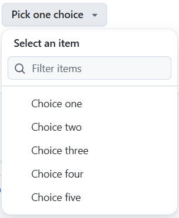
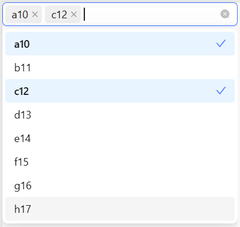

Forms were likely one of the reasons why browser vendors joined forces in the WHATWG in 2004. They felt that HTML standardization was heading into the wrong direction and wanted more practical relevance. While this may be an oversimplification, if true, it highlights the failure of the WHATWG (i.e., the browser vendors) and, subsequently, the W3C. Although the newly standardized form elements and features all point into the right direction, they are incomplete and unfinished. The fact that this is still the case, even more than ten years after HTML5 became a recommendation, is alarming. I will cencentrate in this article on missing elements, inconsistent behaviour and the problems with styling.

## New Form Elements

The WHATWG introduced several new form elements and attributes into the HTML specification, e.g. the email input, telephone input, date field, and range slider. Most of these are simply new types of the input element. This approach was clever — a great example of progressive enhancement. If a browser hasn’t implemented a particular input type yet, a plain text field serves as a fallback. Developers can then use JavaScript if needed. However, when the new elements are supported, JavaScript becomes unnecessary.

This progressive-enhancement model works well for simple inputs. So these new elements are intentionally very simple – essentially shortcuts for single-value fields. They combine regular expressions for validation, an ARIA role, and sometimes trigger a specialized virtual keyboard on mobile phones and tablets. They are similar to web components based on the input element, but are integrated directly into the browser, so no JavaScript is needed for the element to appear. And because they are standardized, the code is consistent across implementations. These are very simple elements.

Combinations of different form elements have unfortunately not been considered at all. As examples, I would like to mention the [combobox](https://open-ui.org/components/combobox.explainer/) and the [range slider](https://open-ui.org/components/enhanced-range-input.explainer/).

### The Combobox

The [combobox](https://component.gallery/components/combobox/) is a combination of a select and a search field. Fluent UI provides a [combobox component](https://fluentsite.z22.web.core.windows.net/0.66.2/maximize/dropdown-example-search-multiple-shorthand/false), as does [Ant Design](https://ant.design/~demos/select-demo-multiple). In both cases, only the search field is a form field. The select is simulated by a list in Fluent, while Ant Design uses a div. The selected options are displayed as (fake) buttons using span and svg elements. This has little to do with actual forms.

<figure>
  
  <figcaption>The combobox (called select-panel) from the <a href="https://primer.style/product/components/select-panel/">Github-design system</a>.</figcaption>
</figure>

<figure>
  
  <figcaption>The combobox from the design-system of <a href="https://ant.design/~demos/select-demo-multiple">ant-design</a>.</figcaption>
</figure>

### The Enhanced Range Element

The [range element](https://developer.mozilla.org/en-US/docs/Web/HTML/Reference/Elements/input/range) can unfortunately only represent a single value. The frequently needed [range slider](https://open-ui.org/components/slider.research/) for two or more values (e.g. for shopping portals) does not exist. You'll have to build it yourself. The well-known [noUiSlider](https://refreshless.com/nouislider/) simulates the slider for one or more values consistently with a div. At least ARIA attributes are used throughout. The same goes with the version by [Quasar](https://quasar.dev/vue-components/range/). No form elements were harmed. It’s a pity that this obvious use case was not standardized.

## Built-in Validation

Standardizing validation in the browser was a smart idea. There are built-in regex rules for validation, which can be manually overridden. Validation is controlled via attributes and a standardized JavaScript API, which is great. In practice, however, you quickly run into details that aren’t flexibly solved. This leads to custom solutions using JavaScript.

There is no simple, built-in way to collect all error messages and display them at the top or bottom of the form without JavaScript. Nor is there a way to communicate the total number of errors to the user. Error messages at the element itself are shown via a popup, which cannot be styled or repositioned. For any improvements in usability and clearer communication, you'll need JavaScript. While this is done through a unified API, it still isn’t possible with plain HTML.

HTML needs better built-in options for handling errors. We should be able to control this with attributes, not JavaScript. The less JavaScript is needed, the faster the page will be.

## Inconsistent browser support

The standard doesn't give form elements consistent capabilities or appearance. I don't know whether browser vendors weren't willing to align on this or simply didn't see the need. Either way, consistent usability, features, and appearance would help both users and developers. For example, browsers hook into the operating system's built-in color picker, which seems sensible – but these pickers can’t be styled and differ in functionality. Android and iOS replace the HTML date picker with their own native widget, which is great on mobile. But on desktop, each browser presents a completely different UI, and none of it is customizable. The result may feel familiar to users, but for developers and their clients, the inconsistency is a nightmare. 

The number input offers increment/decrement arrows in one browser but not in another. The usefulness of these arrows is debatable. The date field is only read aloud [by the iOS native screen reader](https://tetralogical.github.io/screen-reader-HTML-support/lookup/lookup.html#input-date)) when a date is already present; it is not announced as a date field. The email input is announced as an email field [only by Voice Over on MacOS](https://tetralogical.github.io/screen-reader-HTML-support/lookup/lookup.html#input-email). Other screen readers don't specify the semantics, and JAWS seems to ignore it entirely. If browser vendors are leading the standardization of these features, I expect better coordination and consistent implementation.

Semantic information needs to be exposed to screen readers. Without that, the new input type feels only half-baked – basically just a text input with built-in validation and a tailored onscreen keyboard. And both of those could have been achieved without introducing a dedicated email input.

## Partially Miserable Styling Options

Styling form elements is a major challenge that often ends in failure. Developers frequently hide the native control and style the label instead – or hide the control entirely and replace it with a JavaScript-driven construction of divs or lists that can be freely styled.

Fundamentally, styling form elements is miserable. This is why [58% of participants](https://2024.stateofhtml.com/en-US/features/forms/) in the "State of HTML 2024" survey identified styling as by far the biggest pain point with forms.

Browser vendors are currently more active in CSS than in HTML, so there’s a faint glimmer of hope on the horizon. Chromium has introduced the customizable select, based on an [Open UI proposal](https://open-ui.org/components/customizableselect/), and Brecht deRuyte has dedicated a [series of articles](https://utilitybend.com/blog/the-customizable-select-part-one-history-trickery-and-styling-the-select-with-css) on the new, fantastic possibilities.

It’s a start, but the broader problem remains: all controls hidden inside the browser’s shadow DOM need consistent, standardized structure so they can be styled reliably. At CSSDay 2025, Tim Nguyen presented the Working Draft “[CSS Form Control Styling Level 1](https://www.w3.org/TR/2025/WD-css-forms-1-20250325/)” – early work, but promising. I hope it matures quickly and finds its way into browsers.

Without meaningful progress here, we’ll be stuck with [JavaScript-based date pickers](https://open-ui.org/components/datepicker.research/) and other custom controls for the foreseeable future. What’s the point of having a native element if we have to replace it at the first opportunity because we can’t style it?

[Interop 2025](https://wpt.fyi/interop-2025) didn’t include any focus on form controls. Hopefully some proposals make it into Interop 2026 once the [selection process](https://github.com/web-platform-tests/interop/blob/main/2026/selection-process.md) concludes (hopefully by the time this article is published). 

## Lack of Further Development

We are still missing important form elements, and developers have to simulate them with JavaScript. Standardizers could have addressed these gaps in recent years, yet the common response is that we already have all the "building blocks" needed – that developers can simply assemble new controls using JavaScript and Web Components.

Taken to its logical extreme, this argument would reduce HTML to a handful of primitive elements. Everything else would be rebuilt as custom components, each with its own attributes, ARIA wiring, and implementation quirks. That can’t seriously be the goal.

In my view, HTML elements are, in a sense, browser-specific web components, but with some crucial advantages: they do not require JavaScript, and they behave the same for all end users and devices. Non-standard controls, on the other hand, come in dozens of variations, built on different foundations, and with varying quality. Standardization exists precisely so we don’t all have to reinvent them.

## Hope Is Rising

The lack of standardization leads to many different approaches to the same problem. What they have in common is that they have little or nothing to do with actual form elements.

Fortunately, practitioners have come together in the "[Open UI](https://open-ui.org/)" community group to advance the standardization of HTML and CSS. They describe several features that are missing as standards in HTML. For the combobox, Open UI has created [a proposal](https://open-ui.org/components/combobox.explainer/). I hope it will be implemented in browsers and standardized soon.

The same applies to the range slider with more than one value. Open UI also offers a great idea for a long-overdue [extension of the standard](https://open-ui.org/components/enhanced-range-input.explainer/).

## A New Wave of Innovation Is Needed

This article is a very rough overview of the state of forms. My main demands for innovation are:

1. We need more complex form fields as standard elements, such as a combobox.
2. We need a range input with multiple handles.
3. We need much better styling opportunities for every form element. The new stylable select shows the right direction. 
4. Form validation should be controlled by HTML-attributes instead of JavaScript. It's styling should be easy and consistent between browsers.
5. Screenreaders should communicate form semantic without flaws.

The innovation of forms should be part of a much larger initiative. WHATWG and W3C demonstrated at the beginning of the millennium that this is possible. After two decades, it is time to revive this spirit and take HTML to a new level. We’ve seen hints of this recently – elements like `<dialog>`, the popover API, and renewed work on customizable form controls show that the platform can still evolve in meaningful ways. But these feel like isolated wins rather than part of a broader push.

Modern websites no longer fit the document-centric model HTML was created for. A typical news homepage mixes headlines, images, teasers, and interactive elements in ways the original spec never anticipated. The New York Times even present teasers without headlines at all. This diversity shows how little shared foundation there is for developers today – and why HTML needs a broader, more coordinated evolution beyond isolated improvements. 

Modern Websites and especially Webapps need a new paradigm. They evolved far beyond the inventor's idea and it won't stop evolving. The W3C should respond with new elements and paradigms. The document analogy should stand alongside interactive applications as equals. The more that is standardized in this regard, the better it is for the industry. And end users will also benefit from consistently high-quality websites.
