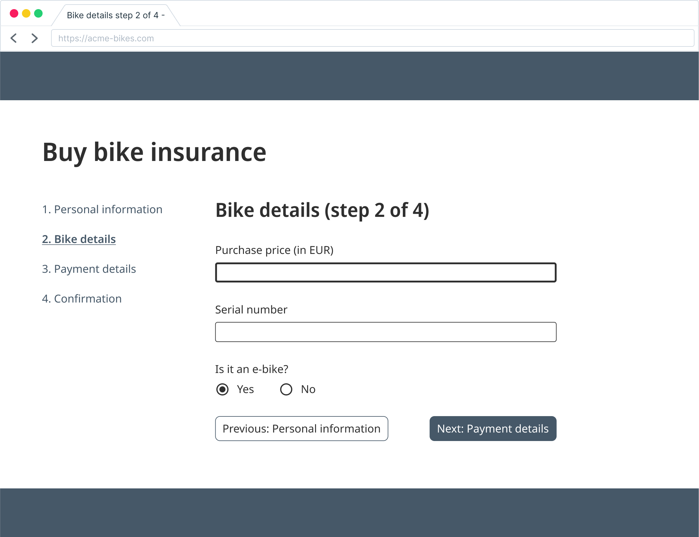

Along with its co-star, the favicon, it appears on stage in the browser's tab. It is presented on search result lists. It is part of the announcements of a screen reader when a page loads. The browser uses it as the proposed name of a bookmark: The page title.

It lives in its `<title>` tag within in the `<head>` tag, supposedly unseen and often overlooked. Most tips & tricks around the page title will revolve around SEO benefits. But that's not all. It plays a vital role in the user flow of navigating the web. 

### The user experience of a page title

Clicking a link and having a new page load is the defining usage pattern of the world wide web. How do we know we clicked the right link? How do we know to which tab to return to when we switched to another program? 

For screen reader users the page title is among the first things announced. On page load, sighted users will most likely first notice the H1 heading. When coming from another programm or another browser tab, the page title helps us identify the right window or tab.

A page title identifies or describes a page and as such reassures us that we are indeed on the right page.

### Multistep user flows

On of these overlooked aspects is the page title in multistep process flows, such as a checkout process or, more general, a multistep form placed over various screens. I specifically use the term "screen" here. 
Multistep forms are often built with JavaScript as multiple screens on one route (effectively, under one URL). From a developer's perspective, it is just one page. From a user's perspective, however, these are multiple pages. 

An example: Let's say, we buy a bike insurance. They ask for name and address, the details of the bike such as purchase price, serial number, and if it's an e-bike, they ask for payment details, etc. The design is one screen per block of information with no other main content.

The user navigates through the form. They fill in their name and address, click "next", now the bike details. Uff, what was the exact price? They might need to open an email client which means opening another program. They see another email, click on a link there, open another tab, etc.

Coming back to the form should now be as seamless as possible. When returning to a tab, screen readers announce at least the program and the page title of the current tab (the rest depends a little on the screen reader). Consider these two possible titles:
* "Bike details step 2 of 4 - Buy bike insurance - company name"
* "Buy bike insurance - company name"

Example one is very precise, it leads the user directly back to where they left off. Example two sufficiently distinguishes the form from other content on the website. 

### Relevant WCAG requirements

What i mentioned so far concerns both accessibility and user experience aspects. Next i want to make more clear what is needed from an accessibility compliance perspective. 

In the Web Content Accessibility Guidelines (WCAG) there are two related success criteria. Number one is [Success Criterion 2.4.2 Page Titled](https://www.w3.org/TR/WCAG22/#page-titled). It checks if a page title describes the topic or purpose of that current page. And there is [Success Criterion 2.4.4 Link Purpose (In Context)](https://www.w3.org/TR/WCAG22/#link-purpose-in-context). It concerns the links on a page.

With regard to accessibility and legal requirements, the WCAG (also included in the European Guideline EN 301549) states minimum requirements. Think of the color contrast of text to background. The contrast ratio of 4.5:1 is the minimum, but a stronger contrast is always better. 

Going back to our bike insurance example, this is how we would audit this process at our company. For success criterion 2.4.2 Page Titled we check:
1. Does each step have a unique URL? Then this page needs to have "Bike details" or "Bike details step 2 of 4" as part of its page title.
2. If there are no unique URLs, i.e. the form always has to be started at step 1, the overall form process must be sufficiently reflected in the page title. "Buy bike insurance - company name" would suffice for passing the success criterion. We would then add a recommendation to add the current step for user experience reasons. 

For success criterion 2.4.4 Link Purpose (In Context) things are little less clear. Remember the typical flow of read a link, click a link, have a new page load. The main intent for the success criterion is that "[Users understand what each link will do](https://www.w3.org/WAI/WCAG22/Understanding/link-purpose-in-context.html)". The criterion focuses on the side of "read a link" and as such an accessibility audit will check the link texts on a given page. 

Nonetheless, the user flow does play a role. In the WCAG's understanding document for success criterion 2.4.4 Link Purpose (In Context) it says:
> Having the link and the title agree, or be very similar, is good practice and provides continuity between the link 'clicked on' and the web page that the user lands on.

## Conclusion

Give your page sufficiently unique page titles. What is sufficient, depends on the implementation details of your website. 

Keep the user flow in mind. The page title is a key element to reassure users they are indeed on the page they intended to be. 

Developer experience is not the same as user experience. As developers we know how things work on a technical level. We might easily forget how users might perceive a website. Also, never assume people will visit your site only in single straight-forward sessions with no distraction. 

## Resources
* Web Content Accessibility Guidelines (WCAG) 2.2 https://www.w3.org/TR/WCAG22/
* MDN: Document: title property https://developer.mozilla.org/en-US/docs/Web/API/Document/title
* Hidde de Vries: Accessible page titles in a Single Page App https://hidde.blog/accessible-page-titles-in-a-single-page-app/. 
* Deque University: Web Accessibility Checklist Page Title https://dequeuniversity.com/checklists/web/page-title
