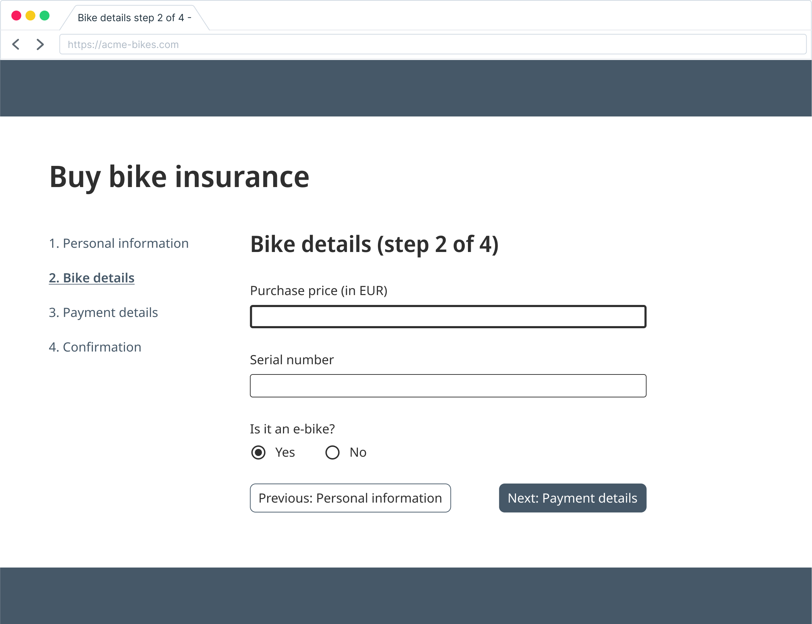

The page title — together with its co-star, the favicon — appears on stage in the browser tab. It shows up in search results. It’s announced by screen readers when a page loads. And it even becomes the default name when you bookmark a page.

It lives in the `<title>` tag within in the `<head>` of the document, supposedly unseen and often overlooked. Most tips and tricks around the page title focus on SEO benefits. But that’s not all: it also plays a vital role in the user flow of navigating the web.

### The user experience of a page title

Clicking a link and having a new page load is the defining usage pattern of the world wide web. How do we know we clicked the right link? How do we know to which tab to return to when we switched to another program? 

For screen reader users the page title is among the first things announced. On page load, sighted users will most likely first notice the H1 heading. When coming from another application or browser tab, the page title helps us identify the right window or tab.

A page title identifies or describes a page and as such reassures us that we are indeed on the right page.

### Example: Multistep user flows

One overlooked aspects of the page title is its use in multi-step flows, such as a checkout process, or — more generally — a multistep form split across various screens.

I specifically use the term "screen" here — multistep forms are often built with JavaScript as multiple screens on one route (effectively, under one URL). From a developer's perspective, it is just one page. From a user's perspective, however, these are multiple pages. 

An example: say we're buying bike insurance. First, we enter our name and address. Then the bike details, such as purchase price, serial number, and whether it's an e-bike. Then payment details. The design is one screen per block of information, with no other main content.

The user navigates through the form. They enter their name and address, click “Next,” and move on to the bike details. Then they realise they don’t remember the exact purchase price. They open their email app to check — and while they're there, another email catches their eye. They click a link, open another tab, and get distracted.

When they return to the insurance form, it should be as seamless as possible. Screen readers will announce the program and the page title of the current tab (the rest depends a little on the screen reader). Clear page titles make it easy to identify where they left off.

Consider these two possible titles:

1. "Bike details - Step 2 of 4 · Buy bike insurance - Company Name"
2. "Buy bike insurance - Company Name"

The first one tells the user exactly where they are in the process. The second still identifies the form, but doesn’t reinforce their progress.

### Relevant WCAG requirements

So far, we’ve looked at this from a user-experience point of view. Next, look at what's needed from an accessibility compliance perspective.

In the Web Content Accessibility Guidelines (WCAG) there are two related success criteria:

1. [Success Criterion 2.4.2 Page Titled](https://www.w3.org/TR/WCAG22/#page-titled) checks whether a page title describes the topic or purpose of the current page.
2. [Success Criterion 2.4.4 Link Purpose (In Context)](https://www.w3.org/TR/WCAG22/#link-purpose-in-context) concerns the links on a page.

With regard to accessibility and legal requirements, the WCAG (also included in the European standard EN 301549) states minimum requirements. Think of text-to-background color contrast: the ratio of 4.5:1 is the minimum, but stronger contrast is always better.

Going back to our bike insurance example, this is how we would audit this process at our company.

For success criterion 2.4.2 Page Titled we check:

1. **Does each step have a unique URL?** Then this page needs to have "Bike details" or "Bike details step 2 of 4" as part of its page title.
2. **If there are no unique URLs** (i.e. the form always starts at step 1), the overall form process must be sufficiently reflected in the page title. "Buy bike insurance - company name" would pass the success criterion. We would then add a recommendation to include the current step for user-experience reasons.

For Success Criterion 2.4.4 Link Purpose (In Context), things are a little less clear. Recall the typical flow: read a link, click a link, have a new page load. The main intent of the success criterion is that "[users understand what each link will do](https://www.w3.org/WAI/WCAG22/Understanding/link-purpose-in-context.html)." The criterion focuses on the "read a link" part, so an accessibility audit will check the link texts on a given page.

Nonetheless, the user flow still plays a role. In the WCAG understanding document for this criterion, it says:

> Having the link and the title agree, or be very similar, is good practice and provides continuity between the link 'clicked on' and the web page that the user lands on.

## Conclusion

Give your page sufficiently unique page titles. What is sufficient depends on the implementation and design details of your website. 

Keep the user flow in mind. The page title is a key element to reassure users they are indeed on the page they intended to be. 

Developer experience is not the same as user experience. As developers we know how things work on a technical level, and we might easily forget how users perceive a website. Never assume people will visit your site only in one straightforward session with no distractions. Clear, contextual titles help people stay oriented when they return.

## Resources
* [Web Content Accessibility Guidelines (WCAG) 2.2](https://www.w3.org/TR/WCAG22/)
* [MDN – Document.title property](https://developer.mozilla.org/en-US/docs/Web/API/Document/title)
* [Hidde de Vries – "Accessible page titles in a Single Page App"](https://hidde.blog/accessible-page-titles-in-a-single-page-app/)
* [Deque University – Page Title Checklist](https://dequeuniversity.com/checklists/web/page-title)
