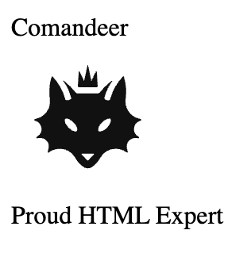
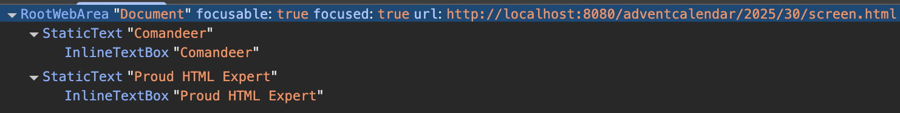
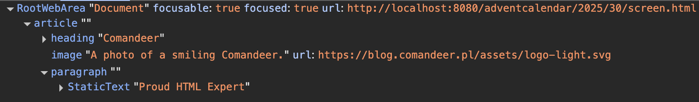

There is always that one elephant in the room alongside HTML – _semantics_. You can ignore it for quite a while, but at the end of the day, you'd need to address that it's there, cluttering half of the space.

## Our beloved elephant

So let's examine this exotic beast! According to Longman Dictionary of Contemporary English, [semantics is <q>the meaning of a word or expression</q>](https://www.ldoceonline.com/dictionary/semantics). In our case, a word is an HTML element. And how can we check what the meaning of a word is? Well, we've already done that – we've checked the semantics of the semantics (inception!). Fortunately, there is also a dictionary for HTML – it's called [<cite>HTML Living Standard</cite>](https://html.spec.whatwg.org/multipage/). It even [says it contains meanings](https://html.spec.whatwg.org/multipage/dom.html#semantics-2):

> Elements, attributes, and attribute values in HTML are defined (by this specification) to have certain meanings (semantics).

Detailed descriptions of all HTML elements are in [chapter 4, called <cite>The elements of HTML</cite>](https://html.spec.whatwg.org/multipage/#toc-semantics).

<p class="highlight"><strong>Note:</strong> That's why I'm not keen on the <q>semantic elements</q> concept. For me, they are all semantic – even <code>&lt;div&gt;</code> – as their meanings are described in the specification.</p>

But what if I tell you there are actually three elephants in the room?

## First semantics: for users

This is the most straightforward one of them all. Because that's the most basic role of semantics: to provide the end user with all the information necessary to correctly understand the content.

This type of semantics can be compared to formatting a text document in Word. You can always select some text and make it bigger and bolder, pretending it's a heading. But then you won't be able to generate a Table of Contents for your document with 100+ pages. The same is true for HTML – except it's the user that will suffer. Let's look at an example – my short bio:

```html
<div>
  <div>Comandeer</div>
  
  <div>Proud HTML Expert</div>
</div>
```

It's still "semantic HTML" (because every HTML element has a meaning!), yet it's not especially useful. And yes, we can style it in any imaginable way (I bet we can even make it dance can-can with the magic of CSS animations) – but it's still just a bunch of `<div>`s [without any particular meaning](https://html.spec.whatwg.org/multipage/grouping-content.html#the-div-element):

> The `div` element has no special meaning at all.

Just like this big, bold text in Word – if it's not a heading, it's not a heading.

Let's focus on raw HTML, forgetting about CSS. If we load the above code in the browser, it will look like this:



It's plain text. And in terms of HTML semantics, that's the truth – we used all these HTML elements to mark up plain text. Good job!

Fortunately, it can be easily fixed:

```html
<article>
  <h1>Comandeer</h1>
  
  <p>Proud HTML Expert</p>
</article>
```

* The wrapper `<div>` element was replaced with the [`<article>` one](https://html.spec.whatwg.org/multipage/sections.html#the-article-element) – a bio can be treated as a <q>complete, or self-contained, composition in a document</q>.
* The `<div>` element with my name was replaced with the [`<h1>` element](https://html.spec.whatwg.org/multipage/sections.html#the-h1,-h2,-h3,-h4,-h5,-and-h6-elements) to indicate the purpose of the `<article>`.
* The image got a [descriptive `alt` attribute](https://html.spec.whatwg.org/multipage/images.html#alt), describing its content.
* The last `<div>` was replaced with the [`<p>` element](https://html.spec.whatwg.org/multipage/grouping-content.html#the-p-element) – after all, it's a paragraph of text.

If we open such a document in the browser, it looks _better_:


In other words, we _formatted_ our text!

<p class="highlight"><strong>Note:</strong> Each HTML element has its own <a href="https://html.spec.whatwg.org/multipage/rendering.html#rendering">default styles</a>, used to display it when there are no stylesheets provided by the website owner. This is the purest achievable form of HTML in a browser.</p>

But it isn't particularly useful on its own. After all, there's always some CSS to make things prettier – why should we care about choosing appropriate HTML elements? Because the Web should not be only visual. One of the main principles of Web Content Accessibility Guidelines (WCAG) is [<q>Perceivable</q>](https://w3c.github.io/wcag/guidelines/22/#perceivable):

> Information and user interface components must be presentable to users in ways they can perceive.

In other words, if someone can't perceive visual information, it **must** be available for them in another form. A bunch of styled `<div>`s do not convey any meaning without their visuals. And that's problematic for assistive technology, like [screen readers](https://developer.mozilla.org/en-US/docs/Glossary/Screen_reader). Screen readers use an [accessibility tree](https://developer.mozilla.org/en-US/docs/Glossary/Accessibility_tree) – a DOM-like structure, built from the page's HTML and containing information about roles and purposes of all HTML elements. Let's see what that tree looks like for the `<div>` version of the page:



It's just a text. What's more important, the image is missing, due to its empty `alt` attribute. The `<article>` version is much better:



Thanks to that, the screen reader can successfully transform the page content into voice and inform the user about where the articles, headings, etc, are. It would not only allow the user to fully understand the page (similarly to how the non-screen-reader user perceived the visual version of the page) but also allow the screen reader to provide better ways of navigating the page, e.g., by [jumping to headings](https://webaim.org/projects/screenreadersurvey10/#finding).

In other words: caring for semantics is caring for the user!

## Second semantics: for user agents

Semantics can also be used to provide additional information for user agents. And I deliberately use this term in quite a wide meaning, as any machine/software that does something on behalf of its user. The most obvious example of a user agent is a browser (which is what is typically called a user agent), but I would extend that name also to search engines. With a long history of SEO, it's not a mystery that search engines can and _do_ understand HTML – just to mention everlasting discussions about the importance of heading elements. Also, browsers can use semantics to provide affordances for users, like [using the `<article>` element to extract content in a reader mode](https://medium.com/@mandy.michael/building-websites-for-safari-reader-mode-and-other-reading-apps-1562913c86c9). But there are also other ways to provide yet another layer of semantics just for machines.

The most ambitious take on semantics for user agents is Web 3.0. And no, I don't mean Web3, based on blockchain. Long before that, back in the 2000s, W3C imagined a new type of web, as they called it – [Web of Data and Services, aka Semantic Web](https://www.w3.org/2007/Talks/0123-sb-W3CEmergingTech/Overviewp.pdf). The idea itself was quite simple yet ingenious: the Web is full of data, but there was no way to enable effective communication between different websites and apps. Back then, machines were also far worse at discovering and understanding data. So they needed us, humans, to _mark up_ data for them. The most basic way of marking stuff up is using HTML. But several additional technologies were developed to allow embedding additional metadata into websites. One of the first was [Resource Description Framework (RDF)](https://www.w3.org/RDF/). It's a _huge_ standard, divided into several specifications. Yet it has one, pretty serious, downside: it's not built on top of HTML as it has its own syntaxes (yes, plural). That's why [RDFa](https://rdfa.info/) has been developed. It's a "lighter" version of RDF and can be used inside HTML via attributes:

```html
<article vocab="https://schema.org/" typeof="Person">
  <h1 property="name">Comandeer</h1>
  
  <p>Proud <span property="jobTitle">HTML Expert</span></p>
</article>
```

The `vocab` attribute points to the vocabulary we want to use and the `typeof` one – a type of data we try to mark up. In our example, we want to spice up my bio with some additional metadata. Due to that, we decided to use the `Person` type (as I'm personally a person). Each property of, well, _me_ is marked up with the `property` attribute, e.g., the heading with the name now has the `property="name"` attribute.

But of course, [there is always more than one way to do something](https://xkcd.com/927/). HTML has its own way of marking up additional metadata, so-called [microdata](https://developer.mozilla.org/en-US/docs/Web/HTML/Guides/Microdata):

```html
<article itemscope itemtype="https://schema.org/Person">
  <h1 itemprop="name">Comandeer</h1>
  
  <p>Proud <span itemprop="jobTitle">HTML Expert</span></p>
</article>
```

It's pretty similar to RDFa. Instead of `vocab` + `typeof` attributes, it uses `itemscope` + `itemtype` ones, and the `property` one is replaced with `itemprop` one.

And if we want something more like RDF (so a separate thing from HTML), there is always [JSON-LD](https://json-ld.org/) – a way to express metadata in JSON. I also need to make one honorable mention – [microformats](https://microformats.io/). They are the OGs of metadata in HTML. They use the `class` attribute to provide additional info about the content:

```html
<article class="h-card">
  <h1 class="p-name">Comandeer</h1>
  
  <p>Proud <span class="p-job-title">HTML Expert</span></p>
</article>
```

The [hCard microformat](https://microformats.org/wiki/h-card) is used for marking up information about people. What I love about microformats is the fact that they are Just HTML™ without any fancy attributes.

<p class="highlight"><strong>Note:</strong> Personally, I'm a fan of the RDFa format, so I'll stick to it for the rest of the article.</p>

But what are vocabularies? In short, they are catalogs of things that can be described, like people, events, books, and places. Each of these things has its own unique set of properties (people have names, places have addresses, events have dates…). Things can also be mixed together (events are organized by people, etc.). Thanks to that, even more complex pieces of reality can be described in a manner understandable by machines.

In our example, the [Schema.org](https://schema.org/) vocabulary is used. Schema.org is a community effort, founded by Google, Microsoft, Yahoo, and Yandex, with a goal to create an open standard for structured data on the Web. This data is then used by search engines to provide additional information about the websites' content. [Google provides a gallery](https://developers.google.com/search/docs/appearance/structured-data/search-gallery) of how it uses the structured data to prepare more detailed search results.

The only problem with Web 3.0 is that it never happened. Granted, we have several great technologies to mark up additional metadata. But at the end of the day, they're used mainly by search engines. The ambitious vision of the Web where machines talk to each other and exchange data to provide better services to their users is still just a vision.

## Third semantics: for web developers

And finally, we can leave the vast land of user-centered semantics and enter the cozy territory of developer-centered semantics. Because an easily understandable HTML is also an easily maintainable HTML. And if we use HTML elements as intended (like creating lists with `<ul>` and `<li>` elements instead of `<divs>`), we're already halfway there!

But sometimes additional info is needed, e.g., a page contains several `<article>` elements and we want to easily distinguish between them. In that case, we can go back to webdev roots and use the `class` attribute:

```html
<article vocab="https://schema.org/" typeof="Person" class="bio">
  <h1 property="name" class="bio__name">Comandeer</h1>
  
  <p class="bio__description">Proud <span property="jobTitle" class="bio__job-title">HTML Expert</span></p>
</article>
```

I'm using a [BEM-like](https://getbem.com/) naming convention here to indicate that this particular `<article>` is a bio. Each of the elements inside the `<article>` also has its own class name, indicating its purpose.

<p class="highlight"><strong>Note:</strong> It can be argued that most of these classes are redundant, repeating the information already provided by RDFa. Yet I tend to treat BEM not as a naming convention but as a DSL for creating component-based applications. However, that's a story for another time.</p>

There are also other ways to make HTML more developer-friendly. One of the better (at least in my opinion) is to [use custom elements](https://github.com/whatwg/html/issues/11663#issuecomment-3293859811). It's especially helpful if we have a bunch of `<div>`s and we can't replace them with any other element, but we already got lost in the jungle of closing tags:

```html
<div class="first">
  <div class="second">
    <div class="third">
      <div class="fourth">
        <div class="fifth">
          <div class="sixth">
            <div class="seventh">AAAAAAAAAAAAAAAAHHHH!</div>
          </div>
        </div>
      </div>
    </div>
  </div>
</div>

<!-- vs -->

<first->
  <second->
    <third->
      <fourth->
        <fifth->
          <sixth->
            <seventh->That's better</seventh->
          </sixth->
        </fifth->
      </fourth->
    </third->
  </second->
</first->
```

We would also need to add a little bit of CSS:

```css
:not(:defined) {
  display: block;
}
```

It ensures that custom elements are displayed as block elements (so like `<div>`s) as they're displayed as inline ones (so like `<span>`s) by default.

## Fourth semantics?

Yet there is another elephant looming on the horizon… There is no doubt that we live in the AI era. LLMs are everywhere around us, and they are yet another machines that can understand HTML. But hey, they are _language models_, finally our technology has advanced enough to be able to fully grasp the beauty of Web 3.0!

Except it doesn't seem to be the case. Instead of using what we already have, new standards emerge [insert XKCD strip about standards here]. The most popular of them is the [`/llms.txt` file](https://llmstxt.org/). It's a Markdown file containing detailed instructions for LLMs on how to handle the website and where particular info is located.

And I find it quite ironic that after all these years of building on the idea of the semantic Web, we finally ended up with theoretically _the_ technology to make use of all these RDFs and JSON-LDs of the Internet – and it doesn't work. Oh, well, maybe in the next 20 years, then…
