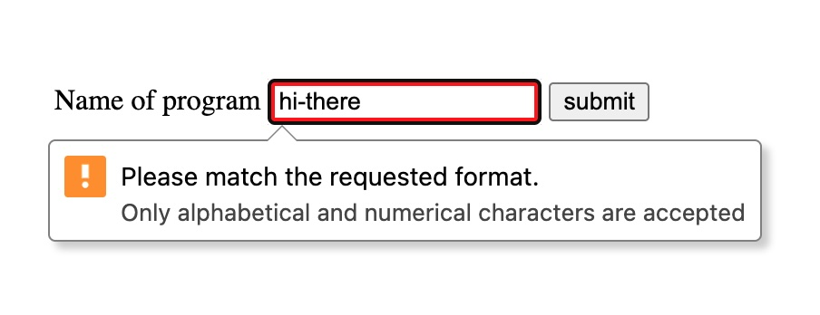

title: "HTML Input Validation is (maybe) Good"
author: "Wes Goulet"
author_bio: "Maker of (hopefully) useful things on the web. Microsoft/Salesforce alum. Big fan of PWAs, SSGs, web standards, and simple/boring code."
date: 2026-01-02
author_links:

- label: "Site"
  url: "https://goulet.dev"
  link_label: "goulet.dev"
  intro: "<p>Built-in HTML input validation makes a good foundation for simple client-side validation. It just needs a little extra to make it accessible.</p>"
  image: "advent25_31"
  canonical: "https://goulet.dev/posts/html-input-validation-is-good/"

---

I think of client-side validation as a progressive enhancement for your users. You have to validate user input on the server (you can't trust what comes from the client), but some validation on the client makes for a nice UX. But that doesn't have to mean lots of JS code or using some validation library on your client. You can get pretty far with the browser's built-in HTML input validation. And then you can layer a little bit of JS on top of that to make it even better.

Let's take a look at a text input. You can use `pattern`, `minlength` and `maxlength` to provide constraints. You can use `title` to provide error message. You can conditionally style invalid input with `:user-invalid`.

## Example

```html
<label for="program_name">Name of program</label>
<input
  type="text"
  id="program_name"
  minlength="3"
  maxlength="20"
  pattern="[a-zA-Z0-9]+"
  title="Only alphabetical and numerical characters are accepted"
  required
/>
```

```css
input:user-invalid {
  border: 4px solid red;
}
```

When the user attempts to submit the form the browser takes care of validating and showing the message.

<figure style="margin: 4rem 0;">
    
    <figcaption>Example validation message on Chrome</figcaption>
</figure>

<figure style="margin: 4rem 0;">
    
    <figcaption>Example validation message on Firefox</figcaption>
</figure>

<figure style="margin: 4rem 0;">
    
    <figcaption>Example validation message on Safari</figcaption>
</figure>

<figure style="margin: 4rem 0;">
    
    <figcaption>Example validation message on Safari on iOS</figcaption>
</figure>

> You can play with a live example at [this CodePen](https://codepen.io/wes_goulet/pen/emJjqKj).

BTW, I just noticed that Chrome and Firefox say "Please" but Safari doesn't 😃

## Styling

You can't style the error popup, so if that's important to you then maybe you need to write your own error UI. A lot of times I don't mind leaning on browser UI when it's available (ie: most of the time I don't need my error messages in my website's overall brand/styling). Also, I think a lot of users have seen the browser's error UI before (from other sites that use native form validation), so there is some familiarity there for the user.

## The Problem: Accessibility

Unfortunately, native form validation isn't very accessible.

I had assumed it was accessible, because most of the time when I lean on the browser to do something it handles accessibility much better than any userland code I would write. But after reading [this excellent post from Adrian Roselli](https://adrianroselli.com/2019/02/avoid-default-field-validation.html) (an accessibility expert), I learned my assumption was wrong.

The main accessibility issues with native form validation are:

- **Error messages aren't associated with form fields** - Screen readers don't reliably announce which field has an error, so users relying on assistive technology can't easily figure out what needs to be fixed.
- **Error messages disappear too quickly** - The browser's error bubble might disappear before users can read it.
- **Error messages don't respect user text size/spacing preferences** - The error bubble text doesn't resize with browser zoom settings or respect text spacing preferences.

Related to all this, [a recent update to WCAG](https://github.com/w3c/wcag/pull/4431) acknowledges these accessibility issues with native form validation.

## Make it better with JS

I originally wrote this post to point out that native form validation is good enough (lean on the browser!) and that's all you need. But after reading about the accessibility issues, I think the right answer is using native form validation as the foundation, and then adding a bit of JS to make it more accessible.

The "bit of JS" we'll use is the Constraint Validation API, which is the JavaScript interface for HTML form validation. It allows you to programmatically check if a form field is valid, get validation messages, and customize how errors are displayed to users. For example, you can check if an input is valid:

```javascript
const element = document.getElementById("program_name");
console.log(element.checkValidity()); // returns true or false
```

You can also get the validation message:

```javascript
const element = document.getElementById("program_name");
console.log(element.validationMessage); // returns the error message if invalid
```

We'll use the Constraint Validation API to create your own error messages that are properly associated with form fields. Here's a simple example:

```html
<form id="my-form">
  <label for="program_name">Name of program</label>
  <input
    type="text"
    id="program_name"
    minlength="3"
    maxlength="20"
    pattern="[a-zA-Z0-9]+"
    title="Only alphabetical and numerical characters are accepted"
    required
    aria-describedby="program_name-error"
  />
  <span id="program_name-error" role="alert" aria-live="polite"></span>
</form>
```

```javascript
const form = document.getElementById("my-form");
const input = document.getElementById("program_name");
const errorMessage = document.getElementById("program_name-error");

// IMPORTANT: set this attribute in JS, that way it's a progressive enhancement (ie: if JS isn't available the native form validation will still work).
form.setAttribute("novalidate", "");

function validateInput() {
  const isValid = input.checkValidity();
  errorMessage.textContent = isValid ? "" : input.validationMessage;
  if (isValid) {
    input.removeAttribute("aria-invalid");
  } else {
    input.setAttribute("aria-invalid", "true");
  }
}

// Validate on blur (when user leaves the field)
input.addEventListener("blur", validateInput);

// Clear errors as user types
input.addEventListener("input", () => {
  if (input.checkValidity()) {
    errorMessage.textContent = "";
    input.removeAttribute("aria-invalid");
  }
});

// Handle form submit
form.addEventListener("submit", (e) => {
  if (!form.checkValidity()) {
    e.preventDefault();
    // Update validation state for all fields
    validateInput();
  }
});
```

In this example:

- The form has `novalidate` to turn off the browser's built-in validation (added via JavaScript so it degrades gracefully).
- The error message is associated with the input using `aria-describedby`, so screen readers will announce it when the field is focused.
- The error message has `role="alert"` and `aria-live="polite"` so screen readers will announce it when it appears.
- The input gets `aria-invalid` set appropriately, clearly marking it for assistive technologies.
- Validation happens on `blur` (when the user leaves the field) and on form submit.
- The error message stays visible, giving users time to read it.

> You can play with a live example at [this CodePen](https://codepen.io/wes_goulet/pen/emJjqKj).

This [post by Cloud Four](https://cloudfour.com/thinks/progressively-enhanced-form-validation-part-2-layering-in-javascript/) spells out a more complete solution in detail. (If you mainly support evergreen browsers then I wouldn't worry too much about the first part "Removing invalid styles on page load for all browsers" since Chrome has shipped support for `:user-invalid` for [a couple years now](https://caniuse.com/wf-user-pseudos).)

So native HTML form validation is a good starting point, but it's not enough on its own if you care about accessibility. The good news is you can use the Constraint Validation API to layer on accessible error messages with a bit of JavaScript. That way you get the browser's validation working as a baseline, and then enhance it to be accessible when JS is available.

> Thanks to [Manuel](https://matuzo.at/) for reviewing this post and pointing out the accessibility issues with native form validation. I started out thinking the browser gives me all I need for client-side form validation, but learned that the browser provides a good start, but it's not enough by itself.
