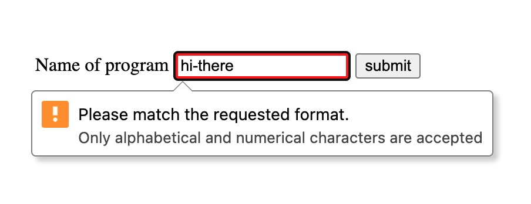
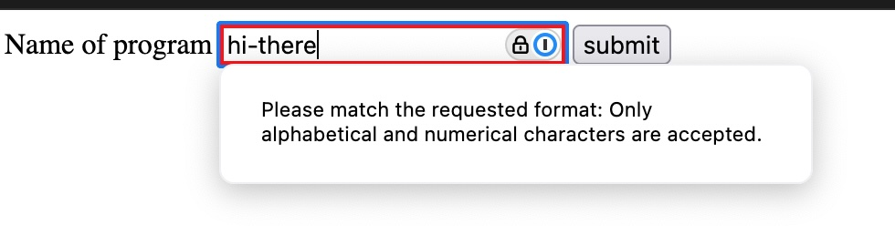
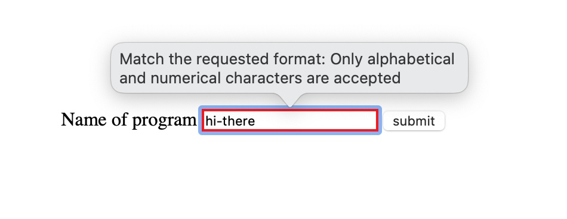

I think of client-side validation as a progressive enhancement for your users. You have to validate user input on the server, but some validation on the client makes for a nice UX. But that doesn't have to mean lots of JS code or using some validation library on your client. You can get pretty far with the browser's built-in HTML input validation.

Let's take a look at a text input. You can use `pattern`, `minlength` and `maxlength` to provide constraints. You can use `title` to provide error message. You can conditionally style invalid input with `:user-invalid`.

## Example

```html
<label for="program_name">Name of program</label>
<input
  type="text"
  id="program_name"
  minlength="3"
  maxlength="20"
  pattern="[a-zA-Z0-9]+"
  title="Only alphabetical and numerical characters are accepted"
  required
/>
```

```css
input:user-invalid {
  border: 4px solid red;
}
```

When the user attempts to submit the form the browser takes care of validating and showing the message.

<figure style="margin: 4rem 0;">
    
    <figcaption>Example validation message on Chrome</figcaption>
</figure>

<figure style="margin: 4rem 0;">
    
    <figcaption>Example validation message on Firefox</figcaption>
</figure>

<figure style="margin: 4rem 0;">
    
    <figcaption>Example validation message on Safari</figcaption>
</figure>

It might not look consistent across browsers, but it does look consistent to users who are used to that browser's UI (which is more important IMO).

> You can play with a live example at [this CodePen](https://codepen.io/wes_goulet/pen/emJjqKj).

BTW, I just noticed that Chrome and Firefox say "Please" but Safari doesn't 😃
