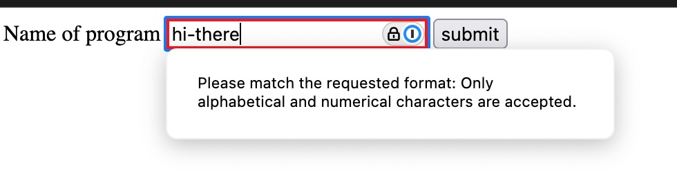
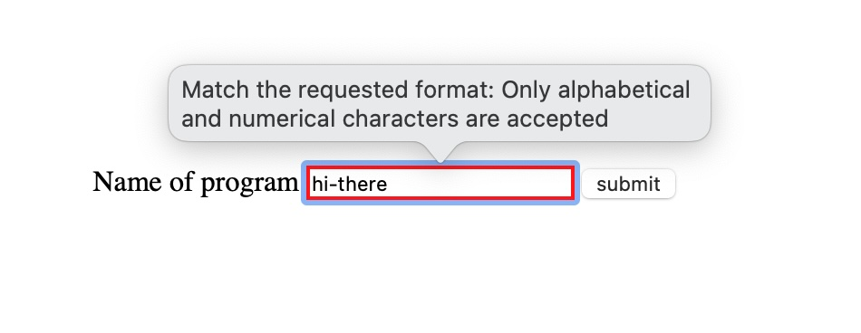
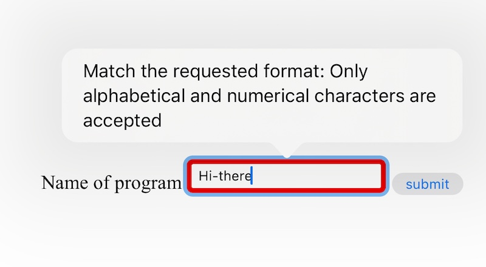

I think of client-side validation as a progressive enhancement for your users. You have to validate user input on the server (you can't trust what comes from the client), but some validation on the client makes for a nice UX. But that doesn't have to mean lots of JS code or using some validation library on your client. You can get pretty far with the browser's built-in HTML input validation. And then you can layer a little bit of JS on top of that to make it even better.

Let's take a look at a text input. You can use `pattern`, `minlength` and `maxlength` to provide constraints. You can use `title` to provide error message. You can conditionally style invalid input with `:user-invalid`.

## Example

```html
<label for="program_name">Name of program</label>
<input
  type="text"
  id="program_name"
  minlength="3"
  maxlength="20"
  pattern="[a-zA-Z0-9]+"
  title="Only alphabetical and numerical characters are accepted"
  required
/>
```

```css
input:user-invalid {
  border: 4px solid red;
}
```

When the user attempts to submit the form the browser takes care of validating and showing the message.

<figure style="margin: 4rem 0;">
    
    <figcaption>Example validation message on Chrome</figcaption>
</figure>

<figure style="margin: 4rem 0;">
    
    <figcaption>Example validation message on Firefox</figcaption>
</figure>

<figure style="margin: 4rem 0;">
    
    <figcaption>Example validation message on Safari</figcaption>
</figure>

<figure style="margin: 4rem 0;">
    
    <figcaption>Example validation message on Safari on iOS</figcaption>
</figure>

> You can play with a live example at [this CodePen](https://codepen.io/wes_goulet/pen/emJjqKj).

BTW, I just noticed that Chrome and Firefox say "Please" but Safari doesn't :smile:

## Styling

You can't style it yourself, so if that's important to you then maybe you need to reach for a library or write your own error UI. A lot of times I don't mind leaning on browser UI when it's available (ie: most of the time I don't need my error messages in my website's overall brand/styling). Also, I think a lot of users have seen the browser's error UI before (from other sites that use native form validation), so there is some familiarity there for the user.

## The Problem: Accessibility

Here's the bad news. Native form validation isn't very accessible.

I kind of assumed it was accessible, because most of the time when I lean on the browser to do something it handles accessibility much better than any userland code I would write. But from reading [this post from Adrian Roselli](https://adrianroselli.com/2019/02/avoid-default-field-validation.html) (an a11y expert), it seems it isn't the case.

Adrian's post lists some bugs opened against browsers to fix a11y issues. Some are marked as fixed, some are not. Here's hoping browser makers continue to improve the accessibility of native form validation.

## Make it better with JS

I originally wrote this post to point out that native form validation is good enough (lean on the browser!) and that's all you need. But after reading about the accessibility issues, I think the right answer is using native form validation as the foundation, and then adding a bit of JS to make it more accessible.

How do we do that? This [Cloud Four series](https://cloudfour.com/thinks/progressively-enhanced-form-validation-part-2-layering-in-javascript/) spells it out nicely, so I won't repeat it here. (If you mainly support evergreen browsers then I wouldn't worry too much about the first part "Removing invalid styles on page load for all browsers" since Chrome has shipped support for `:user-invalid` for [a couple years now](https://caniuse.com/wf-user-pseudos).)

> I learned a lot from writing this post. I started out thinking the browser gives me all I need for client-side form validation, but learned that the browser provides a good start, but it's not enough by itself.
