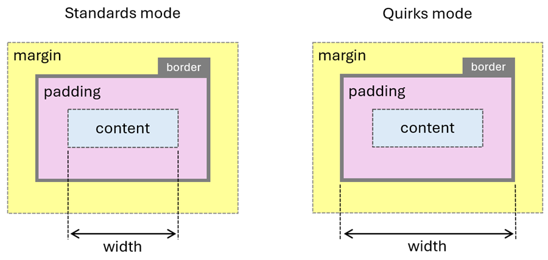
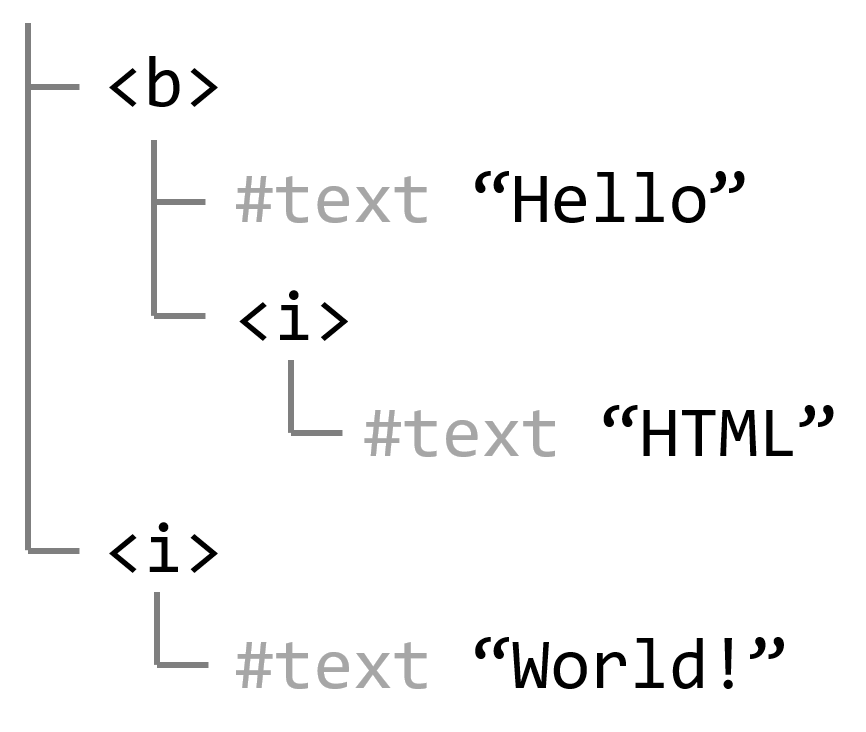

Behold this magnificient HTML document:

```html
<html>
  <body marginheight=150 marginwidth=300 bgcolor=black text=white>
    <marquee>
      <b>Hello <i>HTML</b> World!</i>
    </marquee>
```

To try it in your browser, copy the following line and paste it into the address bar:

```
data:text/html,<html><body marginheight=150 marginwidth=300 bgcolor=black text=white><marquee><b>Hello <i>HTML</b> World!</i></marquee>
```

## What's wrong with it?

Everything? I mean, this HTML looks like it was written in 1998!

1. The document is in _quirks mode_ because it lacks a proper [`DOCTYPE` preamble](https://developer.mozilla.org/docs/Glossary/Doctype).

   If you've never heard of quirks mode, then you're probably lucky enough to have started your web development career after it was an important thing to know about. Suffice to say it's weird. Here are some of the ways quirks mode impacts (or impacted) HTML documents:

   * The box model used to behave differently in older browsers, which affected layout and spacing. For example, in quirks mode, Internet Explorer included the padding and borders in the element's total width and height. Today, all browsers apply width and height to the content box of an element by default, unless you change the `box-sizing` CSS property.

     

   * Font sizes don't inherit on table elements.
   * Certain inline elements, such as images, don't vertically align the way you think they should when they're the only element inside a block-level container.

   You can see a live example of some of these quirks on my site at [Quirks mode vs Standards mode](https://patrickbrosset.com/lab/quirksmode/).

1. The `<head>` tag is missing, which means the document has no `<title>` either, which is bad for accessibility and UX in general

   A common thing that assistive technology users do is read the title of a page first to know if they want to spend more time reading the page's content. Without a descriptive title, folks are forced to start reading more of the content to know if that's what they were looking for in the first place, which is time-consuming and potentially confusing.

   In addition, a title is also useful for SEO purposes, is displayed in browser tabs, used when bookmarking pages, and more.

1. The `<body>` tag uses deprecated attributes: `marginheight`, `marginwidth`, `bgcolor`, and `text`.

   These attributes are [obsolete and discouraged by the spec itself](https://html.spec.whatwg.org/multipage/obsolete.html#obsolete).

1. The `<marquee>` tag is [obsolete](https://html.spec.whatwg.org/multipage/obsolete.html#the-marquee-element) and should be avoided in favor of CSS animations.

   Plus, if you really must animate scrolling text, then please use the [`prefers-reduced-motion` media query](https://developer.mozilla.org/docs/Web/CSS/@media/prefers-reduced-motion) to respect user preferences.

1. The `<b>` and `<i>` tags look like they're used for styling. That's wrong, right?

   More on that later.

1. The `<b>` and `<i>` tags are improperly nested. The nesting is `<b><i></b></i>` which is out of order.

1. The closing `</body>` and `</html>` tags are missing.

## Is this valid HTML?

Well, yes and no:

* No: if you send this to the [W3C HTML validator](https://validator.w3.org/nu/), it'll be pretty angry at you and will list the errors I mentioned earlier.
* But also, yes: the resulting page just loads and works fine in browsers.

Before discussing each point in details, don't you think this is just beautiful? HTML is so self-correcting that making a browser fail only by using HTML is really hard to achieve, and HTML that looks like it was written two decades ago still works! I mean, take a look at [spacejam.com](https://www.spacejam.com/1996/), [this old bar website](https://www.thecrystalcornerbar.com/), or even [the very first web page that was ever created](https://info.cern.ch/hypertext/WWW/TheProject.html).

Now let's go over the list of issues I mentioned earlier one more time, but this time, let's talk about why they're not actually causing any issues:

1. Sure, quirks mode can lead to weird rendering issues if you don't know that you're using it, but it's still implemented in browsers and perfectly ok to use.

   Even if quirks mode was added for [historical reasons](https://quirks.spec.whatwg.org/#history), to support web pages that were made before the CSS specification was fully fleshed out, the code in browser engines which detects the document mode and renders it accordingly is here to stay. There really is no reason for browsers to ever remove it, unless one day, all quirks mode documents were to disappear from the web. This seems highly unlikely though. Judging by Chrome's [QuirksModeDocument usage metric](https://chromestatus.com/metrics/feature/timeline/popularity/2034), about 30% of all page loaded in Chrome still use quirks mode! A bunch of the sites that are listed on that usage metric as using quirks mode appear to be using it from iframes created to display ads. Still, that's a lot of page loads.

   If you're encountering weird rendering issues that you can't explain, double check that you have a `DOCTYPE` in your HTML document. You can also run the following line of code in the browser console: `document.compatMode`. If it returns `BackCompat`, then you're in quirks mode.

1. The `<head>` tag can definitely be omitted. Neither the [HTML specification](https://html.spec.whatwg.org/multipage/semantics.html#the-head-element), nor browser implementations require the tag to be present.

   It's bad for accessibility reasons if you omit it, again because you probably also won't have a `<title>` tag, but it still works.

   In fact, you can also omit `<html>` and `<body>` tags too. Personally, I commonly use this to quickly test things out in the browser. Instead of creating a new HTML file on my computer, which takes a bit more time, I just type some HTML in the address bar directly. For example: `data:text/html,<div>something`. No `<html>`, no `<head>`, no `<body>` elements.

1. `marginheight`, `marginwidth`, `bgcolor`, or `text` are deprecated _presentational attributes_. But, even if they're deprecated and discouraged, they're still implemented in browsers, for backward compatibility reasons.

   In fact, here are other similar attributes: `bgColor`, `fgColor`, `linkColor`, `alinkColor`, and `vlinkColor`.
   
   If you're as old as I am, you might have used these attributes a long time ago, perhaps when creating sites in FrontPage or Dreamweaver.
   
   Anyway, these presentational attributes act as 0-specificity CSS properties, which means that any CSS property you set in a stylesheet will override them.

1. The `<marquee>` element still animates text in browsers. In fact, if you want to go crazy with it, try nesting two `<marquee>` elements, like this:

   ```html
   <marquee
      direction="down"
      width="200"
      height="200"
      behavior="alternate">
      <marquee behavior="alternate">This text will bounce</marquee>
    </marquee>
   ```

   Take a look at [the example on codepen](https://codepen.io/captainbrosset/pen/dPGvrMQ?editors=1100).

   For an accessible alternative, see Daniela Kubesch's article [Get that marquee ✨AeStHeTiC✨](https://www.htmhell.dev/adventcalendar/2022/15/).

1. Using `<b>` and `<i>` is perfectly valid. They used to be meant for making the text bold and italic, hence their names. But they were deprecated in HTML4, and the meaning of the tags was changed to mean something else. The `<b>` tag now means _bring attention_ and the `<i>` tag now means _idiomatic text_.

   `<b>` is now used to mark up keywords, product names, or other spans of text whose typical presentation would be boldfaced, but not including any special importance.

   `<i>` is now used to mark up text that is set off from the normal prose for readability reasons.

   More semantic tag names have since been invented too: `<strong>`, `<em>`, or `<mark>`, which convey slightly different semantics.

   If there's no semantic aspect to the piece of text you want to make bold or italic, don't use `<b>` or `<i>`, use CSS `font-weight` and `font-style` instead.

1. Misnested tags can sometimes happen in HTML, and when it does, the page doesn't break!

   That's the beauty of HTML once again. If you're coming from an XML background, you might be surprised by the forgiveness of HTML. But, in the vast majority of cases, HTML parers just figure things out on their own and get you what you want.

   In our example, the markup is `<b><i></b></i>`, which feels obviously wrong because the closing `</b>` tag should appear after the closing `</i>` tag, to respect nesting. This particular markup creates the following DOM tree: 

   

   This behavior is actually specified in the HTML spec, and called the _adoption agency algorithm_. I think we owe it to [Chris Wilson](https://cwilso.com/) for thinking about this in the first place. Chris, if you ever find traces of old discussions about this, or care to write the backstory, I would be very interested!
   
   Of course, I'm not saying you should do this. It's still important to create correctly nested HTML markup. But there are historical reasons for things like this to work. Back in the early days, browser engines didn't always agree on how to parse and render HTML. So, in order to ensure that as much of the web as possible was supported across all browsers, it was sometimes easier to just support how other browsers did things. And that's how things like misnested tags ended up being supported.

1. Missing end tags are fine. The HTML parser is able to close most of them on its own.

   For example, a list item doesn't need to be closed if what follows is another list item or the end of the list. So, this works fine:

   ```html
   <ul>
     <li>Item 1
     <li>Item 2
     <li>Item 3
   </ul>
   ```

   The same is true for paragraphs. You can omit the closing `</p>` tag if what follows is another paragraph, a heading, a list, and a whole lot of other elements:

   ```html
   <section>
     <p>This is a paragraph
     <p>This is another paragraph
     <h2>This is a heading</h2>
     <p>This is yet another paragraph
   </section>
   ```

   You can find out more about these examples, and others, in the [Optional tags section of the HTML spec](https://html.spec.whatwg.org/multipage/syntax.html#optional-tags).

   Also, think about it, you're probably already using this without realizing. Have you ever closed a ``, `<input>`, or `<link>` tag? Probably not, and that's fine. The HTML spec defines a whole lot of elements which don't require closing tags: `<base>`, `<link>`, `<meta>`, `<hr>`, `<br>`, `<source>`, ``, `<input>`, and others.

## So, what's the moral of the story?

HTML can be very forgiving, and browsers implement things that may seem obscure or weird, but they do so for a very good reason: backward compatibility!

The web is the only platform where sites that were written years ago can still work fine today. This isn't to say that things never get removed though, they do, and probably more often than you realize. Remember AppCache, WebSQL, module import assertions, or special rules that apply to the font-size of `<h1>` elements when nested inside certain elements?

This is both a blessing and a curse. The fact that so much of the languages we use are so forgiving and time-enduring made the web what it is today. A welcoming platform that doesn't take so much effort to get used to, and kind of just works. But, this also means that old features and bad practices can linger on for a long time and, if they're used by many sites and users, can't really ever be removed.
